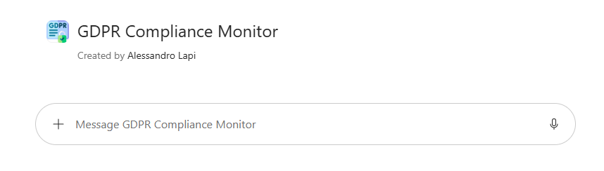
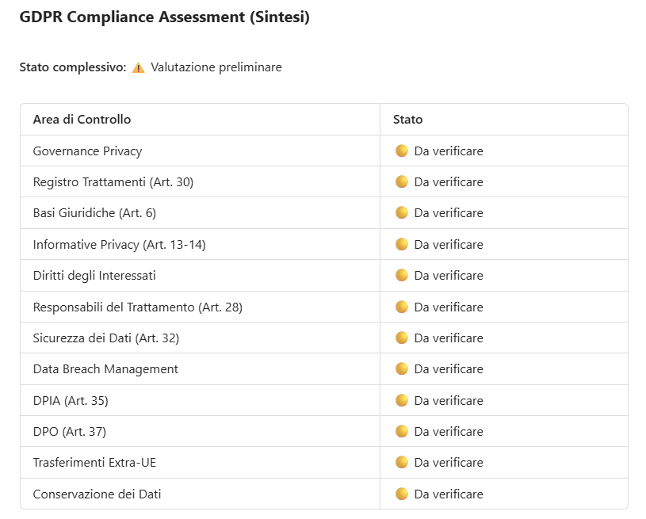

# GDPR Compliance Monitor · v1 (Agent Builder)

## Get started
→ **[Apri la guida tecnica](lab-guide.md)**

## Panoramica

Il **Regolamento (UE) 2016/679 (GDPR)** impone alle organizzazioni un impegno continuo nella protezione dei dati personali: registro dei trattamenti, informative, basi giuridiche, misure di sicurezza, gestione dei data breach e dei diritti degli interessati.

Mantenere la conformità richiede di:

- Conoscere e interpretare correttamente il testo normativo e le linee guida delle autorità
- Verificare periodicamente che processi e documenti interni siano allineati
- Rispondere rapidamente a dubbi operativi di colleghi non specialisti

## Problema

Abbiamo identificato tre criticità principali:

- **Normativa complessa** : Il GDPR e le linee guida collegate sono testi lunghi e tecnici, difficili da consultare per chi non è un esperto.
- **Verifiche manuali** : Controllare documenti interni (informative, registro dei trattamenti, procedure) rispetto ai requisiti normativi è un'attività lenta e soggetta a dimenticanze.
- **Dipendenza dal DPO** : Ogni dubbio operativo ricade sul DPO o sull'ufficio legale, creando colli di bottiglia.

## Soluzione

**GDPR Compliance Monitor (v1)** è un agente progettato **esclusivamente per valutare e monitorare la conformità GDPR** di organizzazioni, processi, servizi, fornitori e applicazioni, tramite una **checklist obbligatoria** e verifiche basate su evidenze.

L'agente:

- Usa il **documento ufficiale del GDPR** caricato nella knowledge base come fonte primaria e riporta per ogni area l'**articolo o considerando** di riferimento
- Integra il testo con le fonti ufficiali aggiornate di **UE, EDPB e Garante**, distinguendo norme vincolanti, orientamenti delle autorità e buone pratiche
- Classifica ogni controllo come *Conforme*, *Parzialmente conforme*, *Non conforme*, *Non applicabile* o *Non valutato*, senza mai dichiarare conforme un controllo privo di evidenza
- Trasforma i gap in un **piano di remediation** con priorità, responsabile e scadenza
- Segnala i casi che richiedono la validazione del DPO o una consulenza legale qualificata

!!! warning "Disclaimer"
	L'agente è uno **strumento di supporto** e non sostituisce il parere del DPO, dell'ufficio legale o di consulenti qualificati. Ogni valutazione deve essere verificata da personale competente.

Questo approccio permette di:

- Rendere sistematiche e ripetibili le verifiche di conformità
- Avere evidenze, riferimenti normativi e gap tracciati in un unico output
- Prioritizzare le azioni correttive e ridurre il carico operativo sul DPO

## Esempi di utilizzo

**Richiesta utente**

`Quali sono i principali obblighi del GDPR per un'organizzazione? Crea una checklist con gli articoli di riferimento.`

**Comportamento dell'agente**

1. Individua le aree di controllo applicabili (governance, registro dei trattamenti, basi giuridiche, informative, diritti, responsabili, sicurezza, data breach, DPIA, DPO, trasferimenti, conservazione)
2. Le presenta come checklist, con l'articolo di riferimento del GDPR per ciascuna area
3. In assenza di evidenze, segna ogni controllo come *Da verificare* e non come conforme
4. Chiude con le azioni prioritarie e le evidenze da raccogliere, indicando i punti da far validare al DPO

Altri esempi:

- `Quali obblighi GDPR si applicano quando si avvia un nuovo trattamento di dati personali?`
- `Quando è obbligatoria una DPIA e quali contenuti minimi deve avere secondo il GDPR?`
- `Come si gestisce un data breach secondo il GDPR? Indica notifiche, tempistiche e documentazione necessarie.`
- `Crea un modello di piano di remediation GDPR con priorità, responsabili e scadenze.`
- `Cosa deve prevedere il contratto con un responsabile del trattamento secondo il GDPR, inclusi sub-responsabili e trasferimenti?`

## Get started
→ **[Apri la guida tecnica](lab-guide.md)**
