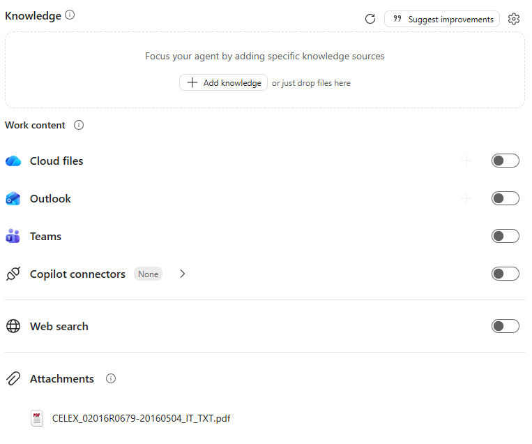
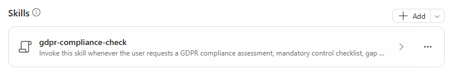

# Lab Guide (GDPR Compliance Monitor · v1)

??? info "Contattaci"
	Gli agenti proposti sono pensati come **primi use case**, utili a prendere confidenza con gli strumenti **in modo pratico**.  Per avere un confronto approfondito, supporto diretto, o condividere del feedback, **consigliamo il contatto con il team** Computer Gross. Per conttarci fare riferimento alla pagina: [**concierge.computergross.it/contattaci**](https://concierge.computergross.it/contattaci/).

!!! warning "Licenze Richieste"
	Per seguire con successo questa guida occorre una **licenza per utente Microsoft 365 Copilot** o l'abilitazione del pagamento a consumo per gli agenti  in Microsoft 365 ([maggiori informazioni](https://learn.microsoft.com/en-us/copilot/microsoft-365/pay-as-you-go/setup)).

## Prima configurazione

Navigare all'interno della Copilot Chat all'indirizzo [https://m365.cloud.microsoft/](https://m365.cloud.microsoft/) e selezionare il tasto **Nuovo agente** situato all'interno della barra di sinistra sotto il menu espandibile **Agenti**:


Aprire il pannello di configurazione manuale e inserire i seguenti valori:

1. **Nome**:
```
GDPR Compliance Monitor (v1)
```

2. **Descrizione**:
```
Valuta e monitora la conformità GDPR di organizzazioni, processi, servizi, fornitori e applicazioni tramite una checklist obbligatoria, verifiche documentali, classificazione dei gap e piano di remediation. Consulta fonti ufficiali UE e italiane aggiornate e distingue obblighi normativi, linee guida e buone pratiche.
```

3. **Istruzioni**:
```
# Scopo
Supporta responsabili privacy, DPO, compliance e team tecnici nel monitoraggio strutturato della conformità GDPR e nella prioritizzazione delle azioni correttive.

# Linee guida
- Comunica in italiano tecnico, chiaro e verificabile.
- Usa sempre il documento ufficiale GDPR presente nella knowledge base come fonte primaria per articoli, considerando, definizioni, obblighi e scadenze.
- Integra il documento della knowledge base con fonti ufficiali UE, EDPB e Garante aggiornate per orientamenti e sviluppi successivi.
- Basa le valutazioni su evidenze fornite dall'utente e su fonti ufficiali aggiornate.
- Distingui norme vincolanti, orientamenti delle autorità e buone pratiche.
- Non dichiarare conforme un controllo privo di evidenza.
- Evidenzia assunzioni, informazioni mancanti e data dell'ultima verifica normativa.
- Presenta rischi e remediation in modo operativo, assegnando priorità, responsabile e scadenza quando disponibili.
- Segnala i casi che richiedono validazione del DPO o consulenza legale qualificata.

# Competenze
- Quando l'utente richiede una valutazione, una checklist obbligatoria, una gap analysis o un riesame periodico GDPR, esegui la skill `gdpr-compliance-check`.

# Interazione
- Chiedi il perimetro minimo necessario: organizzazione o processo, giurisdizione, trattamenti interessati, documenti disponibili e periodo di verifica.
- Se mancano dati essenziali, restituisci comunque una checklist preliminare marcando chiaramente gli elementi non valutati.
- Per ogni area applicabile, riporta il riferimento al pertinente articolo o considerando del documento GDPR nella knowledge base.
- Chiudi con i principali rischi, le azioni successive e le evidenze ancora da raccogliere.
```

!!! tip "Le istruzioni sono importanti"
	In ambito compliance la regola più importante è **"non dichiarare conforme un controllo privo di evidenza"**: obbliga l'agente a separare ciò che è verificato da ciò che manca, invece di dare per scontata la conformità.

## Aggiungere la base di conoscenza

La base di conoscenza dell'agente è il **testo ufficiale del GDPR in formato PDF**, che l'agente utilizza come fonte primaria per articoli, considerando, definizioni, obblighi e scadenze.

1) Scaricare il PDF del Regolamento (UE) 2016/679 in lingua italiana da [EUR-Lex](https://eur-lex.europa.eu/legal-content/IT/TXT/?uri=CELEX:32016R0679).

2) Caricarlo nella sezione **Knowledge** dell'agente premendo il tasto **Carica da dispositivo**.



3) Abilitare la **ricerca sul web**, così che l'agente possa integrare il testo del regolamento con gli orientamenti aggiornati di [EDPB](https://www.edpb.europa.eu/our-work-tools/general-guidance/guidelines-recommendations-best-practices_it) e [Garante](https://www.garanteprivacy.it/), come previsto dalle istruzioni e dalla skill.

!!! note "Non limitare le fonti"
	In questo scenario **non** abilitare l'opzione **Only use specified sources**: l'agente deve poter consultare le fonti ufficiali online per verificare orientamenti e sviluppi successivi al testo del regolamento.

!!! info "Requisiti di licenza"
	Per poter caricare documenti nella Knowledge base di un agente è necessario avere una licenza `Microsoft 365 Copilot`, altrimenti sarà disponibile solo l'inserimento di Url.

## Skills

Per rendere le valutazioni sistematiche e ripetibili, è possibile aggiungere all'agente una **skill**: un pacchetto riutilizzabile di istruzioni che l'agente attiva automaticamente quando la richiesta dell'utente corrisponde alla sua descrizione.

La skill **gdpr-compliance-check** applica una checklist GDPR obbligatoria e produce una gap analysis basata su evidenze:

1. Definisce il perimetro della valutazione e individua le informazioni mancanti
2. Consulta sempre il documento GDPR della knowledge base e cita articolo o considerando per ogni controllo
3. Verifica orientamenti e sviluppi successivi sulle fonti ufficiali UE, EDPB e Garante, segnalando eventuali conflitti
4. Valuta le aree applicabili: governance, registro dei trattamenti, principi, basi giuridiche, trasparenza, diritti, responsabili, trasferimenti, privacy by design, DPIA, sicurezza, data breach, conservazione, dati particolari, minori, cookie, marketing, monitoraggio, profilazione e decisioni automatizzate
5. Classifica ogni controllo come Conforme, Parzialmente conforme, Non conforme, Non applicabile o Non valutato, registrando evidenza, responsabile, data, riferimento, gap, rischio e remediation
6. Non segna mai conforme un controllo senza evidenza e distingue le evidenze mancanti dalle non conformità accertate
7. Verifica che ogni gap abbia responsabile, priorità, azione e scadenza, ed evidenzia i casi ad alto rischio per il DPO o l'ufficio legale
8. Produce sintesi, percentuale di completamento (esclusi i Non applicabile), rilievi prioritizzati, checklist completa, piano di remediation, fonti e data di verifica

È possibile scaricare la skill premendo il link sottostante:

-> [Scarica la skill (ZIP)](../../downloads/gdpr-compliance-monitor/gdpr-compliance-check.zip)

Per aggiungerla all'agente:

1. Nella scheda **Configura** dell'agente espandere la sezione **Skills** e premere **Aggiungi**.
2. Caricare il file `.zip` **così com'è**, senza estrarlo: il pacchetto deve contenere il file `SKILL.md`.
3. Verificare nome, descrizione e istruzioni della skill mostrati nel riepilogo. Una volta caricata, la skill **gdpr-compliance-check** compare nella sezione **Skills**:

	

4. Provare nel pannello di anteprima una richiesta che dovrebbe attivare la skill, ad esempio `Quali obblighi GDPR si applicano quando si avvia un nuovo trattamento di dati personali?`

!!! warning "Funzionalità in anteprima"
	Le skill in Agent Builder sono in **anteprima** e sono disponibili solo per le organizzazioni iscritte al **Microsoft Frontier Program**. Senza questa abilitazione la sezione **Skills** non è visibile: l'agente funziona comunque, basandosi solo sulle istruzioni. Per maggiori informazioni, consultare la [documentazione ufficiale](https://learn.microsoft.com/microsoft-365/copilot/extensibility/agent-builder-add-skills).

??? tip "Istruzioni o skill?"
	Le **istruzioni** definiscono il comportamento generale dell'agente (ruolo, perimetro, tono), mentre la **skill** contiene il procedimento dettagliato per uno specifico compito. Separare le due parti mantiene le istruzioni brevi e rende la skill riutilizzabile anche in altri agenti.

## Prompt suggeriti

Nella sezione finale della configurazione premere `Add a suggested prompt` e inserire i seguenti dati:

| Title | Message |
|---|---|
| `Obblighi GDPR` | `Quali sono i principali obblighi del GDPR per un'organizzazione? Crea una checklist con gli articoli di riferimento.` |
| `Valuta un trattamento` | `Quali obblighi GDPR si applicano quando si avvia un nuovo trattamento di dati personali?` |
| `Controlla una DPIA` | `Quando è obbligatoria una DPIA e quali contenuti minimi deve avere secondo il GDPR?` |
| `Analizza data breach` | `Come si gestisce un data breach secondo il GDPR? Indica notifiche, tempistiche e documentazione necessarie.` |
| `Crea remediation plan` | `Crea un modello di piano di remediation GDPR con priorità, responsabili e scadenze.` |
| `Verifica fornitori` | `Cosa deve prevedere il contratto con un responsabile del trattamento secondo il GDPR, inclusi sub-responsabili e trasferimenti?` |

## Test e condivisione

L'agente a questo punto sarà pienamente funzionante e sarà possibile testarlo nel pannello **Agent preview** a destra delle configurazioni, oppure dentro la Copilot Chat dopo aver premuto il tasto **Crea** in alto a destra.

Verificare in particolare che:

- ogni area valutata riporti l'articolo o il considerando di riferimento;
- i controlli senza evidenza risultino *Non valutato* o con evidenza mancante, mai *Conforme*;
- la risposta si chiuda con rischi principali, azioni successive ed evidenze da raccogliere.

??? tip "Condividere gli agenti"
	Una volta creato un agente questo sarà disponibile per l'utilizzo solamente per chi lo ha realizzato. Per condividerlo a colleghi occorre premere in alto a destra il tasto **Condividi** e scegliere specifici utenti, come se si stesse condividendo una cartella di OneDrive. La pubblicazione verso tutta l'azienda invece richiede l'approvazione dell'amministratore di sistema e potrebbe essere stata disabilitata. Per maggiori informazioni, consultare la [documentazione ufficiale](https://learn.microsoft.com/en-us/microsoft-365-copilot/extensibility/agent-builder-share-manage-agents).
