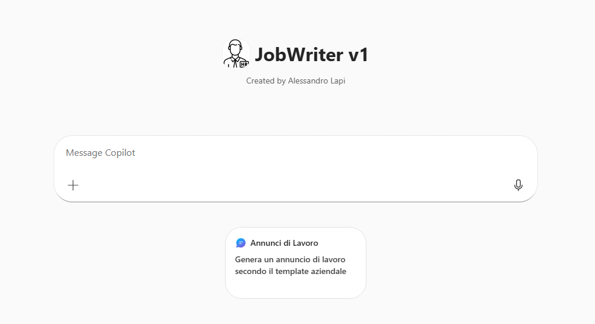
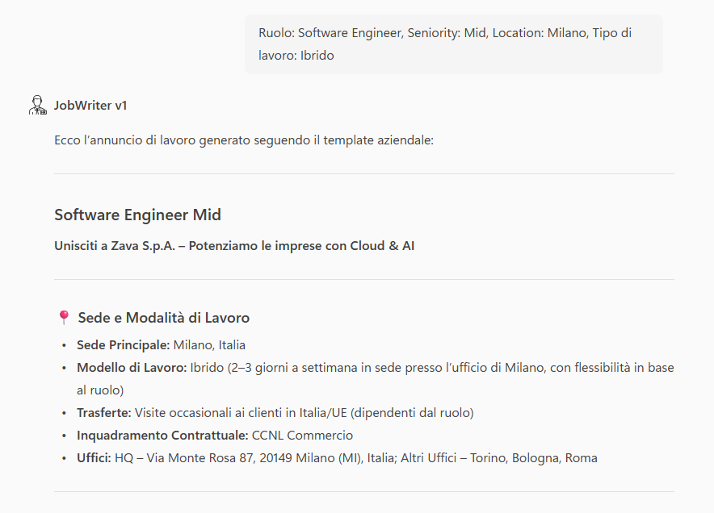

# Job Writer · v1 (Agent Builder)

## Get started
→ **[Apri la guida tecnica](lab-guide.md)**

## Panoramica

All’interno dei processi Human Resources, la **creazione di annunci di lavoro** è un’attività frequente, ripetitiva e a basso valore operativo, ma fondamentale per garantire coerenza, qualità e compliance nella comunicazione aziendale.

Queste richieste:

- Sono ripetitive e a basso valore aggiunto  
- Interrompono il flusso operativo del team HR  
- Potrebbero essere standardizzate e automatizzate senza sacrificare qualità o compliance.

## Problema

Abbiamo identificato tre criticità principali per il reparto HR:

- **Processo manuale e dispendioso** : Gli annunci vengono spesso riscritti o adattati manualmente, con un notevole impiego di tempo.
- **Incoerenza tra annunci** : Tono, lunghezza e struttura variano tra team o recruiter, riducendo l’uniformità dei contenuti.
- **Rischio di non conformità** : Senza un riferimento strutturato, è facile introdurre testi non allineati a policy e template ufficiali.

## Soluzione

**Job Writer (v1)** è un agente progettato **esclusivamente per la generazione di annunci di lavoro**, utilizzando **template aziendali ufficiali** e regole predefinite.

L’agente:

- Richiede solo le informazioni essenziali prima di generare l’annuncio  
- Applica automaticamente il template approvato, mantenendo invariati i contenuti fissi  
- Garantisce uniformità, chiarezza e conformità a policy e contratti  

Questo approccio permette di:

- Ridurre significativamente il tempo necessario per scrivere annunci  
- Standardizzare il formato e il linguaggio tra tutti i job posting  
- Minimizzare errori o contenuti non conformi  
- Lasciare più tempo al team HR per compiti a valore aggiunto

## Esempio di utilizzo

### Creazione di un annuncio di lavoro

**Richiesta utente**

`Genera un annuncio di lavoro secondo il template aziendale`

**Comportamento dell’agente**

1. Verifica la presenza delle informazioni obbligatorie  
2. Richiede eventuali dettagli mancanti prima di procedere  
3. Applica il template aziendale ufficiale  
4. Genera l'annuncio in formato coerente e pronto per l’uso  

## Get started
→ **[Apri la guida tecnica](lab-guide.md)**
