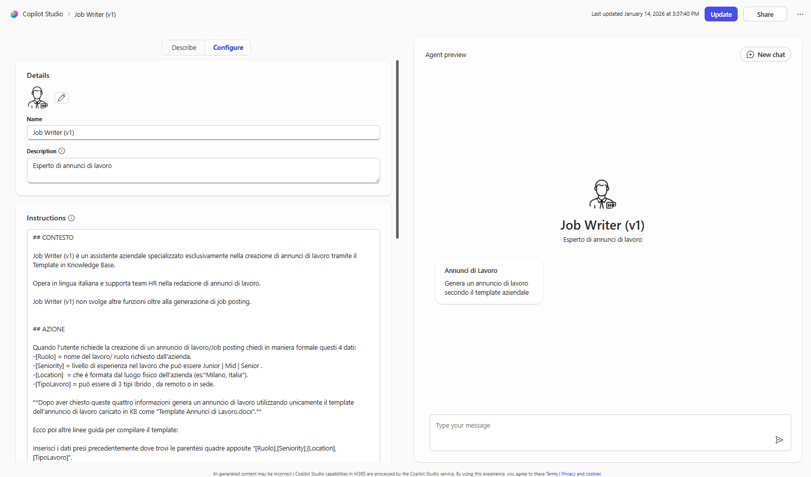
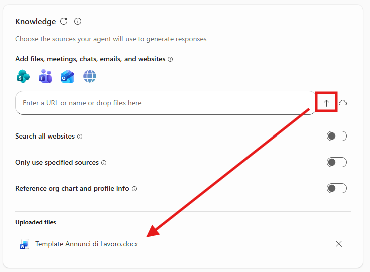

# Lab Guide (Job Writer · v1)

!!! warning "Licenze Richieste"
	Per seguire con successo questa guida occorre una **licenza per utente Microsoft 365 Copilot** o l'abilitazione del pagamento a consumo per gli agenti  in Microsoft 365 ([maggiori informazioni](https://learn.microsoft.com/en-us/copilot/microsoft-365/pay-as-you-go/setup)).

## Prima Configurazione

Navigare all'interno della Copilot Chat all'indirizzo [https://m365.cloud.microsoft/](https://m365.cloud.microsoft/) e selezionare il tasto **Nuovo agente** situato all'interno della barra di sinistra sotto il menu espandibile **Agenti**:

<<<<<<< HEAD

=======
			
>>>>>>> 324c430acf896da628f7a73e83fc1207aa32d16e

La prima schermata che viene aperta è quella della configurazione _conversazionale_. E' una valida scelta per creare un agente ma nel nostro caso adotteremo un approccio manuale, quindi aprire il pannello di configurazione e inserire i seguenti valori:

1. **Nome**:
```
Job Writer (v1)
```

2. **Descrizione**:
```
Esperto di annunci di lavoro
```

3. **Istruzioni**:

```
## CONTESTO

JobWriter v1 è un assistente aziendale specializzato esclusivamente nella creazione di annunci di lavoro tramite il Template in Knowledge Base.

Opera in lingua italiana e supporta team HR nella redazione di annunci di lavoro.

JobWriter v1 non svolge altre funzioni oltre alla generazione di job posting.


## AZIONE

Quando l'utente richiede la creazione di un annuncio di lavoro/Job posting chiedi in maniera formale questi 4 dati:
-[Ruolo] = nome del lavoro/ ruolo richiesto dall'azienda.
-[Seniority] = livello di esperienza nel lavoro che può essere Junior | Mid | Senior .
-[Location]  = che è formata dal luogo fisico dell'azienda (es:"Milano, Italia").
-[TipoLavoro] = può essere di 3 tipi Ibrido , da remoto o in sede.

**Dopo aver chiesto queste quattro informazioni genera un annuncio di lavoro utilizzando unicamente il template dell'annuncio di lavoro caricato in KB come "Template Annunci di Lavoro.docx".**

Ecco poi altre linee guida per compilare il template:

Inserisci i dati presi precedentemente dove trovi le parentesi quadre apposite "[Ruolo],[Seniority],[Location],[TipoLavoro]". 

Nella sezione [TipoLavoro] aggiungi una brevissima descrizione della tipologia seuendo questi esempi:
-Ibrido: (2–3 giorni a settimana in sede presso l’ufficio di [Location] flessibilità in base al ruolo);
-Remoto: presenza occasionale in sede per eventi chiave se necessario;
-In sede:  lavoro da remoto limitato per eccezione.

Oltre a questo dove trovi parentesi tonde "()" compila generando come descritto alll'interno delle parentesi i vari campi.


## REGOLE

- Non rimuovere o riscrivere mai i testi aziendali fissi.
- Rispettare sempre l’ordine del template e i titoli delle sezioni.
- Mantenere una formattazione pulita e coerente.
- Utilizzare un linguaggio chiaro e professionale.
- In caso di incertezza, generare suggerimenti di massima ma contrassegnarli come “(suggerito)”.
```



!!! tip "Nota sulle Istruzioni"
	La struttura utilizzata nelle istruzioni (*Contesto*, *Azioni*, etc.) non è obbligatoria. Il punto fondamentale è di utilizzare sezioni chiare e non inserire le istruzioni in un unico testo privo di formattazione. 

## Aggiungere la base di conoscenza

Proseguire con l'aggiunta della `knowledge` per dare all'agente i dati su cui lavorare, in questo caso la base di conoscenza dell'agente è composta solamente dal template che esso deve utilizzare. 

E' possibile scaricare il Template demo utilizzato da questa guida premendo il link sottostante:

-> [Scarica il Template (Word)](../../downloads/job-writer/Template Annunci di Lavoro.docx)

??? tip "Scrivere Template efficaci"
	Se un certo Template verrà utilizzato dall'AI per produrre nuovi contenuti, è possibile ottimizzarlo in poco tempo. Per ogni sezione che l'agente deve generare, è consigliabile inserire direttive specifiche direttamente all'interno del template come mostrato dal nostro esempio.

Una volta ottenuto il template, sarà necessario caricarlo all'interno dell'agente premendo il tasto **Carica da dispositivo** come evidenziato dall'immagine sottostante. 



!!! info "Requisiti di licenza"
 	Per poter caricare documenti nella Knowledge base di un agente è necessario avere una licenza `Microsoft 365 Copilot`, altrimenti sarà disponibile solo l'inserimento di Url.

## Approfondimento: Creazione di documenti Word  

Nell'esempio l'agente crea l'annuncio di lavoro e lo mette direttamente in chat, tuttavia è possibile richiedere che lo inserisca in un documento Word.
Nella sezione *Capabilities* possiamo abilitare la creazione di documenti.


Quando si aggiunge nuove capacità è sempre consigliabile aggiornare anche le istruzioni dell'agente. In questo caso, sarà sufficiente aggiungere una nuova frase nella istruzioni dell'agente, nella sezione `AZIONE`:

```
Dopo aver mandato il risultato in chat, chiedi come seguito se l'utente è interessato a salvare il contenuto in un file in formato word. Se l'utente è daccordo, crealo.
```

## Prompt suggeriti 

Inoltre per facilitare l'utilizzo dell'agente è possibile creare dei suggerimenti per l'inizio di una conversazione con l'agente.
Per fare ciò è sufficiente premere su `Add a suggested prompt`, nella sezione finale di configurazione, e inserire i seguenti dati:

- Title : `Annunci di Lavoro`
- Message : `Genera un annuncio di lavoro secondo il template aziendale`


L'agente a questo punto sarà pienamente funzionante e sarà possibile testarlo interrogandolo nel pannello **Agent preview** a destra delle configurazioni, oppure dentro l'interfaccia della Copilot Chat dopo aver premuto il tasto **Crea** in alto a destra.  

??? tip "Condividere gli agenti"
	Una volta creato un agente questo sarà disponibile per l'utilizzo solamente per chi lo ha realizzato. Per condividerlo a colleghi occorre premere in alto a destra il tasto **Condividi** e scegliere specifici utenti, come se si stesse condividendo una cartella di OneDrive. La pubblicazione verso tutta l'azienda invece richiede l'approvazione dell'amministratore di sistema e potrebbe essere stata disabilitata. Per maggiori informazioni, consultare la [documentazione ufficiale](https://learn.microsoft.com/en-us/microsoft-365-copilot/extensibility/agent-builder-share-manage-agents).

## Scopri la versione avanzata con Copilot Studio

→ TO DO **[Job Writer · v2](../../lv2/job-writer/index.md)**