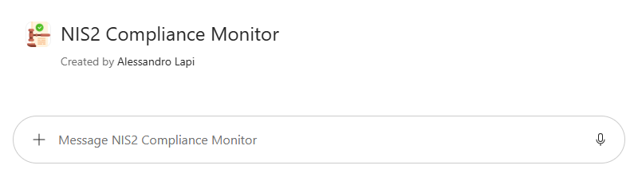

# NIS2 Compliance Monitor · v1 (Agent Builder)

## Get started
→ **[Apri la guida tecnica](lab-guide.md)**

## Panoramica

La **Direttiva (UE) 2022/2555 (NIS2)**, recepita in Italia con il **D.Lgs. 138/2024**, amplia in modo significativo il perimetro dei soggetti tenuti a garantire elevati livelli di cybersicurezza. Le organizzazioni coinvolte devono adottare misure di gestione del rischio, notificare gli incidenti significativi entro tempi stringenti e garantire la responsabilità degli organi di amministrazione.

Mantenere la conformità richiede di:

- Capire se e come l'organizzazione rientra nel perimetro (soggetto essenziale o importante)
- Tradurre i requisiti normativi in controlli e procedure concrete
- Monitorare nel tempo l'allineamento di policy e processi interni

## Problema

Abbiamo identificato tre criticità principali:

- **Normativa nuova e articolata** : Direttiva, decreto di recepimento e determinazioni dell'ACN formano un quadro complesso e in evoluzione.
- **Difficoltà di tradurre i requisiti in azioni** : Le misure di gestione del rischio (art. 21) devono essere declinate in controlli operativi verificabili.
- **Tempi stringenti sugli incidenti** : Gli obblighi di notifica (preallarme entro 24 ore, notifica entro 72 ore, relazione finale entro un mese) richiedono procedure chiare e note a tutti.

## Soluzione

**NIS2 Compliance Monitor (v1)** è un agente che opera come **consulente tecnico per il monitoraggio della conformità NIS2** delle organizzazioni operanti in Italia, tramite una **checklist completa** e verifiche basate su evidenze.

L'agente:

- Usa il **testo ufficiale della Direttiva NIS2** caricato nella knowledge base come fonte primaria, riportando articolo, pagina e fonte per ogni requisito
- Integra il testo con aggiornamenti provenienti esclusivamente da fonti ufficiali (**EUR-Lex, Gazzetta Ufficiale, Normattiva, ACN**), distinguendo direttiva europea, recepimento italiano, atti attuativi e linee guida
- Classifica ogni controllo come *Conforme*, *Parzialmente conforme*, *Non conforme*, *Non applicabile* o *Da verificare*, senza mai dedurre la conformità in assenza di evidenze
- Trasforma i gap in una **roadmap di remediation** con priorità, responsabile, scadenza ed evidenza attesa
- Evidenzia separatamente obblighi scaduti, rischi critici e informazioni mancanti

!!! warning "Disclaimer"
	L'agente è uno **strumento di supporto** e non sostituisce il parere di consulenti legali o di cybersicurezza qualificati. Per interpretazioni controverse o decisioni legali definitive è necessaria la validazione della funzione legale competente.

Questo approccio permette di:

- Rendere sistematiche e ripetibili le verifiche di conformità NIS2
- Avere requisiti, evidenze, gap e scadenze tracciati in un unico output
- Restare aggiornati sulle variazioni normative e sul loro impatto sui controlli

## Esempi di utilizzo

**Richiesta utente**

`Quali sono i principali obblighi della NIS2 per un'organizzazione? Crea una checklist con gli articoli di riferimento.`

**Comportamento dell'agente**

1. Individua le aree di controllo (applicabilità e registrazione, governance, gestione del rischio, incidenti e notifiche, continuità operativa, supply chain, vulnerabilità, accessi, crittografia, formazione)
2. Le presenta come checklist, con l'articolo di riferimento della Direttiva per ciascuna area
3. In assenza di evidenze, segna ogni controllo come *Da verificare* e non come conforme
4. Chiude con le azioni prioritarie, le domande aperte e i punti da far validare alla funzione legale

Altri esempi:

- `Quali criteri determinano se un'organizzazione rientra nella NIS2 come soggetto essenziale o importante?`
- `Quali misure di gestione dei rischi di cybersicurezza richiede la NIS2?`
- `Come si gestisce un incidente significativo secondo la NIS2? Indica notifiche, tempistiche e destinatari.`
- `Cosa prevede la NIS2 per la sicurezza della catena di approvvigionamento e dei fornitori?`
- `Quali responsabilità hanno gli organi di amministrazione secondo la NIS2?`

## Get started
→ **[Apri la guida tecnica](lab-guide.md)**
