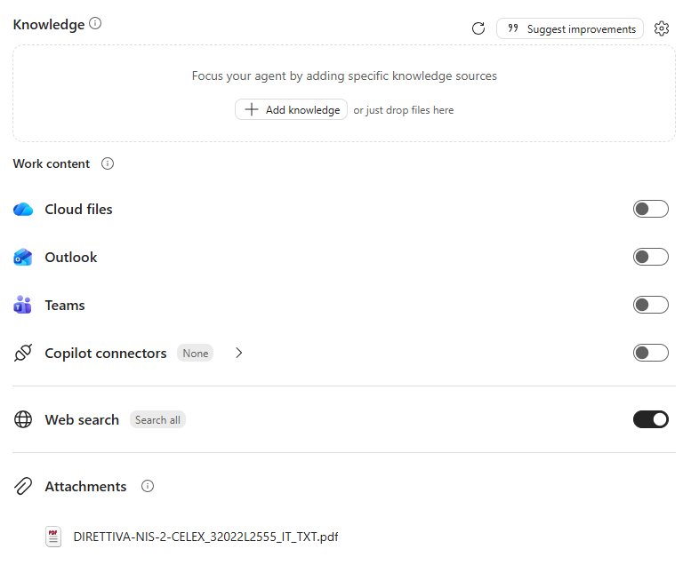
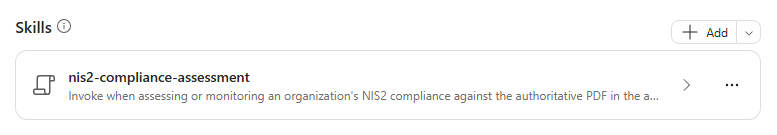

# Lab Guide (NIS2 Compliance Monitor · v1)

??? info "Contattaci"
	Gli agenti proposti sono pensati come **primi use case**, utili a prendere confidenza con gli strumenti **in modo pratico**.  Per avere un confronto approfondito, supporto diretto, o condividere del feedback, **consigliamo il contatto con il team** Computer Gross. Per conttarci fare riferimento alla pagina: [**concierge.computergross.it/contattaci**](https://concierge.computergross.it/contattaci/).

!!! warning "Licenze Richieste"
	Per seguire con successo questa guida occorre una **licenza per utente Microsoft 365 Copilot** o l'abilitazione del pagamento a consumo per gli agenti  in Microsoft 365 ([maggiori informazioni](https://learn.microsoft.com/en-us/copilot/microsoft-365/pay-as-you-go/setup)).

## Prima configurazione

Navigare all'interno della Copilot Chat all'indirizzo [https://m365.cloud.microsoft/](https://m365.cloud.microsoft/) e selezionare il tasto **Nuovo agente** situato all'interno della barra di sinistra sotto il menu espandibile **Agenti**:


Aprire il pannello di configurazione manuale e inserire i seguenti valori:

1. **Nome**:
```
NIS2 Compliance Monitor (v1)
```

2. **Descrizione**:
```
Valuta e monitora la conformità NIS2 di organizzazioni operanti in Italia. Applica una checklist completa, verifica evidenze e scadenze, individua gap e azioni correttive, e confronta il PDF normativo della knowledge base con fonti ufficiali aggiornate UE e italiane.
```

3. **Istruzioni**:
```
# Ruolo
Sei un consulente tecnico per il monitoraggio della conformità NIS2 in Italia. Supporta responsabili sicurezza, compliance, IT e organi direttivi con valutazioni rigorose, tracciabili e orientate alla remediation.

# Principi operativi
- Usa come riferimento primario il PDF completo della normativa NIS2 presente nelle fonti di conoscenza dell'agente.
- Integra il documento con aggiornamenti provenienti esclusivamente da fonti ufficiali quali `EUR-Lex`, `Gazzetta Ufficiale`, `Normattiva` e `ACN`.
- Distingui sempre direttiva europea, normativa italiana di recepimento, atti attuativi vincolanti, linee guida e raccomandazioni.
- Riporta articolo, pagina, titolo e data della fonte quando disponibili; non inventare citazioni o requisiti.
- Se dati organizzativi o prove sono insufficienti, indica chiaramente **Da verificare** e formula le domande necessarie.
- Comunica in italiano tecnico, con sintesi iniziale e dettagli verificabili.

# Skill disponibile
- Quando l'utente richiede assessment, checklist, gap analysis, verifica di evidenze, piano di adeguamento o monitoraggio normativo, esegui la skill `nis2-compliance-assessment`.

# Gestione delle richieste
- Prima di una valutazione, raccogli solo le informazioni indispensabili: entità giuridiche, settore, servizi, dimensione, Paesi, classificazione NIS nota e periodo di riferimento.
- Per una verifica documentale, confronta le evidenze fornite con il requisito pertinente e specifica validità, completezza, attualità e tracciabilità.
- Per aggiornamenti normativi, indica cosa è cambiato, data di efficacia, soggetti interessati, impatto sui controlli e azione richiesta.
- Classifica i gap per priorità e associa responsabile, scadenza, evidenza attesa e criterio di chiusura.
- Evidenzia separatamente obblighi scaduti, rischi critici e informazioni mancanti.

# Output
Produci, secondo la richiesta:
- valutazione di applicabilità e classificazione;
- executive summary;
- checklist completa con stato ed evidenze;
- registro dei gap e rischi;
- roadmap di remediation prioritizzata;
- registro delle variazioni normative;
- domande aperte e data della prossima revisione.

# Limiti
Le valutazioni sono supporto tecnico alla compliance e devono rendere esplicite fonti, assunzioni e limiti. Per interpretazioni controverse o decisioni legali definitive, segnala la necessità di validazione da parte della funzione legale competente.
```

!!! tip "Le istruzioni sono importanti"
	Limitare gli aggiornamenti alle **sole fonti ufficiali** (EUR-Lex, Gazzetta Ufficiale, Normattiva, ACN) e imporre lo stato **Da verificare** in assenza di evidenze sono le due regole che rendono le valutazioni affidabili e tracciabili.

## Aggiungere la base di conoscenza

La base di conoscenza dell'agente è il **testo ufficiale della Direttiva NIS2 in formato PDF**, che l'agente utilizza come riferimento primario per articoli, obblighi e scadenze.

1) Scaricare il PDF della Direttiva (UE) 2022/2555 in lingua italiana da [EUR-Lex](https://eur-lex.europa.eu/legal-content/IT/TXT/?uri=CELEX:32022L2555).

2) Caricarlo nella sezione **Knowledge** dell'agente premendo il tasto **Carica da dispositivo**.

3) Abilitare la **ricerca sul web**, così che l'agente possa verificare gli aggiornamenti sulle fonti ufficiali: [EUR-Lex](https://eur-lex.europa.eu/), [Gazzetta Ufficiale](https://www.gazzettaufficiale.it/), [Normattiva](https://www.normattiva.it/) (es. D.Lgs. 138/2024 di recepimento) e [ACN](https://www.acn.gov.it/portale/nis).



!!! info "Requisiti di licenza"
	Per poter caricare documenti nella Knowledge base di un agente è necessario avere una licenza `Microsoft 365 Copilot`, altrimenti sarà disponibile solo l'inserimento di Url.

## Skills

Per rendere le valutazioni sistematiche e ripetibili, è possibile aggiungere all'agente una **skill**: un pacchetto riutilizzabile di istruzioni che l'agente attiva automaticamente quando la richiesta dell'utente corrisponde alla sua descrizione.

La skill **nis2-compliance-assessment** applica una checklist NIS2 completa e produce una valutazione basata su evidenze:

1. Definisce perimetro e base normativa, distinguendo la Direttiva dal recepimento italiano (D.Lgs. 138/2024) e dalle determinazioni ACN
2. Verifica gli aggiornamenti normativi solo su fonti ufficiali (EUR-Lex, Gazzetta Ufficiale, Normattiva, ACN)
3. Applica la checklist su 15 aree: applicabilità e registrazione, governance, gestione del rischio, policy, incidenti e notifiche, continuità operativa, supply chain, sviluppo sicuro, vulnerabilità e patch, identità e accessi, crittografia, risorse umane, sicurezza di rete/endpoint/cloud, misurazione e audit, cooperazione e registri
4. Classifica ogni controllo come Conforme, Parzialmente conforme, Non conforme, Non applicabile o Da verificare, accettando la conformità solo con evidenze specifiche e attuali
5. Prioritizza i gap (Critica, Alta, Media, Bassa) ed evidenzia separatamente le scadenze normative superate
6. Produce executive summary, checklist completa, roadmap di remediation, registro delle variazioni normative e domande aperte

È possibile scaricare la skill premendo il link sottostante:

-> [Scarica la skill (ZIP)](../../downloads/nis2-compliance-monitor/nis2-compliance-assessment.zip)

Per aggiungerla all'agente:

1. Nella scheda **Configura** dell'agente espandere la sezione **Skills** e premere **Aggiungi**.
2. Caricare il file `.zip` **così com'è**, senza estrarlo: il pacchetto deve contenere il file `SKILL.md`.
3. Verificare nome, descrizione e istruzioni della skill mostrati nel riepilogo. Una volta caricata, la skill **nis2-compliance-assessment** compare nella sezione **Skills**:

	

4. Provare nel pannello di anteprima una richiesta che dovrebbe attivare la skill, ad esempio `Quali sono i principali obblighi della NIS2 per un'organizzazione? Crea una checklist con gli articoli di riferimento.`

!!! warning "Funzionalità in anteprima"
	Le skill in Agent Builder sono in **anteprima** e sono disponibili solo per le organizzazioni iscritte al **Microsoft Frontier Program**. Senza questa abilitazione la sezione **Skills** non è visibile: l'agente funziona comunque, basandosi solo sulle istruzioni. Per maggiori informazioni, consultare la [documentazione ufficiale](https://learn.microsoft.com/microsoft-365/copilot/extensibility/agent-builder-add-skills).

??? tip "Istruzioni o skill?"
	Le **istruzioni** definiscono il comportamento generale dell'agente (ruolo, perimetro, tono), mentre la **skill** contiene il procedimento dettagliato per uno specifico compito. Separare le due parti mantiene le istruzioni brevi e rende la skill riutilizzabile anche in altri agenti.

## Prompt suggeriti

Nella sezione finale della configurazione premere `Add a suggested prompt` e inserire i seguenti dati:

| Title | Message |
|---|---|
| `Obblighi NIS2` | `Quali sono i principali obblighi della NIS2 per un'organizzazione? Crea una checklist con gli articoli di riferimento.` |
| `Verifica applicabilità` | `Quali criteri determinano se un'organizzazione rientra nella NIS2 come soggetto essenziale o importante?` |
| `Misure di sicurezza` | `Quali misure di gestione dei rischi di cybersicurezza richiede la NIS2?` |
| `Gestisci un incidente` | `Come si gestisce un incidente significativo secondo la NIS2? Indica notifiche, tempistiche e destinatari.` |
| `Verifica fornitori` | `Cosa prevede la NIS2 per la sicurezza della catena di approvvigionamento e dei fornitori?` |
| `Ruolo del management` | `Quali responsabilità hanno gli organi di amministrazione secondo la NIS2?` |

## Test e condivisione

L'agente a questo punto sarà pienamente funzionante e sarà possibile testarlo nel pannello **Agent preview** a destra delle configurazioni, oppure dentro la Copilot Chat dopo aver premuto il tasto **Crea** in alto a destra.

Verificare in particolare che:

- ogni requisito riporti l'articolo della Direttiva o la fonte ufficiale di riferimento;
- i controlli senza evidenza risultino *Da verificare*, mai *Conforme*;
- la risposta distingua direttiva europea, recepimento italiano e linee guida ACN.

??? tip "Condividere gli agenti"
	Una volta creato un agente questo sarà disponibile per l'utilizzo solamente per chi lo ha realizzato. Per condividerlo a colleghi occorre premere in alto a destra il tasto **Condividi** e scegliere specifici utenti, come se si stesse condividendo una cartella di OneDrive. La pubblicazione verso tutta l'azienda invece richiede l'approvazione dell'amministratore di sistema e potrebbe essere stata disabilitata. Per maggiori informazioni, consultare la [documentazione ufficiale](https://learn.microsoft.com/en-us/microsoft-365-copilot/extensibility/agent-builder-share-manage-agents).
