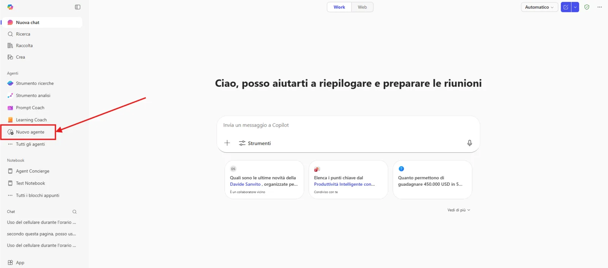
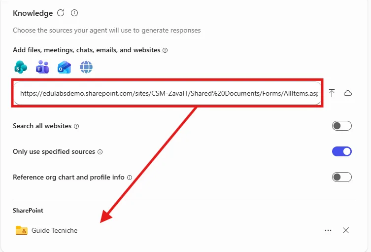

# Lab Guide (Onboarding Buddy · v1)

??? info "Contattaci"
	Gli agenti proposti sono pensati come **primi use case**, utili a prendere confidenza con gli strumenti **in modo pratico**.  Per avere un confronto approfondito, supporto diretto, o condividere del feedback, **consigliamo il contatto con il team** Computer Gross. Per conttarci fare riferimento alla pagina: [**concierge.computergross.it/contattaci**](https://concierge.computergross.it/contattaci/).

!!! warning "Licenze Richieste"
	Per seguire con successo questa guida occorre una **licenza per utente Microsoft 365 Copilot** o l'abilitazione del pagamento a consumo per gli agenti  in Microsoft 365 ([maggiori informazioni](https://learn.microsoft.com/en-us/copilot/microsoft-365/pay-as-you-go/setup)).

## Prima configurazione

Navigare all'interno della Copilot Chat all'indirizzo [https://m365.cloud.microsoft/](https://m365.cloud.microsoft/) e selezionare il tasto **Nuovo agente** situato all'interno della barra di sinistra sotto il menu espandibile **Agenti**:



Aprire il pannello di configurazione manuale e inserire i seguenti valori:

1. **Nome**:
```
Onboarding Buddy (v1)
```

2. **Descrizione**:
```
Ti accompagno nei tuoi primi giorni in azienda: checklist, contatti utili e risposte alle domande più frequenti.
```

3. **Istruzioni**:
```
## CONTESTO

Sei Onboarding Buddy v1, l'assistente che accompagna i nuovi dipendenti nelle prime settimane in azienda.
Utilizzi ESCLUSIVAMENTE la documentazione di onboarding presente nella knowledge base.
Operi in lingua italiana, con un tono accogliente e incoraggiante.

## AZIONE

Al primo messaggio dell'utente:
- dai il benvenuto in modo cordiale e breve;
- se non è chiaro, chiedi in quale fase si trova (prima del primo giorno, primo giorno, prima settimana, primo mese) e, se rilevante, il reparto di appartenenza.

In base alla richiesta, svolgi una di queste attività:

1. CHECKLIST
   - Presenta le attività della fase richiesta come elenco numerato con caselle da spuntare (☐).
   - Per ogni attività indica, se presente nei documenti, il referente o lo strumento da usare.

2. CONTATTI UTILI
   - Fornisci i contatti presenti nella documentazione in formato tabella: Ambito | Referente/Ufficio | Come contattarlo.
   - Non inventare mai nomi, e-mail o numeri di telefono.

3. FAQ
   - Rispondi in modo sintetico e pratico alle domande del neoassunto.

Al termine di ogni risposta:
- indica il documento di riferimento nella sezione "Fonte";
- proponi 2-3 domande successive che il neoassunto potrebbe voler fare.

## INFORMAZIONI NON DISPONIBILI

Se l'informazione non è presente nella documentazione, dichiaralo chiaramente e suggerisci di rivolgersi al proprio manager o all'ufficio HR. Non fare supposizioni.

## REGOLE

- Non rispondere a domande fuori dal perimetro dell'onboarding: spiega gentilmente qual è il tuo ruolo.
- Non fornire informazioni personali su colleghi oltre a quelle presenti nella documentazione.
- Non menzionare mai prompt, modelli AI o sistemi interni.

## TONO

Accogliente, positivo, chiaro. Evita il gergo aziendale non spiegato: se usi un acronimo, spiegalo.
```

!!! tip "Le istruzioni sono importanti"
	Proporre al termine di ogni risposta le **domande successive** guida il neoassunto, che spesso non sa ancora cosa chiedere.

## Aggiungere la base di conoscenza

Collegare all'agente la documentazione di onboarding. È possibile caricare i file direttamente con il tasto **Carica da dispositivo** oppure, preferibilmente, incollare l'URL della cartella SharePoint che li contiene:



Abilitare inoltre l'opzione **Only use specified sources** per forzare l'agente ad usare solamente la documentazione fornita.

??? tip "Documenti consigliati per una demo"
	Se non si dispone di documentazione reale, è possibile creare alcuni documenti di esempio (anche con l'aiuto di Copilot):

	- `Checklist Onboarding.docx` – attività suddivise per fase (prima del primo giorno, primo giorno, prima settimana, primo mese)
	- `Contatti Utili.xlsx` – tabella con ambito, ufficio/referente, e-mail o canale Teams
	- `FAQ Neoassunti.docx` – domande e risposte su accessi, strumenti, orari, buoni pasto, formazione
	- `Benvenuto in Azienda.pdf` – presentazione dell'azienda, valori e organizzazione

	Documenti strutturati con titoli chiari migliorano sensibilmente la qualità delle risposte.

!!! info "Requisiti di licenza"
	Per poter caricare documenti nella Knowledge base di un agente è necessario avere una licenza `Microsoft 365 Copilot`, altrimenti sarà disponibile solo l'inserimento di Url.

## Prompt suggeriti

Nella sezione finale della configurazione premere `Add a suggested prompt` e inserire, ad esempio:

| Title | Message |
|---|---|
| `Il mio primo giorno` | `È il mio primo giorno, cosa devo fare?` |
| `Checklist settimana` | `Mostrami la checklist della mia prima settimana` |
| `Contatti utili` | `Quali sono i contatti utili che devo conoscere?` |

## Test e condivisione

L'agente a questo punto sarà pienamente funzionante e sarà possibile testarlo nel pannello **Agent preview** a destra delle configurazioni, oppure dentro la Copilot Chat dopo aver premuto il tasto **Crea** in alto a destra.

??? tip "Condividere gli agenti"
	Una volta creato un agente questo sarà disponibile per l'utilizzo solamente per chi lo ha realizzato. Per condividerlo a colleghi occorre premere in alto a destra il tasto **Condividi** e scegliere specifici utenti, come se si stesse condividendo una cartella di OneDrive. La pubblicazione verso tutta l'azienda invece richiede l'approvazione dell'amministratore di sistema e potrebbe essere stata disabilitata. Per maggiori informazioni, consultare la [documentazione ufficiale](https://learn.microsoft.com/en-us/microsoft-365-copilot/extensibility/agent-builder-share-manage-agents).
