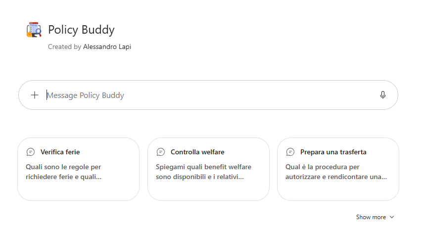
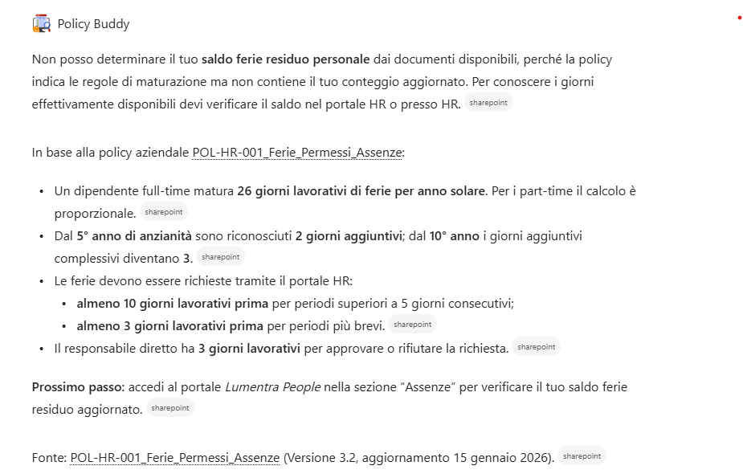

# Policy Buddy · v1 (Agent Builder)

## Get started
→ **[Apri la guida tecnica](lab-guide.md)**

## Panoramica

In ogni azienda i dipendenti hanno domande ricorrenti su **ferie, permessi, welfare, trasferte, rimborsi spese e procedure interne**. Le risposte esistono già, ma sono distribuite in regolamenti, policy e circolari pubblicati su SharePoint.

Queste richieste:

- Sono frequenti e ripetitive
- Ricadono quasi sempre sugli stessi referenti HR, Amministrazione o Office Management
- Richiedono di consultare documenti lunghi per trovare un singolo dettaglio

## Problema

Abbiamo identificato tre criticità principali:

- **Informazioni difficili da trovare** : Le policy sono spesso lunghe, aggiornate nel tempo e sparse in più librerie documentali.
- **Carico sui team di riferimento** : HR e Amministrazione ricevono continuamente le stesse domande via e-mail o chat.
- **Risposte non verificabili** : Le risposte informali "a memoria" non citano la fonte e possono essere obsolete o imprecise.

## Soluzione

**Policy Buddy (v1)** è un agente progettato **esclusivamente per rispondere a domande sulle policy e procedure interne**, utilizzando come fonte unica i documenti aziendali pubblicati su SharePoint.

L'agente:

- Risponde in modo sintetico e operativo alle domande dei dipendenti
- **Cita sempre il documento** (e, quando possibile, la sezione) da cui proviene l'informazione
- Dichiara esplicitamente quando un'informazione non è presente nella documentazione, indicando a chi rivolgersi
- Rispetta i permessi di SharePoint: ogni utente ottiene risposte solo dai documenti a cui ha accesso

Questo approccio permette di:

- Ridurre le richieste ripetitive verso HR e Amministrazione
- Dare ai dipendenti risposte immediate e tracciabili
- Mantenere un'unica fonte di verità: aggiornando il documento su SharePoint, si aggiorna anche l'agente

## Esempi di utilizzo

**Richiesta utente**

`Quanti giorni di ferie ho a disposizione e con quanto anticipo devo richiederle?`

**Comportamento dell'agente**

1. Cerca la risposta nei documenti di policy collegati
2. Restituisce una risposta sintetica e strutturata
3. Riporta la citazione del documento di riferimento
4. Se l'informazione non è disponibile, lo dichiara e indica il referente corretto

Altri esempi:

- `Qual è il massimale di rimborso per un pranzo in trasferta?`
- `Come funziona la piattaforma welfare e quali servizi posso acquistare?`
- `Qual è la procedura per richiedere un'auto aziendale?`

## Get started
→ **[Apri la guida tecnica](lab-guide.md)**
