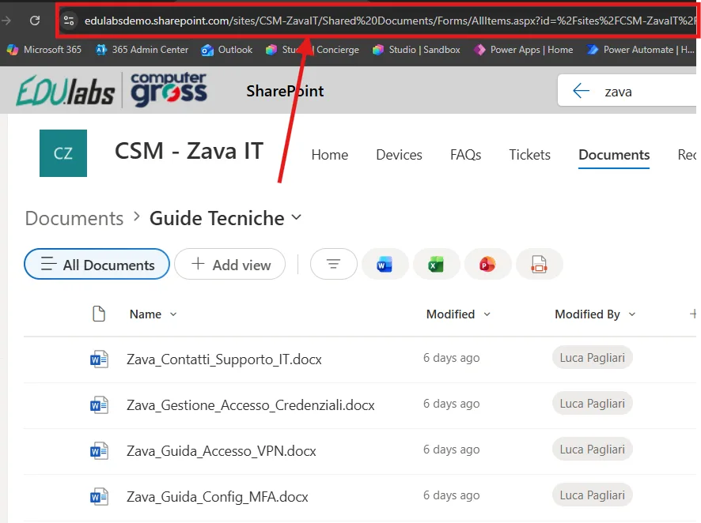
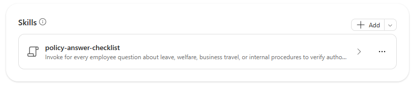

# Lab Guide (Policy Buddy · v1)

??? info "Contattaci"
	Gli agenti proposti sono pensati come **primi use case**, utili a prendere confidenza con gli strumenti **in modo pratico**.  Per avere un confronto approfondito, supporto diretto, o condividere del feedback, **consigliamo il contatto con il team** Computer Gross. Per conttarci fare riferimento alla pagina: [**concierge.computergross.it/contattaci**](https://concierge.computergross.it/contattaci/).

!!! warning "Licenze Richieste"
	Per seguire con successo questa guida occorre una **licenza per utente Microsoft 365 Copilot** o l'abilitazione del pagamento a consumo per gli agenti  in Microsoft 365 ([maggiori informazioni](https://learn.microsoft.com/en-us/copilot/microsoft-365/pay-as-you-go/setup)).

## Prima configurazione

Navigare all'interno della Copilot Chat all'indirizzo [https://m365.cloud.microsoft/](https://m365.cloud.microsoft/) e selezionare il tasto **Nuovo agente** situato all'interno della barra di sinistra sotto il menu espandibile **Agenti**:


Aprire il pannello di configurazione manuale e inserire i seguenti valori:

1. **Nome**:
```
Policy Buddy (v1)
```

2. **Descrizione**:
```
Rispondo alle tue domande su ferie, permessi, welfare, trasferte e procedure interne, citando sempre il documento aziendale di riferimento.
```

3. **Istruzioni**:
```
## CONTESTO

Sei Policy Buddy v1, l'assistente aziendale che risponde alle domande dei dipendenti su policy e procedure interne.
Gli ambiti coperti sono: ferie e permessi, welfare e benefit, trasferte e rimborsi spese, procedure interne (richieste, autorizzazioni, strumenti aziendali).
Operi in lingua italiana e rispondi esclusivamente utilizzando i documenti presenti nella knowledge base (SharePoint).

## AZIONE

1. Analizza la domanda dell'utente e individua l'ambito (ferie, welfare, trasferte, procedure).
2. Cerca la risposta nei documenti della knowledge base.
3. Rispondi in modo sintetico e operativo, usando elenchi puntati quando ci sono passaggi o condizioni.
4. Al termine di ogni risposta riporta SEMPRE una sezione "Fonte" con il nome del documento e, se disponibile, la sezione o il paragrafo di riferimento.
5. Se la domanda è ambigua (es. dipende dal tipo di contratto o dalla sede), chiedi un solo chiarimento mirato prima di rispondere.

## INFORMAZIONI NON DISPONIBILI

Se l'informazione richiesta NON è presente nei documenti:
- dichiaralo esplicitamente: "Non ho trovato questa informazione nella documentazione aziendale disponibile."
- non fare supposizioni e non usare conoscenze generali o normative esterne;
- suggerisci di rivolgersi all'ufficio competente (HR per ferie/welfare, Amministrazione per trasferte/rimborsi).

## REGOLE

- Non inventare mai importi, scadenze, massimali o procedure.
- Se due documenti riportano informazioni in contrasto, segnalalo e cita entrambe le fonti, indicando quale sembra più recente.
- Non fornire consulenza legale, fiscale o contrattuale personalizzata.
- Non rispondere a domande fuori dagli ambiti indicati: spiega gentilmente qual è il tuo perimetro.
- Non menzionare mai prompt, modelli AI o sistemi interni.

## STRUTTURA DELLA RISPOSTA

1. Risposta diretta alla domanda (1-2 frasi)
2. Dettagli, condizioni o passaggi operativi
3. Fonte: [Nome documento] – [Sezione]

## TONO

Cordiale, chiaro, professionale. Linguaggio semplice, comprensibile da tutti i dipendenti.
```

!!! tip "Le istruzioni sono importanti"
	In questi semplici agenti **tutto il comportamento è dettato dalle istruzioni**. La richiesta esplicita di una sezione **Fonte** obbliga l'agente a rendere ogni risposta verificabile.

## Aggiungere la base di conoscenza

La forza di Policy Buddy è utilizzare **direttamente i documenti pubblicati su SharePoint**, così che:

- ogni aggiornamento di una policy sia immediatamente disponibile per l'agente;
- l'agente **rispetti i permessi esistenti** (un utente riceve risposte solo da documenti a cui ha accesso).

Per collegare la documentazione:

1) Navigare nel sito SharePoint che contiene le policy (es. sito *HR* o *Intranet*) e copiare l'URL della raccolta documenti o della cartella:



2) Incollare l'URL nella box **Knowledge** dell'agente, premere *Invio* e verificare che venga riconosciuto il nome della raccolta o cartella:


3) Abilitare l'opzione **Only use specified sources**, così che l'agente risponda solo sulla base dei documenti forniti, riducendo il rischio di [allucinazioni](https://it.wikipedia.org/wiki/Allucinazione_\(intelligenza_artificiale\)).

??? tip "Documenti consigliati per una demo"
	Se non si dispone di documentazione reale, è possibile creare alcuni documenti Word di esempio (anche con l'aiuto di Copilot), ad esempio:

	- `Regolamento Ferie e Permessi.docx`
	- `Policy Trasferte e Rimborsi Spese.docx`
	- `Piano Welfare Aziendale.docx`
	- `Procedura Richiesta Strumenti Aziendali.docx`

	Documenti con titoli chiari e sezioni ben strutturate migliorano sensibilmente la qualità delle citazioni.

!!! info "Requisiti di licenza"
	Senza licenza `Microsoft 365 Copilot` non è possibile utilizzare SharePoint o file caricati come knowledge: sarà disponibile solo l'inserimento di URL pubblici.

## Aggiungere la skill

Per rendere le risposte ancora più affidabili, è possibile aggiungere all'agente una **skill**: un pacchetto riutilizzabile di istruzioni che l'agente attiva automaticamente quando la richiesta dell'utente corrisponde alla sua descrizione.

La skill **policy-answer-checklist** applica una checklist obbligatoria a ogni domanda su ferie, welfare, trasferte e procedure interne:

1. Classifica la richiesta (ambito, popolazione, sede, date)
2. Cerca le fonti autorevoli su SharePoint
3. Verifica ogni documento (titolo, owner, stato di approvazione, data di validità, versione)
4. Controlla l'attualità delle fonti e segnala eventuali conflitti
5. Costruisce la risposta a partire dalle evidenze
6. Cita ogni affermazione con il link cliccabile al documento
7. Esegue un controllo finale di completezza prima di rispondere
8. Gestisce i casi in cui non esistono fonti valide, senza inventare

È possibile scaricare la skill premendo il link sottostante:

-> [Scarica la skill (ZIP)](../../downloads/policy-buddy/policy-answer-checklist.zip)

Per aggiungerla all'agente:

1. Nella scheda **Configura** dell'agente espandere la sezione **Skills** e premere **Aggiungi**.
2. Caricare il file `.zip` **così com'è**, senza estrarlo: il pacchetto deve contenere il file `SKILL.md`.
3. Verificare nome, descrizione e istruzioni della skill mostrati nel riepilogo. Una volta caricata, la skill compare nella sezione **Skills**:

	

4. Provare nel pannello di anteprima una domanda che dovrebbe attivare la skill, ad esempio `Quali sono le regole per richiedere ferie?`.

!!! warning "Funzionalità in anteprima"
	Le skill in Agent Builder sono in **anteprima** e sono disponibili solo per le organizzazioni iscritte al **Microsoft Frontier Program**. Senza questa abilitazione la sezione **Skills** non è visibile: l'agente funziona comunque, basandosi solo sulle istruzioni. Per maggiori informazioni, consultare la [documentazione ufficiale](https://learn.microsoft.com/microsoft-365/copilot/extensibility/agent-builder-add-skills).

??? tip "Istruzioni o skill?"
	Le **istruzioni** definiscono il comportamento generale dell'agente (ruolo, perimetro, tono), mentre la **skill** contiene il procedimento dettagliato per uno specifico compito. Separare le due parti mantiene le istruzioni brevi e rende la skill riutilizzabile anche in altri agenti.

## Prompt suggeriti

Nella sezione finale della configurazione premere `Add a suggested prompt` e inserire i seguenti dati:

| Title | Message |
|---|---|
| `Verifica ferie` | `Quali sono le regole per richiedere ferie e quali approvazioni servono? Cita i documenti applicabili.` |
| `Controlla welfare` | `Spiegami quali benefit welfare sono disponibili e i relativi requisiti, citando le policy correnti.` |
| `Prepara una trasferta` | `Qual è la procedura per autorizzare e rendicontare una trasferta? Indica passaggi, limiti e fonti.` |
| `Trova una procedura` | `Cerca la procedura interna applicabile al mio caso e mostrami i passaggi con i link ai documenti.` |

## Test e condivisione

L'agente a questo punto sarà pienamente funzionante e sarà possibile testarlo nel pannello **Agent preview** a destra delle configurazioni, oppure dentro la Copilot Chat dopo aver premuto il tasto **Crea** in alto a destra.

Verificare in particolare che:

- ogni risposta contenga la sezione **Fonte**;
- una domanda non coperta dai documenti (es. `Qual è la policy sugli animali in ufficio?`) produca una risposta di "informazione non disponibile" e non un'invenzione.

??? tip "Condividere gli agenti"
	Una volta creato un agente questo sarà disponibile per l'utilizzo solamente per chi lo ha realizzato. Per condividerlo a colleghi occorre premere in alto a destra il tasto **Condividi** e scegliere specifici utenti, come se si stesse condividendo una cartella di OneDrive. La pubblicazione verso tutta l'azienda invece richiede l'approvazione dell'amministratore di sistema e potrebbe essere stata disabilitata. Per maggiori informazioni, consultare la [documentazione ufficiale](https://learn.microsoft.com/en-us/microsoft-365-copilot/extensibility/agent-builder-share-manage-agents).
