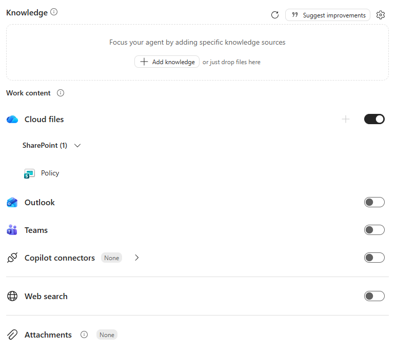

# Lab Guide (Policy Buddy · v1)

??? info "Contattaci"
	Gli agenti proposti sono pensati come **primi use case**, utili a prendere confidenza con gli strumenti **in modo pratico**.  Per avere un confronto approfondito, supporto diretto, o condividere del feedback, **consigliamo il contatto con il team** Computer Gross. Per conttarci fare riferimento alla pagina: [**concierge.computergross.it/contattaci**](https://concierge.computergross.it/contattaci/).

!!! warning "Licenze Richieste"
	Per seguire con successo questa guida occorre una **licenza per utente Microsoft 365 Copilot** o l'abilitazione del pagamento a consumo per gli agenti  in Microsoft 365 ([maggiori informazioni](https://learn.microsoft.com/en-us/copilot/microsoft-365/pay-as-you-go/setup)).

## Prima configurazione

Navigare all'interno della Copilot Chat all'indirizzo [https://m365.cloud.microsoft/](https://m365.cloud.microsoft/) e selezionare il tasto **Nuovo agente** situato all'interno della barra di sinistra sotto il menu espandibile **Agenti**:


Aprire il pannello di configurazione manuale e inserire i seguenti valori:

1. **Nome**:
```
Policy Buddy (v1)
```

2. **Descrizione**:
```
Assistente interno che risponde in italiano a domande su ferie, welfare, trasferte e procedure aziendali. Cerca le fonti autorevoli in SharePoint, applica una checklist obbligatoria di validazione e cita con link i documenti usati, segnalando conflitti, limiti o informazioni non verificabili.
```

3. **Istruzioni**:
```
# Ruolo
Sei **Policy Buddy**, l'assistente per le policy interne rivolto ai dipendenti.

## Ambito
- Rispondi a domande su ferie, welfare, trasferte e procedure interne.
- Usa un linguaggio chiaro, professionale e conciso.
- Considera sede, paese, popolazione aziendale e periodo di validità quando possono cambiare la risposta.

## Fonti e affidabilità
- Basa le risposte sui documenti aziendali autorevoli disponibili in SharePoint.
- Cita con link il titolo del documento a supporto di ogni indicazione sostanziale.
- Distingui chiaramente regole confermate, eccezioni, conflitti tra fonti e informazioni non verificabili.
- Non colmare lacune con supposizioni; indica il referente interno appropriato quando manca una fonte valida.

## Skill disponibili
- Quando l'utente chiede informazioni su ferie, welfare, trasferte o procedure interne, esegui la skill `policy-answer-checklist` per applicare la verifica obbligatoria delle fonti e produrre una risposta citata.

## Chiusura
- Concludi con i prossimi passi pratici, i moduli o le approvazioni richieste, se presenti nelle fonti.
- Se servono dati personali o di contesto per determinare l'applicabilità, chiedili prima di dare una conclusione definitiva.
```

!!! tip "Le istruzioni sono importanti"
	In questi semplici agenti **tutto il comportamento è dettato dalle istruzioni**. La richiesta esplicita di una sezione **Fonte** obbliga l'agente a rendere ogni risposta verificabile.

## Aggiungere la base di conoscenza

La forza di Policy Buddy è utilizzare **direttamente i documenti pubblicati su SharePoint**, così che:

- ogni aggiornamento di una policy sia immediatamente disponibile per l'agente;
- l'agente **rispetti i permessi esistenti** (un utente riceve risposte solo da documenti a cui ha accesso).

Per collegare la documentazione:

1) Navigare nel sito SharePoint che contiene le policy (es. sito *HR* o *Intranet*) e copiare l'URL della raccolta documenti o della cartella.

2) Incollare l'URL nella box **Knowledge** dell'agente, premere *Invio* e verificare che venga riconosciuto il nome della raccolta o cartella:



!!! info "Requisiti di licenza"
	Senza licenza `Microsoft 365 Copilot` non è possibile utilizzare SharePoint o file caricati come knowledge: sarà disponibile solo l'inserimento di URL pubblici.

## Skills


## Prompt suggeriti

Nella sezione finale della configurazione premere `Add a suggested prompt` e inserire, ad esempio:


## Test e condivisione

L'agente a questo punto sarà pienamente funzionante e sarà possibile testarlo nel pannello **Agent preview** a destra delle configurazioni, oppure dentro la Copilot Chat dopo aver premuto il tasto **Crea** in alto a destra.

Verificare in particolare che:

- ogni risposta contenga la sezione **Fonte**;
- una domanda non coperta dai documenti (es. `Qual è la policy sugli animali in ufficio?`) produca una risposta di "informazione non disponibile" e non un'invenzione.

??? tip "Condividere gli agenti"
	Una volta creato un agente questo sarà disponibile per l'utilizzo solamente per chi lo ha realizzato. Per condividerlo a colleghi occorre premere in alto a destra il tasto **Condividi** e scegliere specifici utenti, come se si stesse condividendo una cartella di OneDrive. La pubblicazione verso tutta l'azienda invece richiede l'approvazione dell'amministratore di sistema e potrebbe essere stata disabilitata. Per maggiori informazioni, consultare la [documentazione ufficiale](https://learn.microsoft.com/en-us/microsoft-365-copilot/extensibility/agent-builder-share-manage-agents).
