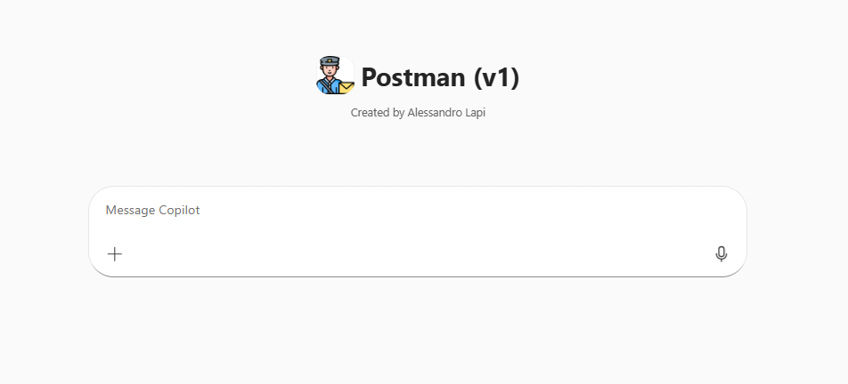
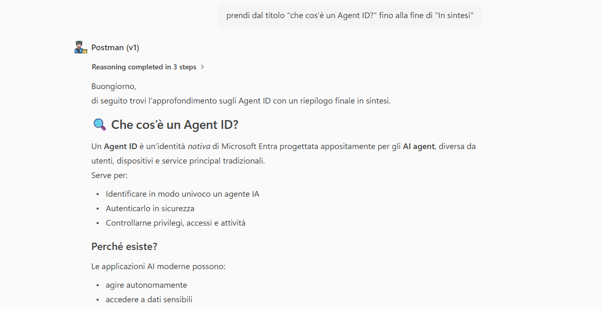
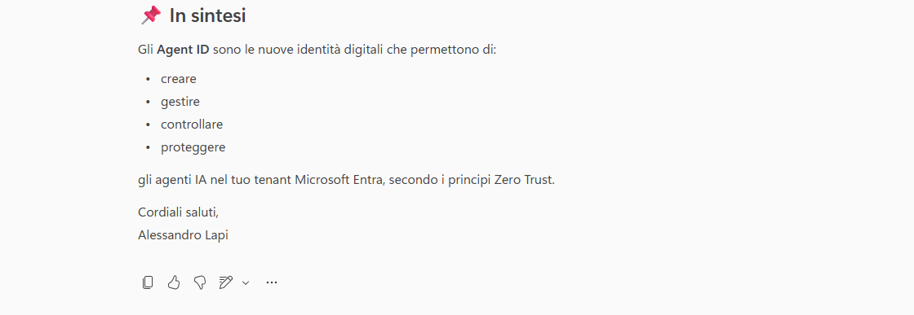

# Postman · v1 (Agent Builder)

## Get started
→ **[Apri la guida tecnica](lab-guide.md)**

## Panoramica

Nel lavoro quotidiano, la comunicazione via email rimane uno strumento essenziale per formalizzare informazioni, rispondere a richieste o archiviare decisioni prese in altri contesti.

In questi scenari, è spesso sufficiente disporre di un **email strutturata correttamente**, che presenti le informazioni in modo chiaro e formale senza introdurre interpretazioni o modifiche al contenuto.

Queste richieste:

- Si basano su contenuti già definiti dall’utente  
- Richiedono precisione e fedeltà al testo originale  
- Necessitano solo di una struttura formale tipica di una email  

## Problema

Abbiamo identificato tre criticità principali nella preparazione delle email:

- **Rielaborazione manuale del contenuto** : Il testo deve essere copiato e adattato manualmente nel corpo della mail.
- **Rischio di alterazione delle informazioni** : Durante la riscrittura possono essere introdotte modifiche non intenzionali.
- **Struttura non uniforme** : Introduzione e chiusura delle email variano in base all’utente o al momento.

## Soluzione

**Postman (v1)** è un agente progettato **esclusivamente per creare il corpo delle email**, **riportando in modo invariato il contenuto specificato dall’utente** e aggiungendo una struttura formale standard.

L’agente:

- Non modifica, riassume o rielabora il contenuto principale  
- Inserisce il testo esattamente come trovato dopo la chiamata dall’utente  
- Genera una breve introduzione coerente con il contesto del contenuto  
- Aggiunge una chiusura di email formale e neutra  

Questo approccio permette di:

- Garantire l’integrità delle informazioni  
- Ridurre il tempo necessario per preparare una email  
- Standardizzare introduzione e chiusura delle comunicazioni  

## Esempio di utilizzo

### Creazione del corpo di una email

**Richiesta utente**

`Crea la mail utilizzando l'intera ricerca sugli agenti id qui sopra`

`Prendi dal titolo "che cos'è un Agent ID?" fino alla fine di "In sintesi"`

**Comportamento dell’agente**

1. Se la richiesta è troppo generica l'agente chiede di specificare l'esatto contenuto richiesto.
2. Acquisisce il contenuto fornito dall’utente  
3. Identifica il contesto generale della comunicazione  
4. Inserisce una breve introduzione tipica di una email  
5. Riporta il contenuto in modo invariato  
6. Aggiunge una chiusura formale standard  

## Get started
→ **[Apri la guida tecnica](lab-guide.md)**
