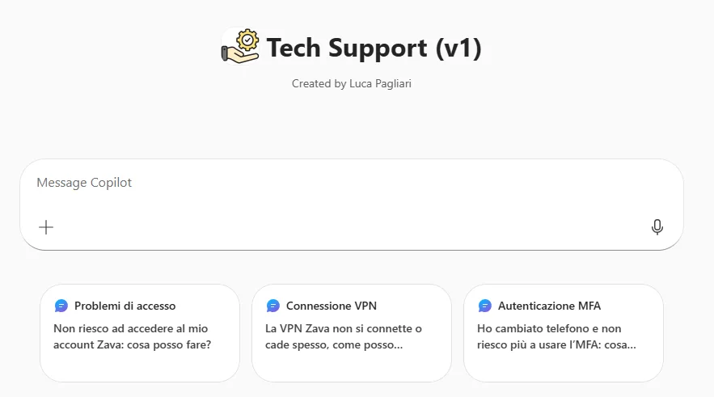
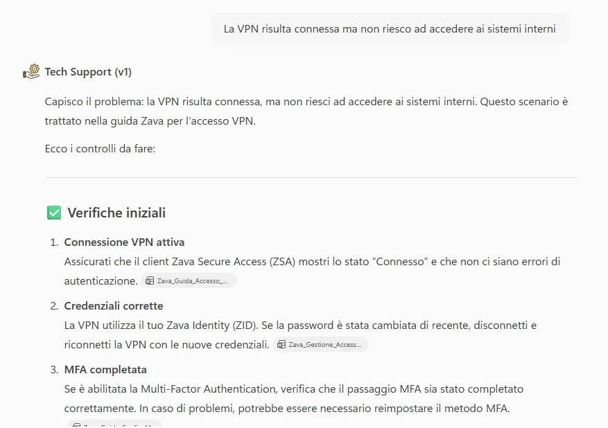

# Tech Support · v1 (Agent Builder)

## Panoramica

Il supporto IT di primo livello è spesso coinvolto nella gestione di richieste **ripetitive e a basso valore**, come problemi di accesso, reset password, configurazione MFA o connessione VPN.

Queste richieste:

- Richiedono tempo
- Interrompono il lavoro del team IT
- Spesso potrebbero essere risolte autonomamente dall’utente con una guida chiara e affidabile.

## Problema

Abbiamo identificato tre criticità principali nel supporto IT di primo livello:

- **Difficoltà nel reperire rapidamente informazioni ufficiali e corrette**: le procedure esistono, ma sono spesso distribuite su documenti diversi o non facilmente consultabili.
- **Dipendenza eccessiva dal supporto dedicato**: anche problemi semplici finiscono per generare ticket o richieste dirette al team IT.
- **Escalation non strutturate**: gli utenti non sanno quando e come contattare il supporto, oppure lo fanno troppo presto.

## Soluzione

**Tech Support (v1)** è un agente Copilot progettato per fornire **supporto tecnico di primo livello**, interrogando **esclusivamente una knowledge base aziendale predefinita**.

L’agente non improvvisa, non utilizza conoscenza generica, **non sostituisce il reparto IT** ma agisce come **primo punto di contatto**, guidando l’utente:

- Nella risoluzione autonoma dei problemi comuni.
- Oppure verso una **escalation manuale chiara e corretta**, quando necessario.

Questo approccio:

- Riduce il carico sul supporto IT.    
- Migliora l’esperienza utente.
- Garantisce risposte coerenti e controllabili.

## Esempi di utilizzo

### 1) Problema risolvibile tramite guida aziendale

**Richiesta utente**

`Ho dimenticato la password del mio account aziendale, come posso reimpostarla?`

**Comportamento dell’agente**

1. Recupera la procedura dalla KB
2. Fornisce istruzioni passo-passo
3. Non attiva escalation

### 2) Troubleshooting guidato

**Richiesta utente**

`La VPN risulta connessa ma non riesco ad accedere ai sistemi interni.`

**Comportamento dell’agente**

1. Esegue verifiche di primo livello
2. Riassume i controlli suggeriti dalla guida VPN
3. Indica il risultato atteso

### 3) Richiesta fuori perimetro → Escalation

**Richiesta utente**

`Come posso abilitare l'archivio della posta elettronica?`

**Comportamento dell’agente**

1. Riconosce che la richiesta non è coperta dalla KB
2. Non inventa procedure 
3. Guida l’utente verso il Portale o contatto IT ufficiale

## Get started
→ **[Apri la guida tecnica](lab-guide.md)**

vvv TO DO
## Next
→ **[IT Help Desk · v2](../../lv2/it-help-desk/index.md)**