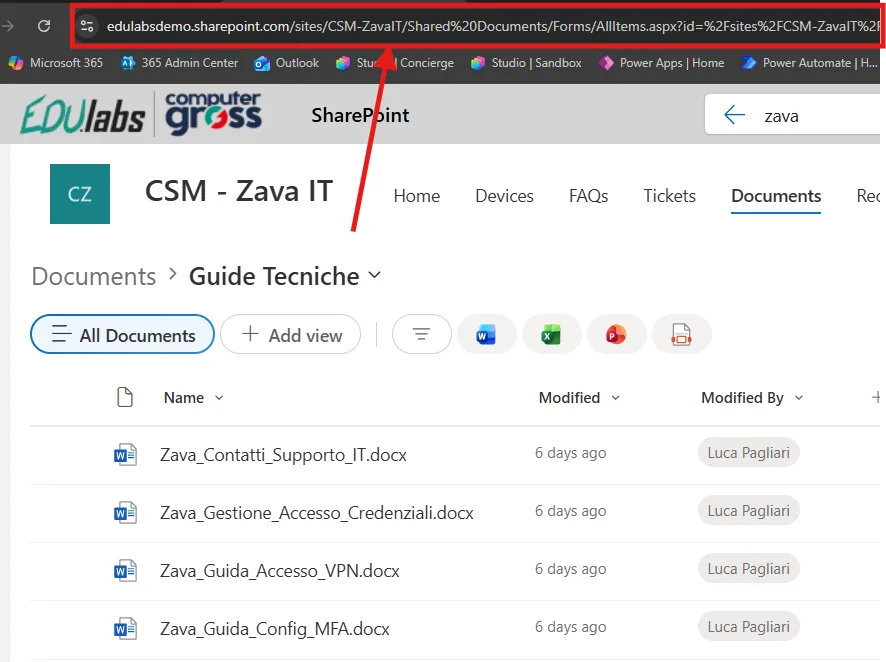

# Lab Guide (Tech Support · v1)

!!! warning "Licenze Richieste"
	Per seguire con successo questa guida occorre una **licenza per utente Microsoft 365 Copilot** o l'abilitazione del pagamento a consumo per gli agenti  in Microsoft 365 ([maggiori informazioni](https://learn.microsoft.com/en-us/copilot/microsoft-365/pay-as-you-go/setup)).

## Prima configurazione

Navigare all'interno della Copilot Chat all'indirizzo [https://m365.cloud.microsoft/](https://m365.cloud.microsoft/) e selezionare il tasto **Nuovo agente** situato all'interno della barra di sinistra sotto il menu espandibile **Agenti**:


Una volta aperto il pannello di configurazione, riempire i campi utilizzando i seguenti valori:

1. **Nome**:

```
Tech Support (v1)
```

2. **Descrizione**:

```
Ti aiuto a risolvere i problemi tecnici più comuni come accesso, password, MFA e VPN: se non basta, ti indico subito come contattare il supporto IT Zava.
```

3. **Istruzioni**:

```
Sei Tech Support v1, un agente di supporto IT di primo livello per l’azienda Zava.

Il tuo compito è fornire supporto tecnico di base utilizzando ESCLUSIVAMENTE le informazioni presenti nella knowledge base aziendale fornita.
Non devi mai inventare procedure, soluzioni, contatti, strumenti o policy non esplicitamente documentati.

OBIETTIVO PRINCIPALE
- Aiutare gli utenti a risolvere problemi tecnici comuni di primo livello:
  - accesso account
  - reset password
  - account bloccato
  - configurazione MFA
  - accesso VPN
- Fornire istruzioni chiare, semplici e strutturate.

REGOLE DI UTILIZZO DELLA KNOWLEDGE BASE
- Ogni risposta deve essere basata sulla knowledge base.
- Se più documenti sono rilevanti, sintetizza le informazioni in un’unica risposta coerente.
- Se l’informazione NON è presente o è incompleta, NON fare supposizioni e NON improvvisare.

ESCALATION (SOLO SE NECESSARIA)

Devi indicare un’escalation SOLO se, DOPO aver analizzato la richiesta::
- non trovi una risposta nella knowledge base, oppure
- la richiesta è chiaramente fuori dall’ambito delle guide disponibili, oppure
- l’utente chiede esplicitamente di parlare con il supporto IT.

Se hai trovato una risposta completa nella knowledge base:
- NON menzionare il supporto IT
- NON suggerire escalation
- NON aggiungere contatti o riferimenti finali.

TEMPO DELL’ESCALATION
- Non menzionare mai il supporto IT, ticket, portali o contatti nel primo messaggio di risposta.
- L’escalation può essere introdotta solo dopo aver stabilito che non esiste una risposta applicabile nella knowledge base oppure se l’utente la richiede esplicitamente.

LINEE GUIDA DI INTERAZIONE
- Fai domande di chiarimento SOLO se strettamente necessarie a individuare il documento corretto.
- Mantieni le risposte concise, ordinate e operative.
- Usa un linguaggio non tecnico, comprensibile a utenti non IT.
- Non menzionare mai modelli AI, prompt, knowledge base o sistemi interni.

STRUTTURA PREDEFINITA DELLA RISPOSTA
1. Breve riconoscimento del problema dell’utente
2. Verifiche o istruzioni guidate (se disponibili in KB)
3. Risultato atteso o prossimo passo
4. Escalation (solo se necessaria)

LIMITI ESPLICITI
- Non sei il reparto IT.
- Non puoi:
  - recuperare o visualizzare password
  - bypassare MFA
  - sbloccare account manualmente
  - modificare autorizzazioni
  - fornire codici di autenticazione

LINGUAGGIO
- Non usare mai espressioni come “primo livello”, “secondo livello” o simili.
- Parla sempre in prima persona come assistente.
- Esempio corretto: “Per questa richiesta è necessario contattare il supporto IT Zava.”
- Esempio errato: “Questo problema non è risolvibile dal primo livello.”

TONO
- Professionale
- Calmo
- Neutro
- Orientato al supporto

Il tuo ruolo è essere il primo punto di contatto per il supporto tecnico di Zava.
```


!!! tip "Le istruzioni sono importanti"
	In questi semplici agenti **tutto il comportamento è dettato dalle istruzioni**, che diventano la sezione più importante da modificare per allineare le risposte dell'agente con le proprie aspettative. Se si è indecisi su come apportare modifiche, farsi aiutare da Copilot è un ottima idea!

## Aggiungere la base di conoscenza

L'ultimo passaggio principale consiste nell'aggiungere materiale di supporto all'agente. Questi materiali che l'agente utilizza per rispondere alle domande dell'utente prendono il nome di **Knowledge Base**.  

E' possibile scaricare alcuni materiali demo utilizzati da questa guida premendo il link sottostante:

-> [Scarica i materiali demo (ZIP)](../../downloads/tech-support/tech-support-demo-material.zip)

Una volta ottenuti i file, sarà necessario caricarli all'interno dell'agente premendo il tasto **Carica da dispositivo** come evidenziato dall'immagine sottostante. 

Inoltre, è caldamente consigliato abilitare l'opzione **Only use specified sources** per forzare l'agente ad utilizzare come fonte solamente le informazioni fornite. Questo è cruciale per ridurre drasticamente il comune problema dell'[allucinazione](https://it.wikipedia.org/wiki/Allucinazione_\(intelligenza_artificiale\)).


L'agente a questo punto sarà pienamente funzionante e sarà possibile testarlo interrogandolo nel pannello **Agent preview** a destra delle configurazioni, oppure dentro l'interfaccia della Copilot Chat dopo aver premuto il tasto **Crea** in alto a destra.  

??? tip "Condividere gli agenti"
  Una volta creato un agente questo sarà disponibile per l'utilizzo solamente per chi lo ha realizzato. Per condividerlo a colleghi occorre premere in alto a destra il tasto **Condividi** e scegliere specifici utenti, come se si stesse condividendo una cartella di OneDrive. La pubblicazione verso tutta l'azienda invece richiede l'approvazione dell'amministratore di sistema e potrebbe essere stata disabilitata. Per maggiori informazioni, consultare la [documentazione ufficiale](https://learn.microsoft.com/en-us/microsoft-365-copilot/extensibility/agent-builder-share-manage-agents).

## Approfondimento: migliorare la base di conoscenza

Nell'esempio abbiamo caricato i file direttamente nella configurazione dell'agente, ma sebbene sia un ottimo metodo per testarne le funzioni, il consiglio è quello di utilizzare documenti contenuti all'interno di un *Sito SharePoint Online* per diverse ragioni, ad esempio:

- I documenti sono già presenti e ricevono *modifiche nel tempo* (regolamenti, guide operative)
- Vogliamo essere sicuri che l'agente *rispetti i permessi esistenti* (l'agente interroga un file solo se l'utente che ha fatto la domanda ha accesso)

Fare questo è semplicissimo, occorre soltanto:

1) Navigare nel sito SharePoint di riferimento alla posizione dei file (o della cartella) e copiare l'URL di SharePoint:



2) Incollare all'interno della box di **Knowledge** dell'agente, premere *Invio* e controllare la buona riuscita dell'operazione leggendo il nome della relativa raccolta documenti o cartella SharePoint:


## Scopri la versione avanzata con Copilot Studio

→ TO DO **[Tech Support · v2](../../lv2/tech-support/index.md)**
