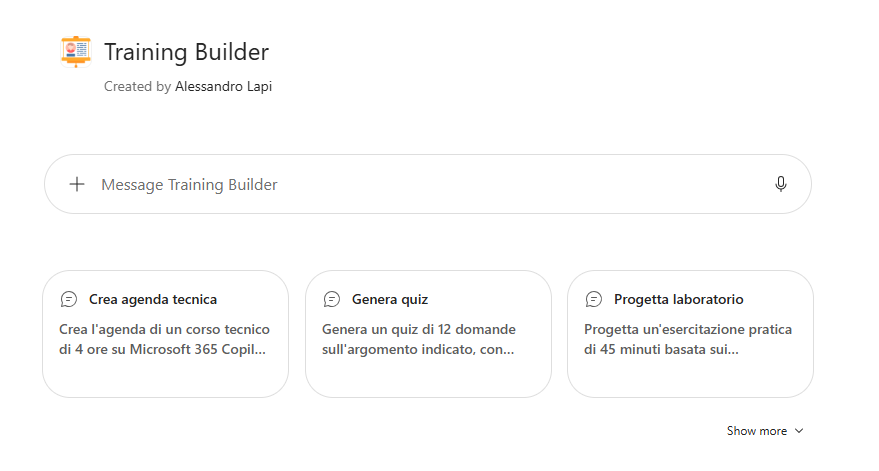
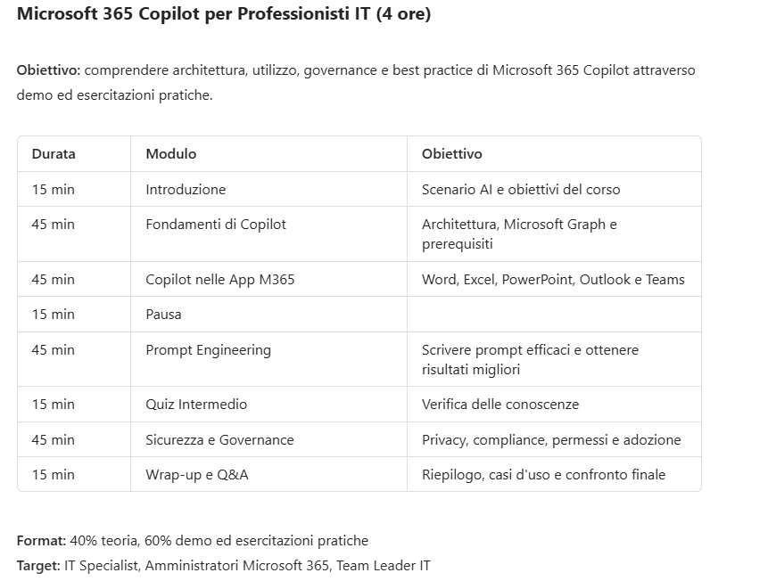

# Training Builder · v1 (Agent Builder)

## Get started
→ **[Apri la guida tecnica](lab-guide.md)**

## Panoramica

Preparare un corso di formazione, interno o verso clienti, richiede molto lavoro preparatorio: **definire l'agenda, distribuire i tempi, scrivere quiz di verifica e progettare esercitazioni pratiche**. Spesso il materiale di partenza esiste già (documentazione tecnica, manuali, slide), ma va trasformato in un percorso didattico.

Queste attività:

- Richiedono tempo e competenze di progettazione didattica
- Vengono ripetute per ogni nuovo corso o edizione
- Producono materiali con struttura e qualità variabili

## Problema

Abbiamo identificato tre criticità principali:

- **Tempo di preparazione elevato** : Trasformare documentazione tecnica in un corso strutturato richiede ore di lavoro.
- **Materiali disomogenei** : Agende, quiz ed esercitazioni hanno formati diversi a seconda di chi li prepara.
- **Verifica dell'apprendimento trascurata** : Quiz ed esercitazioni vengono spesso preparati all'ultimo o omessi.

## Soluzione

**Training Builder (v1)** è un agente che opera come **instructional designer specializzato in contenuti tecnici**: trasforma documenti aziendali o argomenti tecnici in percorsi formativi completi, adattati al pubblico.

L'agente produce:

- **Agenda del corso** : moduli, obiettivi didattici osservabili, tempi e matrice obiettivi-attività-verifica, a partire da un template aziendale
- **Quiz** : domande in formati diversi con soluzioni spiegate, chiave di correzione, soglia di superamento e feedback per fascia di punteggio
- **Esercitazioni** : scenario, obiettivo, prerequisiti, passaggi, risultato atteso e rubric di valutazione
- **Note per il docente** e verifica di coerenza tra obiettivi, agenda, esercitazioni e quiz

Prima di consegnare, l'agente controlla che le durate coincidano, che ogni obiettivo sia coperto e misurato e segnala i contenuti che richiedono conferma tecnica.

Questo approccio permette di:

- Ridurre drasticamente i tempi di preparazione di un corso
- Standardizzare il formato dei materiali formativi grazie ai template
- Includere sempre momenti di verifica e pratica
- Adattare lo stesso contenuto a pubblici diversi

## Esempi di utilizzo

**Richiesta utente**

`Crea l'agenda di un corso tecnico di 4 ore su Microsoft 365 Copilot per un pubblico IT intermedio, con tempi e obiettivi per modulo.`

**Comportamento dell'agente**

1. Riepiloga le assunzioni (pubblico, durata, modalità) e chiede solo i dati essenziali mancanti
2. Compila il template dell'agenda con scheda del corso, obiettivi e programma per moduli
3. Verifica che la somma delle durate coincida con le 4 ore e che ogni obiettivo sia coperto da una verifica
4. Propone una sola iterazione mirata (livello, durata, formato o difficoltà)

Altri esempi:

- `Genera un quiz di 12 domande sull'argomento indicato, con difficoltà crescente, soluzioni spiegate e soglia di superamento.`
- `Progetta un'esercitazione pratica di 45 minuti basata sui documenti disponibili, con scenario, passaggi, risultato atteso e rubric di valutazione.`
- `Trasforma il documento che indico in un modulo formativo con obiettivi, agenda, quiz finale e note per il docente.`
- `Adatta questo materiale tecnico a un pubblico non tecnico, mantenendo accuratezza e aggiungendo esempi concreti.`
- `Controlla la coerenza tra obiettivi, agenda, esercitazioni e quiz di questo corso e segnala le lacune.`

## Get started
→ **[Apri la guida tecnica](lab-guide.md)**
