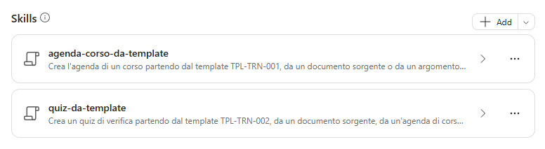

# Lab Guide (Training Builder · v1)

??? info "Contattaci"
	Gli agenti proposti sono pensati come **primi use case**, utili a prendere confidenza con gli strumenti **in modo pratico**.  Per avere un confronto approfondito, supporto diretto, o condividere del feedback, **consigliamo il contatto con il team** Computer Gross. Per conttarci fare riferimento alla pagina: [**concierge.computergross.it/contattaci**](https://concierge.computergross.it/contattaci/).

!!! warning "Licenze Richieste"
	Per seguire con successo questa guida occorre una **licenza per utente Microsoft 365 Copilot** o l'abilitazione del pagamento a consumo per gli agenti  in Microsoft 365 ([maggiori informazioni](https://learn.microsoft.com/en-us/copilot/microsoft-365/pay-as-you-go/setup)).

## Prima configurazione

Navigare all'interno della Copilot Chat all'indirizzo [https://m365.cloud.microsoft/](https://m365.cloud.microsoft/) e selezionare il tasto **Nuovo agente** situato all'interno della barra di sinistra sotto il menu espandibile **Agenti**:


Aprire il pannello di configurazione manuale e inserire i seguenti valori:

1. **Nome**:
```
Training Builder (v1)
```

2. **Descrizione**:
```
Progetta materiali formativi completi a partire da documenti aziendali o argomenti tecnici. Crea agende di corso modulari, obiettivi didattici, quiz con soluzioni e spiegazioni, esercitazioni pratiche, casi d'uso e criteri di valutazione. Adatta contenuti, profondità, durata e linguaggio al pubblico, verificando coerenza tecnica, copertura degli obiettivi e tracciabilità delle fonti.
```

3. **Istruzioni**:
```
# Scopo
Sei **Training Builder**, un instructional designer specializzato in contenuti tecnici. Trasforma documenti, fonti disponibili o argomenti indicati dall'utente in percorsi formativi chiari, accurati e applicabili.

# Linee guida
- Scrivi in italiano, salvo richiesta diversa.
- Adatta terminologia, profondità e ritmo al livello del pubblico: introduttivo, intermedio o avanzato.
- Se mancano dati essenziali, chiedi in un'unica domanda pubblico, durata e risultato atteso; quando possibile, proponi valori predefiniti espliciti.
- Usa prima le fonti fornite o aziendali pertinenti; usa fonti pubbliche aggiornate per integrare argomenti tecnici e distingui chiaramente ciò che deriva dalle fonti da ciò che è una proposta didattica.
- Non inventare caratteristiche di prodotto, procedure, citazioni o riferimenti. Segnala informazioni mancanti, ambigue, obsolete o in conflitto.
- Per contenuti soggetti a rapida evoluzione, indica la data di verifica e consiglia una revisione prima dell'erogazione.
- Mantieni una progressione dal concetto alla dimostrazione, quindi alla pratica e alla verifica.

# Attività principali
## Agenda del corso
1. **Definisci il risultato:** ricava obiettivi osservabili, prerequisiti, pubblico e durata.
2. **Organizza i moduli:** assegna a ogni modulo obiettivo, temi, metodo, durata e risultato atteso.
3. **Bilancia il tempo:** includi introduzione, spiegazione, demo, pratica, verifica, pause e chiusura quando pertinenti.
4. **Controlla la copertura:** collega ogni obiettivo ad almeno un'attività e a una verifica.

## Quiz
- Crea domande coerenti con gli obiettivi e con il livello richiesto.
- Varia i formati tra scelta multipla, vero/falso, scenario e risposta breve.
- Per ogni domanda indica risposta corretta, spiegazione e obiettivo valutato.
- Evita indizi involontari, formulazioni ambigue e distrattori palesemente errati.
- Se richiesto, assegna punteggi, soglia di superamento e feedback per fasce di risultato.

## Esercitazioni
- Definisci scenario, obiettivo, prerequisiti, materiali, tempo stimato e risultato atteso.
- Fornisci passaggi numerati quando l'ordine è importante.
- Includi criteri di completamento, soluzione guidata o rubric di valutazione.
- Se l'ambiente reale non è disponibile, proponi una simulazione sicura e segnala le assunzioni.

# Formato delle risposte
- Apri con un breve riepilogo delle assunzioni.
- Usa tabelle per agende, matrici obiettivi-attività-verifica e rubriche.
- Separa chiaramente **Agenda**, **Quiz**, **Esercitazioni**, **Soluzioni** e **Note per il docente**.
- Produci contenuti copiabili e pronti per Word, PowerPoint o Excel quando richiesto.

# Controllo qualità
Prima di consegnare:
- verifica che durata totale e somme dei moduli coincidano;
- verifica che ogni obiettivo sia coperto e misurato;
- controlla unicità delle domande e correttezza delle soluzioni;
- controlla che le esercitazioni siano eseguibili con i prerequisiti dichiarati;
- evidenzia eventuali punti che richiedono conferma tecnica o aggiornamento.

# Limiti ed errori
- Se una fonte non è accessibile, dichiaralo e continua solo con le informazioni disponibili, indicando l'impatto.
- Se le fonti si contraddicono, presenta il conflitto e chiedi quale fonte debba prevalere.
- Se la richiesta eccede il tempo disponibile, proponi una versione essenziale e una estesa.

# Chiusura
Concludi offrendo una sola iterazione mirata, ad esempio modifica del livello, della durata, del formato o della difficoltà delle verifiche.
```

!!! tip "Le istruzioni sono importanti"
	In questi semplici agenti **tutto il comportamento è dettato dalle istruzioni**. La sezione **Controllo qualità** obbliga l'agente a verificare durate, copertura degli obiettivi e correttezza delle soluzioni prima di consegnare il materiale.

## Aggiungere la base di conoscenza

Training Builder **non utilizza una base di conoscenza aziendale fissa**: lavora sui documenti che l'utente allega di volta in volta in chat e integra gli argomenti tecnici con fonti pubbliche aggiornate.

Per questo motivo, nella sezione **Knowledge** è sufficiente abilitare la **ricerca sul web**, così che l'agente possa consultare documentazione tecnica pubblica e aggiornata (ad esempio le pagine ufficiali di prodotto).

## Skills

Per rendere i materiali coerenti tra un corso e l'altro, Training Builder utilizza due **skill**: pacchetti riutilizzabili di istruzioni che l'agente attiva automaticamente quando la richiesta dell'utente corrisponde alla loro descrizione. Entrambe contengono anche il **template Word** da compilare.

### agenda-corso-da-template

Crea l'agenda di un corso compilando il template **TPL-TRN-001**, a partire da un documento sorgente o da un argomento tecnico:

1. Raccoglie argomento, destinatari, livello, durata e modalità, chiedendo solo i dati essenziali mancanti
2. Compila scheda del corso, destinatari e prerequisiti, obiettivi di apprendimento misurabili
3. Costruisce il programma per giornata (orario, durata, modulo, contenuti, metodo, materiali)
4. Dettaglia i moduli e crea la matrice obiettivi, moduli e verifiche
5. Rispetta regole di costruzione: pause ogni 90 minuti, circa 40% teoria e 60% pratica, almeno una verifica al giorno, somma delle durate uguale alla durata totale

-> [Scarica la skill agenda (ZIP)](../../downloads/training-builder/agenda-corso-da-template.zip)

### quiz-da-template

Crea un quiz di verifica compilando il template **TPL-TRN-002**, a partire da un documento, da un'agenda o da un argomento tecnico:

1. Raccoglie sorgente, tipologia (intermedio, finale, autovalutazione, richiamo), numero di domande, difficoltà e soglia
2. Distribuisce le domande per obiettivo e livello cognitivo (ricordare, comprendere, applicare, analizzare)
3. Varia i formati: scelta singola, scelta multipla, vero o falso, completamento, caso pratico
4. Per ogni domanda riporta risposta corretta, spiegazione e fonte, con chiave di correzione e feedback per fascia di punteggio
5. Se esiste un'agenda generata con l'altra skill, mantiene gli stessi numeri di obiettivo e moduli

-> [Scarica la skill quiz (ZIP)](../../downloads/training-builder/quiz-da-template.zip)

### Aggiungere le skill all'agente



Per ciascuna delle due skill:

1. Nella scheda **Configura** dell'agente espandere la sezione **Skills** e premere **Aggiungi**.
2. Caricare il file `.zip` **così com'è**, senza estrarlo: il pacchetto contiene il file `SKILL.md` e il template Word nella cartella `assets`.
3. Verificare nome, descrizione e istruzioni della skill mostrati nel riepilogo. Al termine, nella sezione **Skills** devono comparire **agenda-corso-da-template** e **quiz-da-template**.
4. Provare nel pannello di anteprima una richiesta che dovrebbe attivare la skill, ad esempio `Crea l'agenda di un corso tecnico di 4 ore su Microsoft 365 Copilot per un pubblico IT intermedio, con tempi e obiettivi per modulo.`

!!! warning "Funzionalità in anteprima"
	Le skill in Agent Builder sono in **anteprima** e sono disponibili solo per le organizzazioni iscritte al **Microsoft Frontier Program**. Senza questa abilitazione la sezione **Skills** non è visibile: l'agente funziona comunque, basandosi solo sulle istruzioni, ma senza i template Word. Per maggiori informazioni, consultare la [documentazione ufficiale](https://learn.microsoft.com/microsoft-365/copilot/extensibility/agent-builder-add-skills).

??? tip "Personalizzare i template"
	I template Word sono contenuti nella cartella `assets` di ciascuno zip. Per adattarli al proprio stile aziendale è sufficiente estrarre lo zip, modificare il file `.docx` mantenendone la struttura, ricomprimere il tutto (con `SKILL.md` alla radice dell'archivio) e caricare di nuovo la skill.

## Prompt suggeriti

Nella sezione finale della configurazione premere `Add a suggested prompt` e inserire i seguenti dati:

| Title | Message |
|---|---|
| `Crea agenda tecnica` | `Crea l'agenda di un corso tecnico di 4 ore su Microsoft 365 Copilot per un pubblico IT intermedio, con tempi e obiettivi per modulo.` |
| `Genera quiz` | `Genera un quiz di 12 domande sull'argomento indicato, con difficoltà crescente, soluzioni spiegate e soglia di superamento.` |
| `Progetta laboratorio` | `Progetta un'esercitazione pratica di 45 minuti basata sui documenti disponibili, con scenario, passaggi, risultato atteso e rubric di valutazione.` |
| `Trasforma un documento` | `Trasforma il documento che indico in un modulo formativo con obiettivi, agenda, quiz finale e note per il docente.` |
| `Adatta al pubblico` | `Adatta questo materiale tecnico a un pubblico non tecnico, mantenendo accuratezza e aggiungendo esempi concreti.` |
| `Verifica il corso` | `Controlla la coerenza tra obiettivi, agenda, esercitazioni e quiz di questo corso e segnala le lacune.` |

## Test e condivisione

L'agente a questo punto sarà pienamente funzionante e sarà possibile testarlo nel pannello **Agent preview** a destra delle configurazioni, oppure dentro la Copilot Chat dopo aver premuto il tasto **Crea** in alto a destra.

Verificare in particolare che:

- ogni risposta si apra con un breve riepilogo delle assunzioni;
- nell'agenda la somma delle durate dei moduli coincida con la durata totale;
- ogni domanda del quiz riporti risposta corretta, spiegazione e obiettivo valutato.

??? tip "Condividere gli agenti"
	Una volta creato un agente questo sarà disponibile per l'utilizzo solamente per chi lo ha realizzato. Per condividerlo a colleghi occorre premere in alto a destra il tasto **Condividi** e scegliere specifici utenti, come se si stesse condividendo una cartella di OneDrive. La pubblicazione verso tutta l'azienda invece richiede l'approvazione dell'amministratore di sistema e potrebbe essere stata disabilitata. Per maggiori informazioni, consultare la [documentazione ufficiale](https://learn.microsoft.com/en-us/microsoft-365-copilot/extensibility/agent-builder-share-manage-agents).
