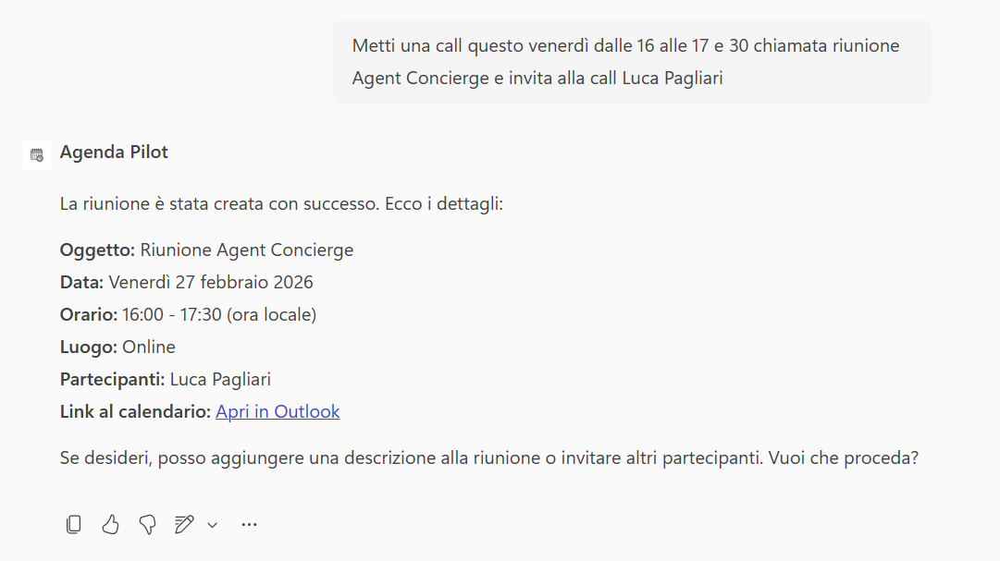
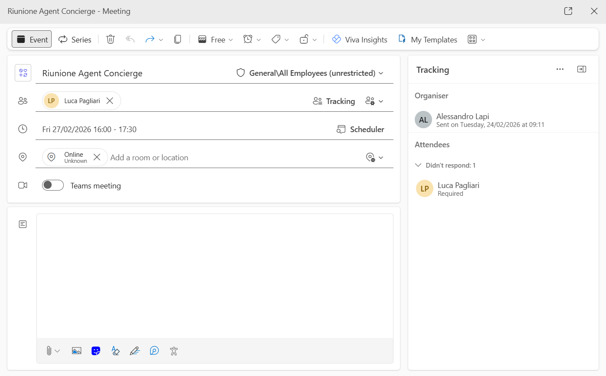

# Agenda Pilot 

## Get started
→ **[Open the lab guide](lab-guide.md)**

## Panoramica

All’interno delle attività quotidiane di lavoro, la **gestione del calendario, la schedulazione di eventi e meeting** è fondamentale per organizzare riunioni, appuntamenti e scadenze.

Queste richieste:

- Sono frequenti e operative
- Richiedono precisione nella gestione di date, orari e partecipanti
- Possono generare errori se non gestite con attenzione

Un supporto conversazionale consente di semplificare l’interazione con il calendario mantenendo controllo e accuratezza.

## Problema

Abbiamo identificato tre criticità principali nella gestione manuale del calendario:

- **Sovrapposizione involontaria di impegni**: Gestendo il calendario a mano, è facile creare meeting che si accavallano o prenotare slot in cui si è già occupati.
- **Inserimento manuale ripetitivo**: Creare appuntamenti ricorrenti, modificare orari, aggiungere dettagli o aggiornare partecipanti richiede tempo ed è soggetto a errori.

## Soluzione

**Agenda Pilot** è un agente progettato **esclusivamente per la gestione del calendario  dell’utente**, con funzionalità mirate e controllate.

L’agente:

- Analizza la richiesta dell’utente prima di eseguire qualsiasi azione
- Utilizza l'MCP server di Outlook Calendar per creare, aggiornare o recuperare eventi    
- Non cancella o modifica eventi
- Mantiene un tono formale, chiaro e orientato alla precisione
- Richiede informazioni aggiuntive quando necessario e suggerisce miglioramenti organizzativi

Questo approccio permette di:

- Ridurre errori nella gestione degli appuntamenti
- Garantire maggiore controllo prima di modifiche critiche
- Standardizzare il formato di risposta in chat
- Semplificare l’organizzazione quotidiana

## Esempio di utilizzo

### Interrogare il Calendario

**Richiesta utente**

`Quali impegni ho questa settimana?`

Comportamento dell'agente:

- Utilizza l'MCP Server di Outlook per comunicare con il Calendar
- Prende in maniera autonoma il Calendar Id
- Analizza e riporta in Chat tutti gli eventi Schedulati per il periodo richiesto dall'utente

### Creare un nuovo Evento

**Richiesta utente**

`Metti una call questo venerdì dalle 16 alle 17 e 30 chiamata riunione Agent Concierge e invita alla call Luca Pagliari`

Comportamento dell'agente:

- Utilizza l'MCP Server di Outlook per comunicare con il Calendar
- L'agente controlla che lo slot richiesto sia libero
- Procede con la creazione dell'evento con i dati richiesti.
- Invita le persone coinvolte
- Richiede maggiori informazioni se necessarie.

## Get started
→ **[Apri la guida tecnica](lab-guide.md)**