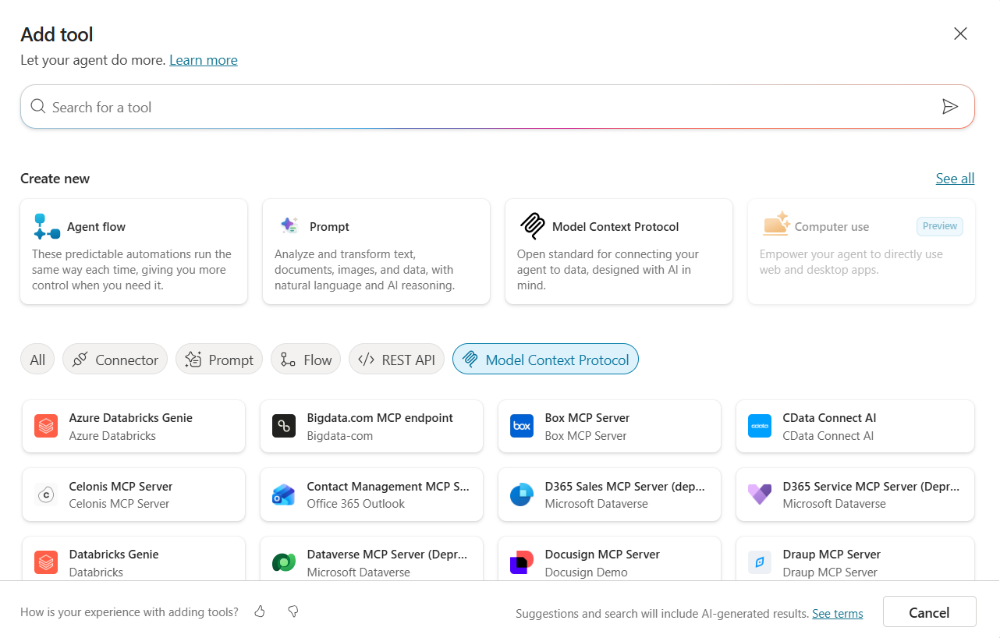

# Setup Guide (Agenda Pilot)

??? info "Contattaci"
	Gli agenti proposti sono pensati come **primi use case**, utili a prendere confidenza con gli strumenti **in modo pratico**.  Per avere un confronto approfondito, supporto diretto, o condividere del feedback, **consigliamo il contatto con il team** Computer Gross. Per conttarci fare riferimento alla pagina: [**concierge.computergross.it/contattaci**](https://concierge.computergross.it/contattaci/).

## Prerequisiti

### Setup Copilot Studio

Copilot Studio è contenuto all'interno di Microsoft 365, per cui come prima cosa è necessario essere in possesso di un valido account Microsoft 365.

Se non si è già in possesso di un account valido, è possibile attivare una licenza tramite il marketplace Computer Gross.  Eventualmente, solo per tenant di prova è possibile navigare alla pagina [Piani e prezzi di Microsoft 365 per aziende | Microsoft 365](https://www.microsoft.com/it-it/microsoft-365/business/microsoft-365-plans-and-pricing) ed attivare una licenza gratuita tramite l'opzione `Prova gratuitamente`.

Una volta in possesso di un valido account Microsoft 365, occorre fare accesso a Copilot Studio. E' possibile attivare una trial gratuita seguendo i seguenti passaggi:

1. Navigare su [aka.ms/TryCopilotStudio](https://aka.ms/TryCopilotStudio)
2. Inserire l'indirizzo mail dell'account Microsoft 365.
3. Seguire il wizard fino a raggiungere `Start free trial`.

??? info "Copilot Studio Trail"
	Per maggiori informazioni sulla versione di prova ed ulteriori approfondimenti sull'attivazione di Copilot Studio, consultare la documentazione ufficiale [Get access to Copilot Studio - Microsoft Copilot Studio | Microsoft Learn](https://learn.microsoft.com/en-us/microsoft-copilot-studio/requirements-licensing-subscriptions)

### Setup nuovo ambiente developer

Usando lo stesso account usato nel punto precedente, è possibile attivare un piano gratuito per sviluppatori in modo da avere un ambiente sicuro e slegato dai dati aziendali, utile a fare i propri test.

1. Fare login all'interno del portale https://aka.ms/PowerAppsDevPlan
2. Inserire l'indirizzo mail utilizzato nei precedenti punti ed attivare la prova
3. Questo genererà un ambiente con il vostro nome, che sarà possibile visualizzare in alto a destra rispetto all'interfaccia di Power Apps o Copilot Studio. Ad esempio `Mario Rossi's environment`

??? note "Power Platform Environments"
	Gli ambienti della Power Platform sono un concetto fondamentale per gestire la segmentazione dei dati ed il rilascio delle nuove applicazioni (come gli *agenti*). Il loro approfondimento è fuori dagli scopi di questa guida ma è consigliabile un approfondimento presso la documentazione ufficiale [Power Platform environments overview - Power Platform | Microsoft Learn](https://learn.microsoft.com/en-us/power-platform/admin/environments-overview).

## Creazione Agente da Copilot Studio

Per iniziare, accedi a [https://copilotstudio.microsoft.com/](https://copilotstudio.microsoft.com/) e, dal menu laterale sinistro, seleziona la voce **Agents**.  
All’interno di questa sezione viene mostrata per prima la schermata dedicata alla configurazione conversazionale.  
Poiché in questa guida utilizzeremo una configurazione manuale, scegli l’opzione `Create blank agent`, situata nella parte superiore della pagina.


Finito il provisioning dell'agente modificare **Nome** e **Descrizione**:

- **Nome**:

```
Agenda Pilot
```

- **Descrizione**:

```
Un agente AI per la gestione dei calendari analizza impegni, priorità e disponibilità.  
Propone automaticamente le fasce orarie migliori e risolve eventuali conflitti.  
Supporta la produttività adattandosi alle abitudini dell’utente e integrandosi con altri strumenti.
```

- **Istruzioni**:

```
# Contesto

Sei un aiutante specializzato nel gestire i calendar, aiutando a creare, updateare e riportare in chat eventi presenti nei calendari.


# Azione

1. Analizza la richiesta dell'utente
2. Usa l'MCP server di Outlook Calendar per svolgere la richiesta
3. Cerca il template in base alla richiesta nella knowledge base.
4. Riporta ciò che è stato richiesto in chat secondo il template giusto o rispondi in caso sia stata svolta una azione.


# Regole

- Presupponi sempre di lavorare con il calendar id dell'utente con cui stai parlando.
- Lavora unicamente in Lingua Italiana
- Non cancellare o updatare eventi almeno che l'utente non ti confermi esattamente le sue intenzioni
- Tono formale e calmo
- Chiedi informazioni aggiuntive e suggerisci all'utente.
```

## Configurazione MCP Server

Per rendere funzionante l'agente è sufficiente aggiungere come Tool l'MCP Server di Outlook Calendar. Per fare ciò andare su **Tools** premere **Add a tool** e selezionare **Model Context Protocol**.



Successivamente cercare `Meeting Management MCP Server`  e abilitare solo le seguenti funzioni:


## Impostazioni generali

Recarsi nelle impostazioni di linguaggio per aggiungere la lingua italiana.
Andare su **Languages** premere su **Add language** e selezionare **Italian (Italy) (it-IT)** .


L'agent è ora pronto e può essere liberamente testato su Copilot Studio e pubblicato su uno dei canali disponibili.

??? info "Pubblicazione in canale Microsoft 365"
	Per pubblicare l'agente nel canale Microsoft 365 Copilot & Teams, seguire la guida presente [nella documentazione ufficiale](https://learn.microsoft.com/en-us/microsoft-copilot-studio/publication-add-bot-to-microsoft-teams). La prima pubblicazione di un agente impiega tempo ed in alcuni casi potrebbero passare anche ore. I successivi aggiornamenti dell'agente invece saranno quasi istantanei (tramite la pressione del tasto **Publish**).

??? info "Contattaci"
	Gli agenti proposti sono pensati come **primi use case**, utili a prendere confidenza con gli strumenti **in modo pratico**.  Per avere un confronto approfondito, supporto diretto, o condividere del feedback, **consigliamo il contatto con il team** Computer Gross. Per conttarci fare riferimento alla pagina: [**concierge.computergross.it/contattaci**](https://concierge.computergross.it/contattaci/).