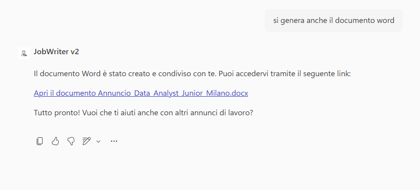

# Job Writer · v2 (Copilot Studio)

## Get started
→ **[Apri la guida tecnica](lab-guide.md)**
## Panoramica

La redazione di annunci di lavoro richiede coerenza, precisione e rispetto degli standard aziendali.  
Con **Job Writer (v1)** è stato introdotto un primo livello di automazione, utile per generare bozze di annunci in modo rapido, ma ancora dipendente da attività manuali per correggere struttura e formattazione.

**Job Writer (v2)** nasce per eliminare queste inefficienze, offrendo un processo **completo e interamente guidato**.  
L’agente accompagna l’utente nella raccolta delle informazioni, applica automaticamente il template aziendale e genera annunci di lavoro **di qualità superiore**, più coerenti, accurati e allineati agli standard aziendali.

Il risultato è un documento Word **standardizzato e identico alla versione generata in chat**, salvato direttamente nell’ambiente di lavoro dell’utente.  
Job Writer evolve così da semplice supporto alla scrittura a **strumento operativo per la generazione di annunci di lavoro**, con un impatto diretto sulla produttività del team HR.

## Soluzione

**Job Writer (v2)** introduce un processo **guidato e automatizzato** per la creazione degli annunci di lavoro, eliminando le incoerenze e le attività manuali.

L’agente segue una logica chiara e ripetibile: raccoglie solo le informazioni necessarie, genera l’annuncio utilizzando template ufficiali e produce direttamente un documento pronto all’uso.

Quando il flusso viene avviato:

1. L’agente entra in un **topic guidato** per raccogliere gli input necessari, verificando se alcune informazioni sono già disponibili nella richiesta iniziale dell'utente
2. I dati raccolti vengono utilizzati da una **Prompt Action** che applica il template aziendale per la generazione dell’annuncio
3. Il contenuto generato viene trasformato in un **documento Word identico alla versione mostrata in chat**
4. Il documento viene salvato automaticamente nel **OneDrive dell’utente** tramite **MCP Server**

In questo modo l’utente segue un percorso strutturato che porta direttamente al risultato molto vicino a quello finale.

Questo approccio permette di:

- Garantire coerenza e conformità agli standard aziendali
- Eliminare passaggi manuali e possibili errori di formattazione
- Separare chiaramente la fase conversazionale dalla generazione e gestione dei documenti
- Fornire all’utente un file immediatamente disponibile, tracciabile e pronto all’uso

## Esempio di utilizzo

### Creazione guidata con salvataggio automatico

**Richiesta utente**

```
Genera l'annuncio di lavoro per la seguente posizione:
Ruolo: Data Analyst, Seniority: Junior, Location: Milano, Italia, Tipo di lavoro: Ibrido
```





**Comportamento dell’agente**

1. Avvia il topic guidato
2. Raccoglie le informazioni necessarie se non specificate nella richiesta iniziale
3. Genera l’annuncio con il template ufficiale
4. Chiede se creare il documento Word identico alla chat 
5. Salva il file in OneDrive dell’utente


## Get started
→ **[Apri la guida tecnica](lab-guide.md)**