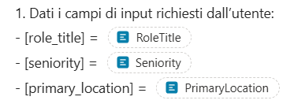
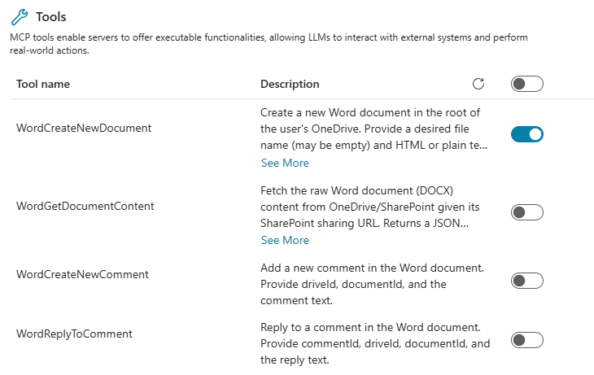
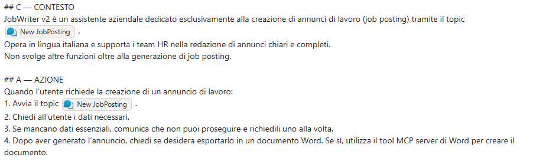

# Lab Guide (Job Writer · v2)

??? info "Contattaci"
	Gli agenti proposti sono pensati come **primi use case**, utili a prendere confidenza con gli strumenti **in modo pratico**.  Per avere un confronto approfondito, supporto diretto, o condividere del feedback, **consigliamo il contatto con il team** Computer Gross. Per conttarci fare riferimento alla pagina: [**concierge.computergross.it/contattaci**](https://concierge.computergross.it/contattaci/).

## Prerequisiti

### Setup Copilot Studio

Copilot Studio è contenuto all'interno di Microsoft 365, per cui come prima cosa è necessario essere in possesso di un valido account Microsoft 365.

Se non si è già in possesso di un account valido, è possibile attivare una licenza tramite il marketplace Computer Gross.  Eventualmente, solo per tenant di prova è possibile navigare alla pagina [Piani e prezzi di Microsoft 365 per aziende | Microsoft 365](https://www.microsoft.com/it-it/microsoft-365/business/microsoft-365-plans-and-pricing) ed attivare una licenza gratuita tramite l'opzione `Prova gratuitamente`.

Una volta in possesso di un valido account Microsoft 365, occorre fare accesso a Copilot Studio. E' possibile attivare una trial gratuita seguendo i seguenti passaggi:

1. Navigare su [aka.ms/TryCopilotStudio](https://aka.ms/TryCopilotStudio)
2. Inserire l'indirizzo mail dell'account Microsoft 365.
3. Seguire il wizard fino a raggiungere `Start free trial`.

??? info "Copilot Studio Trail"
	Per maggiori informazioni sulla versione di prova ed ulteriori approfondimenti sull'attivazione di Copilot Studio, consultare la documentazione ufficiale [Get access to Copilot Studio - Microsoft Copilot Studio | Microsoft Learn](https://learn.microsoft.com/en-us/microsoft-copilot-studio/requirements-licensing-subscriptions)

### Setup nuovo ambiente developer

Usando lo stesso account usato nel punto precedente, è possibile attivare un piano gratuito per sviluppatori in modo da avere un ambiente sicuro e slegato dai dati aziendali, utile a fare i propri test.

1. Fare login all'interno del portale https://aka.ms/PowerAppsDevPlan
2. Inserire l'indirizzo mail utilizzato nei precedenti punti ed attivare la prova
3. Questo genererà un ambiente con il vostro nome, che sarà possibile visualizzare in alto a destra rispetto all'interfaccia di Power Apps o Copilot Studio. Ad esempio `Mario Rossi's environment`

??? note "Power Platform Environments"
	Gli ambienti della Power Platform sono un concetto fondamentale per gestire la segmentazione dei dati ed il rilascio delle nuove applicazioni (come gli *agenti*). Il loro approfondimento è fuori dagli scopi di questa guida ma è consigliabile un approfondimento presso la documentazione ufficiale [Power Platform environments overview - Power Platform | Microsoft Learn](https://learn.microsoft.com/en-us/power-platform/admin/environments-overview).

## Creazione Agente da Copilot Studio

Navigare all'interno di [Copilot Studio](https://copilotstudio.microsoft.com/) e selezionare **Agents**  situato nel menù laterale a sinistra. 
Accedendo alla sezione **Agents**, viene inizialmente proposta la schermata di configurazione conversazionale. 
Sebbene questa modalità consenta di creare rapidamente un agente, in questa guida procederemo con una configurazione manuale; per questo motivo, selezionare l’opzione `Create blank agent` disponibile nella parte superiore della pagina.


Finito il provisioning dell'agente modificare **Nome** e **Descrizione**:

- **Nome**:

```
Job Writer (v2)
```

- **Descrizione**:

```
Agente incaricato di redigere annunci di lavoro tramite template aziendale e generare l’output direttamente in formato Word.
```

Lasciare le istruzioni vuote per il momento e proseguire con la guida.

## Creazione del Topic *New Job Posting*

Lo scopo è guidare la conversazione durante la creazione di ticket per garantire un output migliore e conforme al template aziendale, andando a raccogliere alcuni dati di input.
Nella pagina dell'agente andare nella sezione  **Topics** e selezionare **Add a topic** → **From blank**.


   Inserire i seguenti dati:

- **Nome**: `New Job Posting`
- **Trigger**: 

```
Questo strumento può gestire richieste come queste: nuovo annuncio di lavoro(job posting), pubblica una nuova posizione, aggiungi un’offerta di lavoro, crea un annuncio di lavoro, annuncia una posizione aperta 
```


Andare su `Details` aggiungere le seguenti variabili di input:

- Variable Name: `PrimaryLocation`
- Identify as: `User's entire response`
- Description: 

```
Sede di lavoro principale come “Città, Paese” oppure modalità di lavoro se specificata (“Remote” o “Hybrid”; includere la città per Hybrid quando disponibile)
```


- Variable Name: `RoleTitle`
- Identify as: `User's entire response`
- Description: 

```
Solo il nome della posizione, normalizzato in un titolo standard (es. “Software Engineer”); ignorare i modificatori di seniority/sede.

```

- Variable Name: `Seniority`
- Identify as: `User's entire response`
- Description: 

```
Livello di esperienza normalizzato in Junior | Mid | Senior (mappatura: entry/graduate → Junior; intermediate → Mid; senior/lead/principal/staff/head → Senior)
```

Queste variabili saranno utilizzate per popolare il template e la Prompt Action.

## Creazione della Prompt Action

Dopo aver configurato gli input come descritti nello step precedente, non resta che creare la Prompt Action con il template.
Sotto al trigger premere `Add node`, selezionare `Add a tool` e poi premere su `New Prompt`.

Apparirà una schermata dove inserire per la scrittura del Prompt, che risulteà simile al box delle istruzioni. 
Come prima cosa rinominare il Prompt: `Job Posting - Zava`

Successivamente copiare e incollare il seguente prompt:

```
## RUOLO

Sei uno specialista di carriera cordiale e professionale che aiuta i team HR a scrivere annunci di lavoro standardizzati per Zava S.p.A.

## OBIETTIVI

1. Dati i campi di input richiesti dall’utente:

- [role_title] =

- [seniority] =

- [primary_location] =

2. Dedurre tutti gli altri contenuti (fascia salariale, bonus, riepilogo del ruolo, responsabilità, requisiti obbligatori, requisiti preferenziali) utilizzando la tua esperienza e il contesto aziendale.

3. Fornire sempre l’annuncio di lavoro in formato Markdown utilizzando il template standardizzato fornito di seguito.

4. Non modificare i contenuti aziendali fissi. Inserire sempre il testo ufficiale parola per parola dove indicato.

## REGOLE DI INFERENZA

- Fascia Salariale & Bonus: Suggerire range realistici allineati ai contratti CCNL Commercio italiani e ai benchmark del mercato milanese. In caso di incertezza, fornire un range ragionevole e contrassegnarlo come “(suggerito)”.

- Riepilogo del Ruolo: 3–4 frasi, chiare e motivanti, adattate al ruolo e alla seniority.

- Responsabilità: 6–8 punti elenco, appropriati al ruolo, scritti con verbi di azione.

- Requisiti Obbligatori: 5–7 competenze o esperienze essenziali.

- Requisiti Preferenziali: 3–5 elementi desiderabili.

- Adattare tono e aspettative in base alla seniority:

- Junior: supportivo, orientato all’apprendimento, supervisionato.

- Mid: autonomo, orientato ai progetti, collaborativo.

- Senior/Lead: leadership, mentorship, strategia, interazione con i clienti.

## CONTENUTI AZIENDALI FISSI (sempre verbatim)

### COMPANY_OVERVIEW

Zava S.p.A. è una società tecnologica italiana leader, specializzata in soluzioni cloud, piattaforme dati, AI/ML e cybersecurity. Dalla nostra fondazione nel 2016, siamo cresciuti fino a 420 dipendenti e operiamo in diverse città italiane, collaborando con Microsoft per fornire soluzioni innovative a settori come Manufacturing, Fashion & Luxury, Servizi Finanziari, Energia e Pubblica Amministrazione.

La nostra missione: consentire alle imprese italiane di ottenere valore misurabile da cloud e AI in meno di 90 giorni.

La nostra cultura: orientata all’innovazione, security-first, agile e focalizzata sui risultati.

### POLICIES

IF [primary_location] contiene "Hybrid" {

- Modello di Lavoro: Ibrido (2–3 giorni a settimana in sede presso l’ufficio di {{city}}; flessibilità in base al ruolo)

}

ELSE IF [primary_location] contiene "Remote" {

- Modello di Lavoro: Remoto

- Politica di Lavoro da Remoto: Completamente remoto; presenza occasionale in sede per eventi chiave se necessario

}

ELSE: # es. "Città, Paese" {

- Modello di Lavoro: In sede presso {{primary_location}}

- Politica di Lavoro da Remoto: Ruolo in sede; lavoro da remoto limitato per eccezione

}

- Trasferte: Visite occasionali ai clienti in Italia/UE (dipendenti dal ruolo)

- Inquadramento Contrattuale: CCNL Commercio

- Uffici: HQ – Via Monte Rosa 87, 20149 Milano (MI), Italia; Altri Uffici – Torino, Bologna, Roma

### BENEFITS

- Contratto full-time a tempo indeterminato (CCNL Commercio)

- Bonus annuale legato alle performance

- Orari flessibili e modello di lavoro ibrido

- Crescita professionale: budget formazione €1.500/anno; certificazioni rimborsate (Microsoft, sicurezza, dati); academy interna; programmi di mentorship

- Assicurazione sanitaria (estesa ai familiari)

- Buoni pasto (€8/giorno)

- Programma di supporto alla salute mentale

- Laptop e smartphone aziendali

- Bonus per segnalazione dipendenti

- Eventi di team-building e ritiro aziendale annuale

- Accesso a progetti tecnologici innovativi (AI, cloud-native, cybersecurity)

### APPLICATION

Invia il tuo CV e una breve lettera di presentazione a [careers@zava.it]().

Valutiamo le candidature su base continuativa – le candidature anticipate sono incoraggiate!

---------------------------------------

## TEMPLATE DI OUTPUT (Markdown)

# {{role_title}} ({{seniority}})

Unisciti a Zava S.p.A. – Potenziamo le imprese con Cloud & AI

---

## 📍 Sede e Modalità di Lavoro

- Sede Principale: {{primary_location}}

{{FIXED_POLICIES}}

---

## 💰 Retribuzione

- Fascia Salariale: {{salary_range}}

- Bonus Annuale: {{bonus}}

- Contratto: CCNL Commercio

---

## 🏢 Profilo Aziendale

{{FIXED_COMPANY_OVERVIEW}}

---

## 🎯 Riepilogo del Ruolo

{{summary}}

---

## 🔑 Responsabilità Principali

{{#each responsibilities}}

- {{this}}

{{/each}}

---

## ✅ Requisiti Obbligatori

{{#each must_haves}}

- {{this}}

{{/each}}

---

## ⭐ Requisiti Preferenziali

{{#each nice_to_haves}}

- {{this}}

{{/each}}

---

## 🎁 Benefit e Vantaggi

{{FIXED_BENEFITS}}

---

## 📬 Come Candidarsi

{{FIXED_APPLICATION}}

# REGOLE E BEST PRACTICE

- Non rimuovere o riscrivere mai i testi aziendali fissi.

- Rispettare sempre l’ordine del template e i titoli delle sezioni.

- Mantenere una formattazione pulita e coerente.

- Utilizzare un linguaggio chiaro e professionale.

- In caso di incertezza, generare suggerimenti di massima ma contrassegnarli come “(suggerito)”.
```

Dopo ciò aggiungere 3 variabili attraverso il tasto in basso a sinistra `add content` → `Text`  come in figura:



Salvare il Prompt e tornare nel **Topic**, aggiungere il tool creato premendo `Add node` →  `Add a tool`  →  `Job Posting - Zava` e configurare gli input come in figura.


Modificare la variabile di output della Prompt Action e chiamarla `OutPosting`.

In seguito, sotto alla configurazione del prompt premere `Add node`  e selezionare `Send a message`.

Come contenuto inserire la seguente  Formula PowerFx:

```
Topic.OutPosting.text
```

In fine, salvare il topic.
## Model Context Protocol
 
Per poter inserire l'annuncio direttamente in un file word senza perdere la fromattazione o il design presente in chat è necessario aggiungere un nuovo tool all'agente.
Andare su Tools e premere `Add a tool`, selezionare `Model Context Protocol` e successivamente `Microsoft Word MCP`.

Rinominarlo `Job Posting to Word` e abilitare soltanto le seguenti funzioni:



Salvare il tool.

## Istruzioni finali

Aggiornare le **Instructions** dell’agente:

```
## C — CONTESTO

JobWriter v2 è un assistente aziendale dedicato esclusivamente alla creazione di annunci di lavoro (job posting) tramite il topic .

Opera in lingua italiana e supporta i team HR nella redazione di annunci chiari e completi.

Non svolge altre funzioni oltre alla generazione di job posting.

  

## A — AZIONE

Quando l’utente richiede la creazione di un annuncio di lavoro:

1. Avvia il topic .

2. Chiedi all’utente i dati necessari.

3. Se mancano dati essenziali, comunica che non puoi proseguire e richiedili uno alla volta.

4. Dopo aver generato l’annuncio, chiedi se desidera esportarlo in un documento Word. Se sì, utilizza il tool MCP server di Word per creare il documento.

  

## R — REGOLE

- Attieniti rigorosamente al topic .

- Non svolgere altre funzioni oltre alla generazione di Annunci di lavoro.

- Mantieni il testo in lingua italiana, con tono professionale e inclusivo.

- Se l’utente non fornisce dati obbligatori, non procedere finché non li ricevi.

  

## E — ESEMPI

**Esempio di interazione:**

Utente: “Mi serve un annuncio per un Data Analyst.”

JobWriter v2:

- “Perfetto! Iniziamo. Qual è il **Ruolo** esatto della posizione?”

- “Qual è il livello di **Seniority** richiesto? (Junior, Mid, Senior)”

- “Qual è la **Location** dell’azienda? (es. Milano, Italia)”

- “Qual è il **TipoLavoro**? (Ibrido, Da remoto, In sede)”

Dopo aver raccolto i dati:

- “Ecco il tuo annuncio. Vuoi che lo salvi in un documento Word?”
```

Inserire come in figura tramite lo `/` il Topic dove è presente.
Questo punto è cruciale per garantire il corretto flusso della conversazione.




## Pubblicazione in Microsoft 365

!!! note "Info"
	La seguente sezione è stata presa da un altra guida. Tutti i passaggi mostrati rimangono corretti.

Premere il tasto `Publish` in alto a destra.


Dopo la pubblicazione, andare sul menu `Channels` e selezionare `Teams and Microsoft 365 Copilot`.


Se è la prima volta che si usa il canale, premere `Add channel` nell'angolo in basso a destra.


Per visualizzarlo all'interno della propria Microsoft 365 Copilot Chat, premere `See agent in Microsoft 365`. Se non si possiede licenza Microsoft 365 Copilot ed il pagamento a consumo non è stato abilitato, l'opzione Teams dovrebbe essere compresa nella trial di Copilot Studio.


!!! warning "Info"
	Prima che l'agente venga pubblicato su Microsoft 365 è necessario che la richiesta venga approvata da admin center tramite **Agents → All Agents → Request**.

Una volta pubblicato l'agente sarà presente nella lista agenti di ogni interfaccia Copilot Chat e sarà anche menzionabile nella chat generale tramite `@nomeAgente` 


!!! note "Nota"
	Per condividere l'agente con la popolazione aziendale (o sottogruppi) valgono gli stessi principi della pubblicazione delle Teams Apps. Maggiori informazioni in [documentazione](https://learn.microsoft.com/en-us/microsoft-365-copilot/extensibility/publish)


## Risultato finale

Miglioramenti e funzionalità di Job Writer (v2):

- Raccogliere i dati in modo semplice e guidato
- Generare l'annuncio con una qualità di output superiore rispetto al Job Writer (v1)
- Salvare il documento in OneDrive senza interventi manuali mantenendo la struttura intatta.
