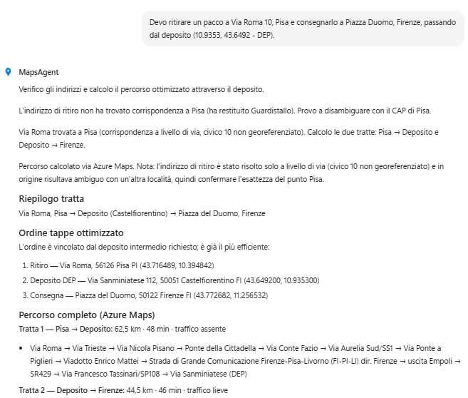
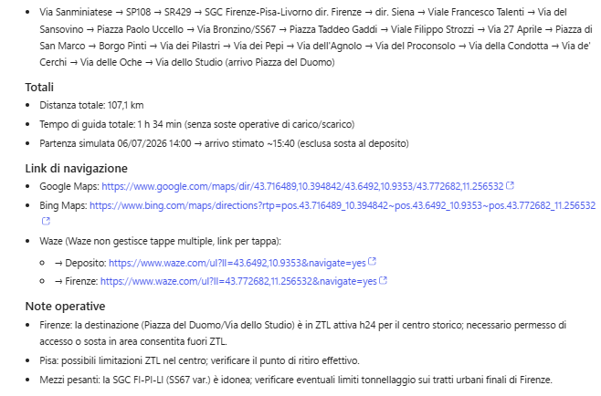

# Maps Agent · v2 (Copilot Studio)

## Per iniziare
→ **[Apri la guida tecnica](lab-guide.md)**

## Panoramica

La pianificazione di ritiri e consegne richiede di validare indirizzi, calcolare rotte affidabili e scegliere il vettore più adatto: un'attività che comporta il confronto di più fonti (mappe, vettori, vincoli di percorso) e che spesso viene svolta manualmente.

Con **Maps Agent** l'obiettivo è affidare questo lavoro a un assistente conversazionale che si appoggia ad **Azure Maps** per validare le location, calcolare distanze e tempi di percorrenza, ed elaborare un percorso ottimizzato su più tappe.

**Maps Agent (v2)** introduce l'integrazione diretta con Azure Maps ed è costruito sulla **nuova esperienza Agents di Copilot Studio** (non *Classic*): il comportamento dell'agente è guidato interamente da **Instructions** in linguaggio naturale e dai **Tool** collegati, senza dover progettare Topic o flussi di conversazione dedicati.

Il risultato è una risposta strutturata e ripetibile (percorso ottimizzato, tappe, distanza, tempi, vettore raccomandato, costo stimato e link di navigazione esterni) pronta per essere condivisa con il team logistico.

## Soluzione

**Maps Agent (v2)** introduce un processo guidato per la pianificazione di percorsi di ritiro e consegna, eliminando le stime manuali e la ricerca dispersiva tra più strumenti di mappatura.

L'agente segue una logica chiara e ripetibile: identifica le location coinvolte, le valida e le converte in coordinate tramite Azure Maps, calcola il percorso ottimale e confronta i vettori disponibili prima di restituire una raccomandazione.

Quando una richiesta viene ricevuta:

1. L'agente identifica tutte le location di ritiro e consegna presenti nella richiesta dell'utente
2. Utilizza i tool Azure Maps `Get location by address` / `Get location by point` per validare indirizzi e coordinate
3. Calcola con il tool `Get route` distanza, tempi di percorrenza e l'intero percorso tra le tappe, ottimizzandone l'ordine
4. Confronta i vettori disponibili in base a costo, disponibilità, copertura del servizio e tempi di consegna stimati
5. Restituisce percorso, tappe, percorso raccomandato, costo stimato e motivazione, insieme ai link di navigazione esterni (Google Maps, Bing Maps, Waze) e, se richiesto, a una mappa statica del percorso tramite il tool `Get static map`

In questo modo l'utente ottiene in un'unica interazione una raccomandazione operativa pronta all'uso, invece di dover consultare più strumenti separatamente.

Questo approccio permette di:

- Validare indirizzi e coordinate in modo affidabile tramite Azure Maps, senza inventare dati mancanti
- Ottimizzare l'ordine delle tappe riducendo tempi e distanze superflue
- Fornire link di navigazione pronti all'uso su più provider (Google Maps, Bing Maps, Waze)
- Separare chiaramente l'orchestrazione conversazionale (Instructions) dall'esecuzione delle chiamate ad Azure Maps (Tool), senza la necessità di Topic dedicati come nella Classic experience

## Esempio di utilizzo

### Pianificazione di un percorso di ritiro e consegna

**Richiesta utente**

```
Devo ritirare un pacco a Via Roma 10, Pisa e consegnarlo a Piazza Duomo, Firenze, passando dal deposito (10.9353, 43.6492 - DEP).
```




**Comportamento dell'agente**

1. Identifica le location di ritiro, consegna e il deposito indicato
2. Valida indirizzi e coordinate tramite i tool Azure Maps
3. Calcola il percorso ottimizzato tra le tappe, con distanza e tempo di percorrenza stimati
4. Confronta i vettori disponibili e raccomanda quello più adatto, motivando la scelta
5. Restituisce la risposta in formato strutturato (percorso, tappe, vettore, costo, motivazione, eventuali dati mancanti) con i link di navigazione su Google Maps, Bing Maps e Waze

## Per iniziare
→ **[Apri la guida tecnica](lab-guide.md)**
