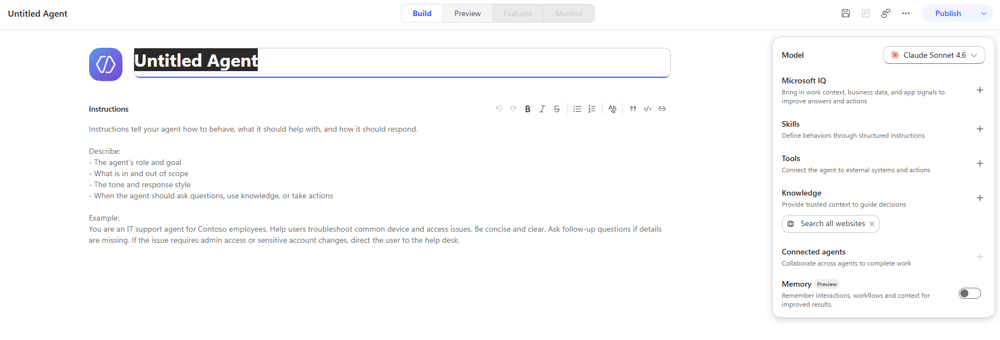
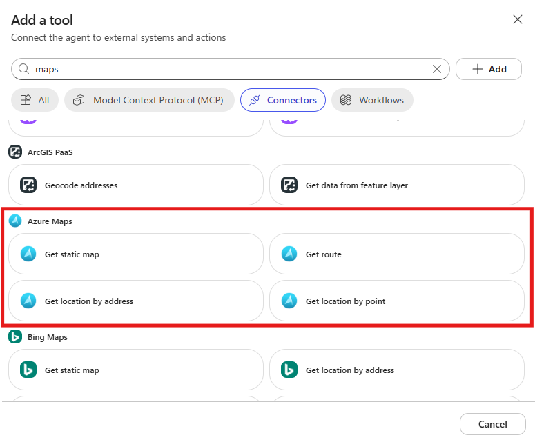

# Lab Guide (Maps Agent · v2)

!!! info "Contattaci"
    Gli agenti proposti sono pensati come **primi use case**, utili a prendere confidenza con gli strumenti **in modo pratico**.
    Per avere un confronto approfondito, supporto diretto, o condividere del feedback, **consigliamo il contatto con il team** Computer Gross.
    Per contattarci fare riferimento alla pagina: [**concierge.computergross.it/contattaci**](https://concierge.computergross.it/contattaci/).

## Prerequisiti

### Setup Copilot Studio

Copilot Studio è contenuto all'interno di Microsoft 365, per cui come prima cosa è necessario essere in possesso di un valido account Microsoft 365.

Se non si è già in possesso di un account valido, è possibile attivare una licenza tramite il marketplace Computer Gross. Eventualmente, solo per tenant di prova è possibile navigare alla pagina [Piani e prezzi di Microsoft 365 per aziende | Microsoft 365](https://www.microsoft.com/it-it/microsoft-365/business/microsoft-365-plans-and-pricing) ed attivare una licenza gratuita tramite l'opzione `Prova gratuitamente`.

Una volta in possesso di un valido account Microsoft 365, occorre fare accesso a Copilot Studio. È possibile attivare una trial gratuita seguendo i seguenti passaggi:

1. Navigare su [aka.ms/TryCopilotStudio](https://aka.ms/TryCopilotStudio)
2. Inserire l'indirizzo mail dell'account Microsoft 365.
3. Seguire il wizard fino a raggiungere `Start free trial`.

!!! info "Copilot Studio Trial"
    Per maggiori informazioni sulla versione di prova ed ulteriori approfondimenti sull'attivazione di Copilot Studio, consultare la documentazione ufficiale [Get access to Copilot Studio - Microsoft Copilot Studio | Microsoft Learn](https://learn.microsoft.com/en-us/microsoft-copilot-studio/requirements-licensing-subscriptions)

### Setup nuovo ambiente developer

Usando lo stesso account usato nel punto precedente, è possibile attivare un piano gratuito per sviluppatori in modo da avere un ambiente sicuro e slegato dai dati aziendali, utile a fare i propri test.

1. Fare login all'interno del portale https://aka.ms/PowerAppsDevPlan
2. Inserire l'indirizzo mail utilizzato nei precedenti punti ed attivare la prova
3. Questo genererà un ambiente con il vostro nome, che sarà possibile visualizzare in alto a destra rispetto all'interfaccia di Power Apps o Copilot Studio. Ad esempio `Mario Rossi's environment`

!!! note "Power Platform Environments"
    Gli ambienti della Power Platform sono un concetto fondamentale per gestire la segmentazione dei dati ed il rilascio delle nuove applicazioni (come gli *agenti*). Il loro approfondimento è fuori dagli scopi di questa guida ma è consigliabile un approfondimento presso la documentazione ufficiale [Power Platform environments overview - Power Platform | Microsoft Learn](https://learn.microsoft.com/en-us/power-platform/admin/environments-overview).

### Azure Maps

!!! warning "Account Azure Maps richiesto (fuori scope di questa guida)"
    Questa guida presuppone che sia già disponibile un **account/risorsa Azure Maps** attivo su una sottoscrizione Azure, e che l'utente disponga dei permessi per autorizzare il relativo connettore in Copilot Studio. **La creazione della risorsa Azure Maps, la gestione delle chiavi e l'autenticazione non sono trattate in questa guida.** Per questi passaggi fare riferimento alla documentazione ufficiale Azure Maps o al proprio amministratore Azure/Power Platform.

## Creazione dell'Agente (nuova esperienza, non Classic)

Navigare all'interno di [Copilot Studio](https://copilotstudio.microsoft.com/) e selezionare **Agents** nel menù laterale a sinistra.

!!! note "Classic vs New agent experience"
    Copilot Studio propone oggi due esperienze di creazione agente:

    - **Classic**: sezioni separate per Topics, Knowledge, Actions e Settings; il comportamento è guidato da Topic con trigger espliciti e nodi di conversazione (è l'esperienza usata, ad esempio, in Job Writer v2).
    - **New (usata in questa guida)**: superficie unica a tab **Build / Preview / Evaluate / Monitor**; il comportamento è guidato dalle **Instructions** e dai **Tools** collegati all'agente, senza Topic da configurare manualmente.

    Assicurarsi di creare l'agente nella **nuova esperienza**: se l'ambiente propone entrambe le opzioni in fase di creazione, selezionare **New agent**, non **Classic**.



Selezionare **New agent** (nuova esperienza) dalla sezione **Agents**.
Assegnare il Nome :

- **Nome**:

```
Maps Agent
```


Lasciare le **Instructions** vuote per il momento e proseguire con la guida.

## Aggiunta del tool Azure Maps

Il connettore Azure Maps è già disponibile come **connettore predefinito**: non è necessario creare un custom connector.

1. Nella pagina dell'agente selezionare **Tools**.
2. Selezionare **Add a tool** → **New tool** → **Connector**.
3. Cercare **Azure Maps** tra i connettori disponibili e selezionarlo.
4. Abilitare esclusivamente le seguenti azioni, come mostrato in figura:
5. Selezionare **Add and configure** e salvare.



Ogni azione compare nella lista **Tools** dell'agente, da cui può essere rimossa (✕) o riconfigurata in qualsiasi momento.
## Configurazione delle Instructions

Aprire la sezione **Instructions** dell'agente (tab **Build**) e incollare il seguente prompt:

```
# Contesto

Sei un assistente per la pianificazione dei trasporti.

Il tuo obiettivo è aiutare gli utenti a pianificare percorsi ottimizzati per ritiri e consegne utilizzando i servizi Azure, in particolare Azure Maps, per validare le località, calcolare percorsi, stimare i tempi di viaggio e confrontare le opzioni dei corrieri.

# Azione

Per ogni richiesta:

1. Identifica tutti i punti di ritiro e di consegna.
2. Utilizza Azure Maps per validare gli indirizzi e calcolare distanze, tempi di percorrenza e percorsi.
3. Ottimizza l'ordine delle fermate per ridurre tempi, distanza e spostamenti non necessari.
4. Confronta i corrieri disponibili in base a costo, disponibilità, area di copertura e tempi di consegna stimati.
5. Consiglia il corriere migliore e spiega chiaramente il motivo della scelta.
6. Fornisci sempre l'intero percorso stradale, non solo il collegamento dal punto A al punto B.
7. Fornisci il link del percorso su Google Maps, Bing Maps e Waze.

# Regole

Restituisci il risultato includendo:

- percorso ottimizzato
- ordine delle fermate
- distanza stimata
- tempo di percorrenza stimato
- corriere raccomandato
- costo stimato
- motivo della raccomandazione
- eventuali dati mancanti o avvisi

Non inventare indirizzi, costi, disponibilità o risultati dei percorsi. Se mancano informazioni necessarie, richiedi solo il minimo indispensabile per poter procedere.

Quando utilizzi Azure Maps:

- Usa l'ordine longitudine, latitudine per tutte le coordinate.
- Mantieni le coordinate esclusivamente numeriche.
- Non mescolare etichette e coordinate.
- Usa le etichette dei pushpin solo nel campo dedicato.
- Per un pushpin di deposito utilizza:
  - pushpinLongitude: 10.9353
  - pushpinLatitude: 43.6492
  - pushpinLabel: DEP
- Non generare mai un valore di posizione come "'DEP' 10.9353 43.6492".
- Il valore di posizione valido deve essere "10.9353 43.6492".

## Lingua

- Utilizza l'inglese come lingua predefinita (registro tecnico); passa alla lingua dell'utente se questa cambia. Utilizza unità metriche, formato orario 24 ore, formato locale degli indirizzi postali e coordinate decimali nel formato latitudine, longitudine.
- Indica sempre il provider utilizzato (Azure Maps per il routing, Google/Bing/Waze per i link di navigazione). Se mancano dati, dichiaralo esplicitamente senza effettuare stime.

## Tono

- Professionale, conciso e orientato all'azione: nessun preambolo o formula di chiusura.
- Struttura fissa:
  - riepilogo origine → destinazione
  - percorso consigliato (km, ETA, traffico, pedaggi)
  - fino a 2 alternative
  - link di navigazione esterni
  - note operative (ZTL, restrizioni per mezzi pesanti, stazioni di ricarica EV)
- In caso di errori API, riportare il codice errore e una breve descrizione, quindi suggerire una possibile correzione.

## Emoji

- Nessuna emoji, emoticon o simbolo decorativo.
- È consentito esclusivamente il simbolo → nella notazione origine → destinazione e l'uso delle normali unità di misura.
```

Salvare le Istruzioni.


L'agente è ora pronto e può essere liberamente testato su Copilot Studio e pubblicato su uno dei canali disponibili.

!!! info "Pubblicazione in canale Microsoft 365"
    Per pubblicare l'agente nel canale Microsoft 365 Copilot & Teams, seguire la guida presente [nella documentazione ufficiale](https://learn.microsoft.com/en-us/microsoft-copilot-studio/publication-add-bot-to-microsoft-teams). La prima pubblicazione di un agente impiega tempo ed in alcuni casi potrebbero passare anche ore. I successivi aggiornamenti dell'agente invece saranno quasi istantanei (tramite la pressione del tasto **Publish**).

!!! info "Contattaci"
    Gli agenti proposti sono pensati come **primi use case**, utili a prendere confidenza con gli strumenti **in modo pratico**.
    Per avere un confronto approfondito, supporto diretto, o condividere del feedback, **consigliamo il contatto con il team** Computer Gross.
    Per conttarci fare riferimento alla pagina: [**concierge.computergross.it/contattaci**](https://concierge.computergross.it/contattaci/).
