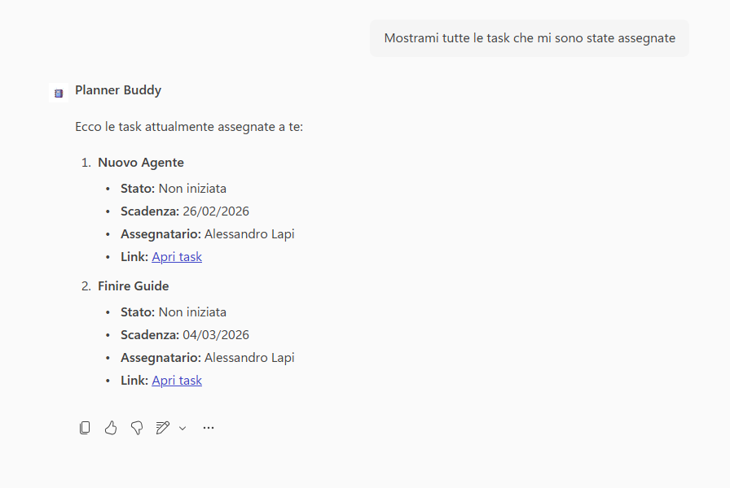

# Planner Buddy 

## Get started

→ **[Apri la guida tecnica](lab-guide.md)**

## Panoramica

All’interno dei processi di gestione operativa, il **monitoraggio e aggiornamento delle task in Microsoft Planner** è un’attività quotidiana e ripetitiva per team di progetto.
Queste operazioni:

* Sono frequenti e orientate al controllo dello stato delle attività
* Interrompono il flusso di lavoro quando richiedono accesso manuale alla piattaforma
* Possono essere gestite in modo rapido e standardizzato tramite un’interfaccia conversazionale 

## Problema

Abbiamo identificato la criticità principale nella gestione manuale delle task su Planner:

* **Aggiornamenti manuali ripetitivi e lenti** : La modifica dello stato delle task richiede navigazione e selezione manuale, rallentando l’operatività.
## Soluzione

Plunner Buddy  è un agente progettato **esclusivamente per la gestione delle task in Microsoft Planner**, con due sole funzioni operative:

* Recuperare e mostrare la lista delle task di un piano
* Aggiornare lo stato di una task esistente 

L’agente:

* Presenta le task in modo chiaro e strutturato (Titolo, Stato, Assegnatario, Scadenza, ID)
* Richiede l’ID in caso di ambiguità tra task con nomi simili
* Conferma sempre l’esito dell’azione effettuata
* Non crea, elimina o modifica dati diversi dallo stato della task

Questo approccio permette di:

* Velocizzare l’accesso alle informazioni operative
* Ridurre errori nell’aggiornamento delle attività
* Garantire controllo e tracciabilità delle modifiche
* Mantenere un perimetro funzionale chiaro e sicuro

## Esempio di utilizzo

### Visualizzazione delle task di un piano

**Richiesta utente**

`Mostrami tutte le task che mi sono state assegnate`

**Comportamento dell’agente**

1. Recupera le task dal piano indicato
2. Mostra per ogni task: Titolo, Stato, Assegnatario, Scadenza, Link
3. Presenta l’elenco in formato ordinato e leggibile
4. Non aggiunge interpretazioni o informazioni non presenti in Planner

### Aggiornamento dello stato di una task

**Richiesta utente**

`Segna come completata la task Nuovo Agente` 

**Comportamento dell’agente**

1. Verifica la presenza dell’ID fornito
2. Aggiorna esclusivamente lo stato della task indicata
3. Conferma il nuovo stato 
4. Non modifica altri campi o dati

## Get started
→ **[Apri la guida tecnica](lab-guide.md)**