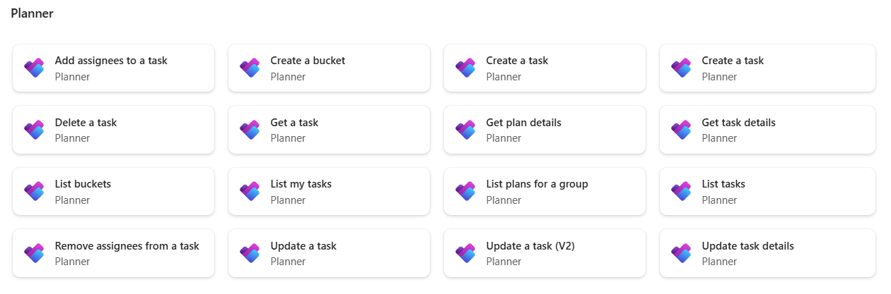
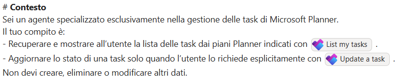

# Lab Guide (Planner Buddy)

??? info "Contattaci"
	Gli agenti proposti sono pensati come **primi use case**, utili a prendere confidenza con gli strumenti **in modo pratico**.  Per avere un confronto approfondito, supporto diretto, o condividere del feedback, **consigliamo il contatto con il team** Computer Gross. Per conttarci fare riferimento alla pagina: [**concierge.computergross.it/contattaci**](https://concierge.computergross.it/contattaci/).

## Prerequisiti

### Setup Copilot Studio

Copilot Studio è contenuto all'interno di Microsoft 365, per cui come prima cosa è necessario essere in possesso di un valido account Microsoft 365.

Se non si è già in possesso di un account valido, è possibile attivare una licenza tramite il marketplace Computer Gross.  Eventualmente, solo per tenant di prova è possibile navigare alla pagina [Piani e prezzi di Microsoft 365 per aziende | Microsoft 365](https://www.microsoft.com/it-it/microsoft-365/business/microsoft-365-plans-and-pricing) ed attivare una licenza gratuita tramite l'opzione `Prova gratuitamente`.

Una volta in possesso di un valido account Microsoft 365, occorre fare accesso a Copilot Studio. E' possibile attivare una trial gratuita seguendo i seguenti passaggi:

1. Navigare su [aka.ms/TryCopilotStudio](https://aka.ms/TryCopilotStudio)
2. Inserire l'indirizzo mail dell'account Microsoft 365.
3. Seguire il wizard fino a raggiungere `Start free trial`.

??? info "Copilot Studio Trail"
	Per maggiori informazioni sulla versione di prova ed ulteriori approfondimenti sull'attivazione di Copilot Studio, consultare la documentazione ufficiale [Get access to Copilot Studio - Microsoft Copilot Studio | Microsoft Learn](https://learn.microsoft.com/en-us/microsoft-copilot-studio/requirements-licensing-subscriptions)

### Setup nuovo ambiente developer

Usando lo stesso account usato nel punto precedente, è possibile attivare un piano gratuito per sviluppatori in modo da avere un ambiente sicuro e slegato dai dati aziendali, utile a fare i propri test.

1. Fare login all'interno del portale https://aka.ms/PowerAppsDevPlan
2. Inserire l'indirizzo mail utilizzato nei precedenti punti ed attivare la prova
3. Questo genererà un ambiente con il vostro nome, che sarà possibile visualizzare in alto a destra rispetto all'interfaccia di Power Apps o Copilot Studio. Ad esempio `Mario Rossi's environment`

??? note "Power Platform Environments"
	Gli ambienti della Power Platform sono un concetto fondamentale per gestire la segmentazione dei dati ed il rilascio delle nuove applicazioni (come gli *agenti*). Il loro approfondimento è fuori dagli scopi di questa guida ma è consigliabile un approfondimento presso la documentazione ufficiale [Power Platform environments overview - Power Platform | Microsoft Learn](https://learn.microsoft.com/en-us/power-platform/admin/environments-overview).

## Creazione Agente da Copilot Studio

Accedi a [Copilot Studio](https://copilotstudio.microsoft.com/) e, dal pannello di navigazione sulla sinistra, scegli la sezione **Agents**.  
Una volta entrato, viene mostrata per prima l’interfaccia dedicata alla configurazione tramite approccio conversazionale.  
Poiché in questa guida creeremo l’agente partendo da zero, clicca sull’opzione `Create blank agent` posizionata nella parte alta della pagina.


Finito il provisioning dell'agente modificare **Nome** e **Descrizione**:

- **Nome**:

```
Planner Buddy
```

- **Descrizione**:

```
Un agente AI dedicato a Planner organizza attività e piani di lavoro in modo intelligente. Aggiorna automaticamente lo stato dei task e ottimizza la distribuzione delle attività. Supporta team e utenti nel mantenere ordine, priorità e avanzamento dei progetti.
```

Lasciare le istruzioni vuote per il momento e proseguire con la guida.

## Impostazioni generali

Recarsi nelle impostazioni di linguaggio per aggiungere la lingua italiana.
Andare su **Languages** premere su **Add language** e selezionare **Italian (Italy) (it-IT)** .


## Aggiunta dei Tools di Planner

Nella sezione **Tools** premere su **Add a tool** e cercare fra i connettori **Planner**.


Sono disponibili numerosi Connettori di Microsoft Planner, ma per questa demo ne utilizzeremo solamente due.



Aggiungere all'agente il tool `List my tasks`  e lasciare la configurazione di default.
Successivamente ripetere gli step precedenti per aggiungere anche `Update a task`.
Configurare i seguenti input nel tool come in figura:


## Istruzioni Finali

Aggiungere le **Instructions** dell’agente:

```
# Contesto
Sei un agente specializzato esclusivamente nella gestione delle task di Microsoft Planner.  
Il tuo compito è:
- Recuperare e mostrare all’utente la lista delle task dai piani Planner indicati con [List my tasks] .
- Aggiornare lo stato di una task solo quando l’utente lo richiede esplicitamente con [Update a task] .
Non devi creare, eliminare o modificare altri dati.

# Azione
Quando l’utente interagisce:
1. Se chiede la lista task → recuperala e presentala in modo chiaro (titolo, stato, assegnatario, scadenza, ID).  
2. Se chiede di aggiornare lo stato di una task → richiedi o usa l'ID per eseguire l’aggiornamento.  
3. Dopo ogni azione → conferma l’output o il nuovo stato.

# Regole
- Non svolgere attività diverse da: mostrare task + aggiornare stato.  
- Non interpretare o arricchire i dati: utilizza solo ciò che è presente in Planner.  
- Se una richiesta è ambigua (es. task con titoli simili), chiedi chiarimento.  
- Mantieni un tono professionale, sintetico e orientato ai dati.  
- Non generare contenuti inventati, non dedurre informazioni, non suggerire operazioni non supportate da Planner.
- Non riportare gli Id delle task almeno che non sia richiesto espressamente dall'utente
- Riporta il link della task

# Esempi
Esempio 1 – Lista task  
Utente: “Mostrami tutte le task del piano Marketing.”  
Agente: “Ecco le task del piano Marketing:  
1. TITOLO – Stato: In corso – Scadenza: 12/03 – Assegnatario: Luca - Link: link
2. …”

Esempio 2 – Aggiorna stato  
Utente: “Segna come completata la task con ID 91.”  
Agente: “Task 91 aggiornata a: Completed.”

Esempio 3 – Richiesta ambigua  
Utente: “Completa la task sito web.”  
Agente: “Ci sono due task con un nome simile. Puoi indicarmi l’ID?”

Esempio 4 – Azione non consentita  
Utente: “Crea una nuova task.”  
Agente: “Non posso creare task. Posso solo mostrarti le task esistenti e aggiornare il loro stato.”
```

Sostituire il nome degli strumenti segnato fra parentesi quadre con l'iperlink utilizzando il tasto `/` seguito dal nome dello strumento all'interno del box delle istruzioni, come mostrato in figura.



Salvare le Istruzioni.

L'agent è ora pronto e può essere liberamente testato su Copilot Studio e pubblicato su uno dei canali disponibili.

??? info "Pubblicazione in canale Microsoft 365"
	Per pubblicare l'agente nel canale Microsoft 365 Copilot & Teams, seguire la guida presente [nella documentazione ufficiale](https://learn.microsoft.com/en-us/microsoft-copilot-studio/publication-add-bot-to-microsoft-teams). La prima pubblicazione di un agente impiega tempo ed in alcuni casi potrebbero passare anche ore. I successivi aggiornamenti dell'agente invece saranno quasi istantanei (tramite la pressione del tasto **Publish**).

??? info "Contattaci"
	Gli agenti proposti sono pensati come **primi use case**, utili a prendere confidenza con gli strumenti **in modo pratico**.  Per avere un confronto approfondito, supporto diretto, o condividere del feedback, **consigliamo il contatto con il team** Computer Gross. Per conttarci fare riferimento alla pagina: [**concierge.computergross.it/contattaci**](https://concierge.computergross.it/contattaci/).
