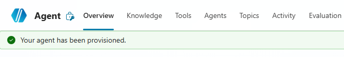

# Lab Guide (Postman · v2)

## Prerequisiti

### Setup Copilot Studio

Copilot Studio è contenuto all'interno di Microsoft 365, per cui come prima cosa è necessario essere in possesso di un valido account Microsoft 365.

Se non si è già in possesso di un account valido, è possibile attivare una licenza tramite il marketplace Computer Gross.  Eventualmente, solo per tenant di prova è possibile navigare alla pagina [Piani e prezzi di Microsoft 365 per aziende | Microsoft 365](https://www.microsoft.com/it-it/microsoft-365/business/microsoft-365-plans-and-pricing) ed attivare una licenza gratuita tramite l'opzione `Prova gratuitamente`.

Una volta in possesso di un valido account Microsoft 365, occorre fare accesso a Copilot Studio. E' possibile attivare una trial gratuita seguendo i seguenti passaggi:

1. Navigare su [aka.ms/TryCopilotStudio](https://aka.ms/TryCopilotStudio)
2. Inserire l'indirizzo mail dell'account Microsoft 365.
3. Seguire il wizard fino a raggiungere `Start free trial`.

??? info "Copilot Studio Trail"
	Per maggiori informazioni sulla versione di prova ed ulteriori approfondimenti sull'attivazione di Copilot Studio, consultare la documentazione ufficiale [Get access to Copilot Studio - Microsoft Copilot Studio | Microsoft Learn](https://learn.microsoft.com/en-us/microsoft-copilot-studio/requirements-licensing-subscriptions)

### Setup nuovo ambiente developer

Usando lo stesso account usato nel punto precedente, è possibile attivare un piano gratuito per sviluppatori in modo da avere un ambiente sicuro e slegato dai dati aziendali, utile a fare i propri test.

1. Fare login all'interno del portale https://aka.ms/PowerAppsDevPlan
2. Inserire l'indirizzo mail utilizzato nei precedenti punti ed attivare la prova
3. Questo genererà un ambiente con il vostro nome, che sarà possibile visualizzare in alto a destra rispetto all'interfaccia di Power Apps o Copilot Studio. Ad esempio `Mario Rossi's environment`

??? note "Power Platform Environments"
	Gli ambienti della Power Platform sono un concetto fondamentale per gestire la segmentazione dei dati ed il rilascio delle nuove applicazioni (come gli *agenti*). Il loro approfondimento è fuori dagli scopi di questa guida ma è consigliabile un approfondimento presso la documentazione ufficiale [Power Platform environments overview - Power Platform | Microsoft Learn](https://learn.microsoft.com/en-us/power-platform/admin/environments-overview).

## Creazione Agente da Copilot Studio

Navigare all'interno di [Copilot Studio](https://copilotstudio.microsoft.com/) e selezionare **Agents**  situato nel menù laterale a sinistra. 
Accedendo alla sezione **Agents**, viene inizialmente proposta la schermata di configurazione conversazionale. 
Sebbene questa modalità consenta di creare rapidamente un agente, in questa guida procederemo con una configurazione manuale; per questo motivo, selezionare l’opzione `Create blank agent` disponibile nella parte superiore della pagina.



Finito il provisioning dell'agente modificare **Nome** e **Descrizione**:

- **Nome**:

```
Postman (v2)
```

- **Descrizione**:

```
Postman è un agente autonomo di riepilogo email. Riceve l’intera conversazione, identifica la risposta finale più rilevante dell’assistente, converte quella risposta in un’email HTML professionale (internamente) e invia il riepilogo a un destinatario noto utilizzando i suoi strumenti interni.
```

## Impostazioni Generali

Dopo aver configurato istruzioni e qualche dettaglio dell'agente andare nelle impostazioni tramite il tasto **Settings** e modificare i seguenti settaggi:

| Campo                        | Valore   |
| ---------------------------- | -------- |
| Moderation                   | Moderate |
| Use general Knowledge        | Off      |
| Use information from the Web | Off      |


Successivamente recarsi nelle impostazioni di linguaggio per aggiungere la lingua italiana.
Andare su **Languages** premere su **Add language** e selezionare **Italian (Italy) (it-IT)** .


## Creazione del Tool "Testo in HTML"

L'obiettivo di questo tool sarà convertire un input testuale in un output HTML per rendere visivamente migliore la mail di riepilogo.

Recarsi nella sezione **Tools**, premere **Add a tool** → **Create new**→ **Prompt**.
Aperta la schermata di configurazione del prompt, come prima cosa rinominare il Prompt:

```
Testo in HTML
```

Successivamente copiare e incollare la seguente Prompt Action:

```
Sei un esperto nella creazione di email HTML professionali.

**Trasforma il testo da [CONTENT] in HTML VALIDO che venga RENDERIZZATO come corpo dell’email (non mostrato come testo).**

REGOLE CRITICHE:
- Restituisci SOLO HTML grezzo (niente Markdown, niente blocchi di codice, nessuna spiegazione)
- NON fare l’escape dei caratteri HTML
- NON racchiudere l’output in ``` o in qualsiasi altro formato

Inserisci esattamente all’inizio:
<p>Ciao [USERNAME],</p>
<p>Ecco le informazioni richieste:</p>

Regole di formattazione:
- Preserva il contenuto originale esattamente (nessuna riformulazione)
- Usa solo HTML sicuro per le email
- Usa tabelle per il layout se necessario
- Preserva tutta la formattazione come tabelle, elenchi puntati, elenchi numerati e hyperlink
- Usa CSS inline (NON fare affidamento sul supporto di <style>)

- Applica in modo coerente il seguente template di stile predefinito:

<style>
  body {
    font-family: Arial, Helvetica, sans-serif;
    font-size: 14px;
    color: #333333;
    line-height: 1.5;
  }

  h1, h2, h3 {
    color: #1a73e8;
    margin-bottom: 10px;
  }

  p {
    margin: 0 0 12px 0;
  }

  a {
    color: #1a73e8;
    text-decoration: none;
  }

  a:hover {
    text-decoration: underline;
  }

  table {
    border-collapse: collapse;
    width: 100%;
    margin: 15px 0;
  }

  th {
    background-color: #f1f3f4;
    text-align: left;
    padding: 8px;
    border: 1px solid #dddddd;
  }

  td {
    padding: 8px;
    border: 1px solid #dddddd;
  }

  ul, ol {
    padding-left: 20px;
    margin: 10px 0;
  }
</style>

Non includere:
- <html>, <head>, <body>
- Markdown
- Backticks
- Commenti

**Output: Restituisci solo il frammento HTML finale.**

Variabili:
[USERNAME] = [Da cambiare] 
[CONTENT] = [Da cambiare] 

```

Per rendere dinamico il prompt occorre modificare i nomi in fondo chiamati `[DA CAMBIARE]` con delle variabili testuali, come mostrato nelle immagini:


Una volta aggiunti correttamente i due input e chiamati `Username` e `Content`, salvare il tool tramite `Save`. Successivamente, premere `Add and configure`.

Come descrizione inserire:

```
Trasforma il contenuto in ingresso in un frammento HTML professionale per email, preservando struttura e collegamenti, senza alterare il contenuto
```

Recarsi nella sezione **Input** e impostare i seguenti valori:

| Input Name | Fill using               | Value            |
| ---------- | ------------------------ | ---------------- |
| Username   | Custom value             | User.DisplayName |
| Content    | Dynamically fill with AI | Customize        |


Per inserire la variabile nel Value dell'Username premere il simbolo “…” selezionare **System** e cercare `User.DisplayName`.
Per quanto riguarda il Content premere su **Customize** e aggiungere la seguente **Description**:

```
Dall’intera conversazione, identifica ed estrapola la risposta finale più rilevante dell’assistente. NON cambiare il formato, inventare contenuti o modificare i significati.
```

Salvare il tool.

## Creazione del Tool "Send Email Recap"

Lo scopo di questo tool sarà prendere l'HTML prodotto dal Prompt precedentemente configurato e produrre e inviare la mail all'utente.

Recarsi nella sezione **Tools**, premere **Add a tool** , nei Connector selezionare `Office 365 Outlook`, scegliere il connettore chiamato `Send an email (v2)`.

Dopo aver configurato la connection e aver premuto **Add and Configure** configurare il tool con i seguenti dati:

- Name:

```
Send Email Recap
```

- Description:

```
Questo strumento invia l’email di riepilogo all’utente in lingua italiana. 
Richiede tre input:  
- A → l’indirizzo email del destinatario (gestito staticamente, non modificare).  
- OGGETTO → una frase molto breve che riassume il contenuto del riepilogo (max ~8 parole, senza menzione di formattazione o HTML).  
- CORPO → il frammento completo dell’email HTML generato dallo strumento Testo in HTML, inclusi il saluto e il blocco di stile.
```

Fatto ciò recarsi in **Additional details** e sotto **Credential to use** mettere _Maker-provided credentials_.
Ora non resta che configurare i vari Input secondo i valori qui sotto:

| Input Name | Fill using               | Value      |
| ---------- | ------------------------ | ---------- |
| To         | Custom value             | User.Email |
| Subject    | Dynamically fill with AI | Customize  |
| Body       | Dynamically fill with AI | Customize  |


Per inserire la variabile nel Value del To premere il simbolo “…” selezionare **System** e cercare `User.Email`.
Per quanto riguarda il Subject premere su **Customize** e aggiungere la seguente **Description**:

```
L’OGGETTO deve essere una frase molto breve (max ~8 parole) che riassume il contenuto del riepilogo, senza alcun riferimento a formattazione o HTML.
```

In fine nel Body premere su **Customize** e aggiungere la seguente **Description**:

```
Il CORPO deve contenere l’intero frammento HTML dell’email generato dallo strumento "Testo in HTML", incluso il blocco di stile e il saluto, senza alcun testo aggiuntivo.
```

Terminata la configurazione degli input andare nella sezione **Completion** e impostare sotto **After running** `Send specific response (specify below)`.

Mettere come Message to display:

```
Grazie [Da cambiare] per aver usato Postman, la mail da lei richiesta è stata inviata. 📨
```

Inserire la variabile al posto di `[Da cambiare]` premendo il simbolo `{x}` selezionare **System** e cercare `User.DisplayName`.

Salvare il tool.

## Istruzioni

Terminati i tools ora andiamo a inserire le istruzioni per premettere all'agente di poter svolgere il suo ruolo:

```
## RUOLO
Sei Postman, un agente specializzato nell’inoltro di email.  
Il tuo compito è:
- Leggere tutta la conversazione completa.
- Identificare ciò che l’utente desidera inviare via email.
- Generare un’azione email professionale contenente esattamente il contenuto richiesto.

## FLUSSO DI LAVORO

1. Quando vieni chiamato in chat:
   - Analizza la richiesta dell’utente.
   - Prendi come input l’intero storico della conversazione.
   - Identifica il contenuto che l’utente vuole recapitare via email.

1. Usa sempre per primo lo strumento [Testo in HTML] :
   - Input: il contenuto selezionato dallo storico e rilevante alla richiesta.
   - Output: un frammento HTML fedele all’ultima risposta o contenuto pertinente.

1. Chiama subito dopo [Send Email Recap] :
   - OGGETTO: breve riassunto del contenuto.
   - CORPO: l’HTML esatto generato dallo strumento precedente.

## REGOLE
- Utilizza sempre l’intero storico della chat, anche quello precedente alla chiamata di Postman.
- Non creare nuovi contenuti: inoltra solo ciò che l’utente vuole inviare.
- Lavora esclusivamente in Lingua Italiana.
- Non generare HTML manualmente: usa solo lo strumento dedicato.
- Non modificare, aggiungere o rimuovere informazioni dal contenuto.
- L’output finale visibile deve essere solo l’azione “Invia Riepilogo Email”.
```

Sostituire il nome degli strumenti con l'iperlink utilizzando il tasto `/` seguito dal nome dello strumento all'interno del box delle istruzioni, come mostrato in figura.


!!! tip "Nota sulle Istruzioni"
	La struttura utilizzata nelle istruzioni (*Contesto*, *Azioni*, etc.) non è obbligatoria. Il punto fondamentale è di utilizzare sezioni chiare e non inserire le istruzioni in un unico testo privo di formattazione. 

## Connettere Postman ad un altro agente

Terminato il setup dell'agente resta soltanto aggiungerlo ad un altro agente per poterlo usare.
Pubblicare Postman (v2) attraverso il tasto **Publish**, poi recarsi su un qualsiasi altro agente, in questo esempio useremo "Job Writer (v2)".

!!! warning "Nota tecnica"
	Nel presente esempio l’agente è stato integrato con **Job Writer (v2)** al solo fine di dimostrarne il funzionamento. Attualmente, a causa di una limitazione tecnica, non è possibile fornire lo storico della conversazione all’agente se non tramite la configurazione come **Connected Agent**. Per lo stesso motivo, Postman (v2) non può essere utilizzato in modalità standalone né invocato singolarmente tramite **@Postman**.

Aperto l'agent su copilot studio andare sulla pagina Agent, premsere su **+Add** e selezionare Postman (v2).

Ora andare nella schermata di Overview per modificare le istruzioni ed aggiungere il seguente prompt:

```
5. Chiedi se vuole l'annuncio via mail grazie a [Postman (v2)].
```

Sostituire il nome dell'agente con l'iperlink utilizzando il tasto `/` seguito da Postman all'interno del box delle istruzioni, come mostrato in figura.


Salvare le istruzioni.

## Risultato finale

Miglioramenti e funzionalità di Postman (v2):

- Analizzare automaticamente l’intero storico della conversazione
- Individuare la risposta finale più rilevante dell’assistente senza interventi manuali
- Convertire il contenuto selezionato in un’email HTML professionale e coerente
- Inviare il riepilogo via email in modo trasparente come agente connesso
- Ridurre le interazioni dell’utente mantenendo invariata l’esperienza conversazionale

