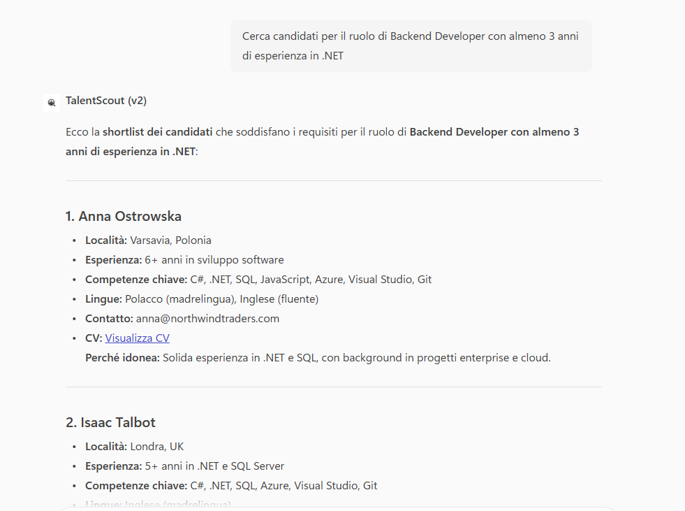

# Talent Scout · v2 (Copilot Studio)

## Get started

→ **[Apri la guida tecnica](lab-guide.md)**

## Panoramica

La selezione dei candidati richiede tempo, metodo e capacità di analisi.  
Con un approccio tradizionale, i CV arrivano via email, vengono salvati manualmente e analizzati uno a uno, con un elevato dispendio di tempo e rischio di perdita di informazioni.

**Talent Scout (v1)** introduceva un primo livello di supporto alla ricerca, consentendo di interrogare un archivio di CV tramite conversazione. Tuttavia, la gestione delle nuove candidature e le notifiche al team rimanevano attività manuali.

**Talent Scout (v2)** evolve questo modello introducendo un sistema **completo e automatizzato** per la gestione e l’analisi dei candidati.  
L’agente non solo ricerca e filtra i CV in base ai criteri richiesti, ma intercetta automaticamente le nuove candidature in arrivo, le archivia in modo strutturato e notifica il team HR.

Il risultato è un processo di screening **più veloce, tracciabile e standardizzato**, con CV centralizzati e immediatamente disponibili per l’analisi.

## Soluzione

**Talent Scout (v2)** introduce un processo **guidato e automatizzato** per la ricerca e la gestione delle candidature, separando chiaramente la parte conversazionale dalla parte di automazione.

L’agente segue una logica chiara e ripetibile: analizza i CV secondo criteri oggettivi, organizza automaticamente le nuove candidature e mantiene il team aggiornato in tempo reale.

Quando il flusso viene avviato manualmente (ricerca candidati):

1. L’agente analizza il testo e identifica automaticamente i criteri rilevanti (ruolo, seniority, competenze, anni di esperienza, località, modalità di lavoro, ecc.)
2.  Applica tali criteri all’archivio CV disponibile
3. Analizza il contenuto dei documenti in modo contestuale
4.  Restituisce una short list motivata con spiegazione del livello di matching


Quando invece il flusso viene attivato automaticamente (nuova candidatura via email):

1. Un trigger intercetta l’arrivo di una email con CV in formato PDF allegato
2. Il file viene salvato automaticamente in una libreria dedicata su **Microsoft SharePoint**
3. Un secondo tool invia una notifica strutturata su **Microsoft Teams**
4. Il team HR viene informato in tempo reale dell’arrivo del nuovo candidato

In questo modo l’intero processo è centralizzato, tracciabile e coerente.

Questo approccio permette di:

- Automatizzare la raccolta delle candidature
- Centralizzare tutti i CV in un unico repository aziendale
- Ridurre drasticamente il tempo di screening
- Separare chiaramente la fase conversazionale dalla gestione documentale e dalle notifiche
- Garantire maggiore controllo e governance del processo di selezione

## Esempio di utilizzo

### Ricerca candidati con criteri specifici

**Richiesta utente**

```
Cerca candidati per il ruolo di Backend Developer con almeno 3 anni di esperienza in .NET
```



**Comportamento dell’agente**

1. Estrae automaticamente ruolo, seniority, stack tecnologico e location
2. Analizza i CV archiviati
3. Calcola il livello di compatibilità
4. Restituisce elenco candidati con motivazione del match  

### Arrivo automatico di una nuova candidatura

**Evento**

Arriva una email con allegato `CV_NomeCandidato.pdf`


**Comportamento del sistema**

1. Il trigger intercetta la mail
2. Salva il file su SharePoint in modo strutturato
3. Registra le informazioni principali del candidato
4. Invia notifica automatica su Teams al canale HR

## Get started

→ **[Apri la guida tecnica](lab-guide.md)**