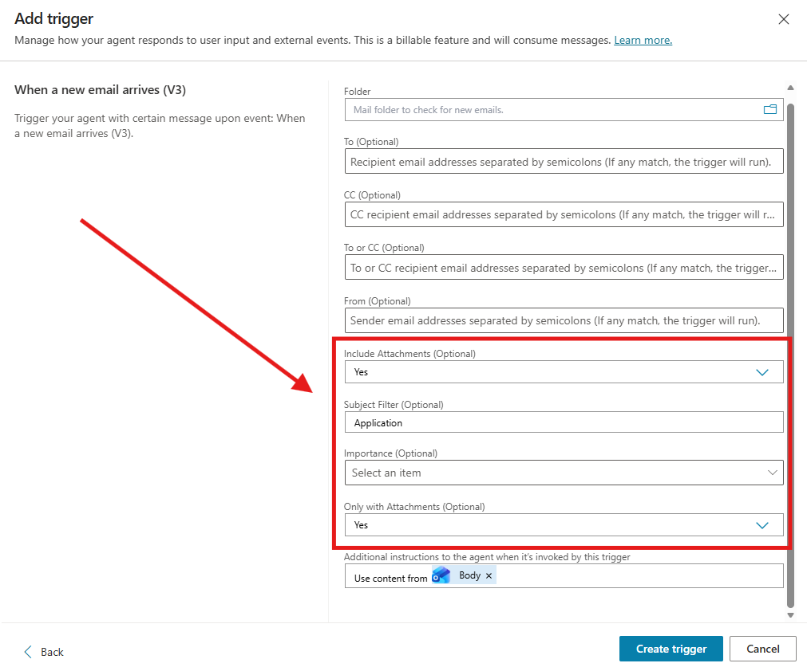
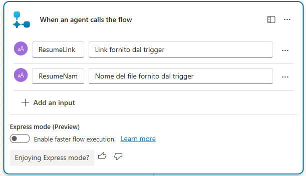
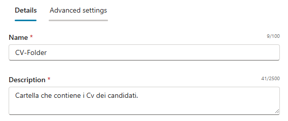
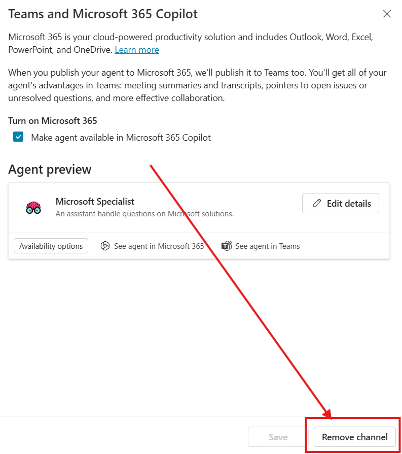

## Prerequisiti

### Setup Copilot Studio

Copilot Studio è contenuto all'interno di Microsoft 365, per cui come prima cosa è necessario essere in possesso di un valido account Microsoft 365.

Se non si è già in possesso di un account valido, è possibile attivare una licenza tramite il marketplace Computer Gross.  Eventualmente, solo per tenant di prova è possibile navigare alla pagina [Piani e prezzi di Microsoft 365 per aziende | Microsoft 365](https://www.microsoft.com/it-it/microsoft-365/business/microsoft-365-plans-and-pricing) ed attivare una licenza gratuita tramite l'opzione `Prova gratuitamente`.

Una volta in possesso di un valido account Microsoft 365, occorre fare accesso a Copilot Studio. E' possibile attivare una trial gratuita seguendo i seguenti passaggi:

1. Navigare su [aka.ms/TryCopilotStudio](https://aka.ms/TryCopilotStudio)
2. Inserire l'indirizzo mail dell'account Microsoft 365.
3. Seguire il wizard fino a raggiungere `Start free trial`.

??? info "Copilot Studio Trail"
	Per maggiori informazioni sulla versione di prova ed ulteriori approfondimenti sull'attivazione di Copilot Studio, consultare la documentazione ufficiale [Get access to Copilot Studio - Microsoft Copilot Studio | Microsoft Learn](https://learn.microsoft.com/en-us/microsoft-copilot-studio/requirements-licensing-subscriptions)

### Setup nuovo ambiente developer

Usando lo stesso account usato nel punto precedente, è possibile attivare un piano gratuito per sviluppatori in modo da avere un ambiente sicuro e slegato dai dati aziendali, utile a fare i propri test.

1. Fare login all'interno del portale https://aka.ms/PowerAppsDevPlan
2. Inserire l'indirizzo mail utilizzato nei precedenti punti ed attivare la prova
3. Questo genererà un ambiente con il vostro nome, che sarà possibile visualizzare in alto a destra rispetto all'interfaccia di Power Apps o Copilot Studio. Ad esempio `Mario Rossi's environment`

??? note "Power Platform Environments"
	Gli ambienti della Power Platform sono un concetto fondamentale per gestire la segmentazione dei dati ed il rilascio delle nuove applicazioni (come gli *agenti*). Il loro approfondimento è fuori dagli scopi di questa guida ma è consigliabile un approfondimento presso la documentazione ufficiale [Power Platform environments overview - Power Platform | Microsoft Learn](https://learn.microsoft.com/en-us/power-platform/admin/environments-overview).


### Creazione Sito SharePoint

Per questo caso d'uso è stato utilizzato un sito SharePoint. E' possibile replicare lo stesso sito navigando seguendo i seguenti passaggi:

1. Navigare su SharePoint Online
2. Selezionare il tasto `+ Create site`
3. Scegliere le seguenti opzioni nel wizard di creazione:
	- **Select the site type**: `Team Site`
	- **Select a template**: `Blank`
	- **Name**: `Cv-Site`
	- **Privacy**, **Language** a piacere
4. Nella cartella Documents caricare i seguenti Cv demo:


###  Creazione del canale su Teams

Per questo caso d'uso è stato utilizzato un nuovo team su Teams. E' possibile replicare lo stesso sito navigando seguendo i seguenti passaggi:

1. Navigare su Teams
2. Selezionare il tasto `+ New Team`
3. Scegliere le seguenti opzioni nel wizard di creazione:
	- Team Name: `Concierge2026`
	- Description: `Blank`
	- Team type: `Private`
	- First channel name: `Generale`
4. Nel Team premere su `Create a channel`:
	- Channel Name: `Applicants`
	- Description: `Blank`
	- Choose a channel type: `Standard`
	- Layout: `Posts`
5. Premere Create


## Creazione Agente da Copilot Studio

Navigare all'interno di [Copilot Studio](https://copilotstudio.microsoft.com/) e selezionare **Agents**  situato nel menù laterale a sinistra. 
Accedendo alla sezione **Agents**, viene inizialmente proposta la schermata di configurazione conversazionale. 
Sebbene questa modalità consenta di creare rapidamente un agente, in questa guida procederemo con una configurazione manuale; per questo motivo, selezionare l’opzione `Create blank agent` disponibile nella parte superiore della pagina.


Finito il provisioning dell'agente modificare **Nome** e **Descrizione**:

- **Nome**:

```
Talent Scout (v2)
```

- **Descrizione**:

```
Talent Scout (v2) è un agente intelligente che analizza i CV in base ai criteri espressi dall’utente, creando shortlist di candidati compatibili. Gestisce automaticamente le nuove candidature ricevute via email, salvando i PDF su SharePoint e notificando il team HR su Teams, rendendo il processo di recruiting più rapido, centralizzato e tracciabile.
```
## Impostazioni generali

Recarsi nelle impostazioni di linguaggio per aggiungere la lingua italiana.
Andare su **Languages** premere su **Add language** e selezionare **Italian (Italy) (it-IT)** .


## Creazione del Trigger

Nella sezione `Triggers`, premere `+Add Trigger`  e selezionare `When a new email arrives (V3)`.


Configurare i seguenti campi del trigger:

- Include Attachments : Yes
- Subject Filter : Application
- Only with Attachments : Yes



Premere su `Create trigger` e successivamente `Edit in Power Automate`.


Una volta aperto il flow su PowerAutomate selezionare il trigger e andare nei `Settings` per abilitare lo `Split on` e  selezionare `@triggerOutputs()?['body/value']`


Successivamente premere sotto al trigger il `+` e aggiungere una `Condition` con i seguenti settaggi:


!!! note "Tips"
	Per inserire valori dinamici come `contentType` premere su `ƒx` →  Dynamic Content.

Configurata la Condition recarsi sotto il ramo `True` e aggiungere `Create File` di SharePoint che deve essere configurato con questi parametri:
- Site Address: Cv-Site
- Folder Path: /Shared Documents

Gli altri campi da configurare come in figura:


Terminato il connettore per l'upload del file su SharePoint aggiungiamo un altro connettore per permettere la creazione di un link di sharing.
Cercare `Create sharing link for a file or folder` e inserire :
- Site Address : Cv-Site
- Library Name : Documents
- Item Id : body/ItemId (Dynamic Content dal nodo precedente)
- Link Type : View only
- Link Scope : Poeple in your organization

In fine prendere il nodo finale `Sends a prompt to the specified copilot for processing` spostarlo sotto il nodo precedente e inserire il seguente body/message : 

```
Usa il tool "Notify Teams Applicant channel"  per postare su Teams il nuovo resume con questi dati [ResumeLink (text)] = "@{outputs('Create_sharing_link_for_a_file_or_folder')?['body/link/webUrl']}" and [ResumeTitle (text_1)] = "@{outputs('Create_file')?['body/Name']}"
```


Salvare premendo su Save draft e poi pubblicarlo con Publish.

## Creazione del Tool

Andare su Tools → `Add a tool` → `New Agent Flow`.
Rinominare il flow `Notify Teams Applicant channel` e inserire come input nel nodo `When an agent calls the flow` i seguenti parametri:
- Text | ResumeLink | Link fornito dal trigger
- Text | ResumeName | Nome del file fornito dal trigger



Aggiungere `Post card in a chat or channel` come nodo sotto al trigger e configurarlo con i seguenti dati:

- Post as : Flow bot
- Post in : Channel 
- Team : Concierge 2026
- Channel : Applicants
- Adaptive card :

```
{
    "type": "AdaptiveCard",
    "speak": "New Resume Uploaded",
    "body": [
        {
            "inlines": [
                {
                    "type": "TextRun",
                    "size": "Small",
                    "text": "New Resume",
                    "selectAction": {
                        "url": "@{triggerBody()?['text']}",
                        "type": "Action.OpenUrl"
                    }
                }
            ],
            "type": "RichTextBlock"
        },
        {
            "columns": [
                {
                    "width": "stretch",
                    "items": [
                        {
                            "size": "Large",
                            "text": "📄 New Resume Uploaded",
                            "weight": "Bolder",
                            "wrap": true,
                            "type": "TextBlock"
                        }
                    ],
                    "verticalContentAlignment": "Center",
                    "type": "Column"
                }
            ],
            "spacing": "Small",
            "type": "ColumnSet"
        },
        {
            "type": "Table",
            "columns": [
                {
                    "width": 1
                },
                {
                    "width": 2
                }
            ],
            "rows": [
                {
                    "type": "TableRow",
                    "cells": [
                        {
                            "type": "TableCell",
                            "items": [
                                {
                                    "type": "TextBlock",
                                    "text": "Name",
                                    "wrap": true,
                                    "weight": "Bolder"
                                }
                            ],
                            "verticalContentAlignment": "Center"
                        },
                        {
                            "type": "TableCell",
                            "items": [
                                {
                                    "type": "TextBlock",
                                    "text": "@{triggerBody()?['text_1']}",
                                    "wrap": true
                                }
                            ],
                            "verticalContentAlignment": "Center"
                        }
                    ]
                },
                {
                    "type": "TableRow",
                    "cells": [
                        {
                            "type": "TableCell",
                            "items": [
                                {
                                    "type": "TextBlock",
                                    "text": "Status",
                                    "wrap": true,
                                    "weight": "Bolder"
                                }
                            ],
                            "verticalContentAlignment": "Center"
                        },
                        {
                            "type": "TableCell",
                            "items": [
                                {
                                    "type": "TextBlock",
                                    "text": "Waiting for Review",
                                    "wrap": true
                                }
                            ],
                            "verticalContentAlignment": "Center"
                        }
                    ]
                },
                {
                    "type": "TableRow",
                    "cells": [
                        {
                            "type": "TableCell",
                            "items": [
                                {
                                    "type": "TextBlock",
                                    "text": "Due Date",
                                    "wrap": true,
                                    "weight": "Bolder"
                                }
                            ],
                            "verticalContentAlignment": "Center"
                        },
                        {
                            "type": "TableCell",
                            "items": [
                                {
                                    "type": "TextBlock",
                                    "text": "@{addDays(utcNow(), 3, 'MMM dd, yyyy')}",
                                    "wrap": true
                                }
                            ],
                            "verticalContentAlignment": "Center"
                        }
                    ]
                },
                {
                    "type": "TableRow",
                    "cells": [
                        {
                            "type": "TableCell",
                            "items": [
                                {
                                    "type": "TextBlock",
                                    "text": "Priority",
                                    "wrap": true,
                                    "weight": "Bolder"
                                }
                            ],
                            "verticalContentAlignment": "Center"
                        },
                        {
                            "type": "TableCell",
                            "items": [
                                {
                                    "type": "TextBlock",
                                    "text": "🚩 Important",
                                    "color": "Attention",
                                    "wrap": true
                                }
                            ],
                            "verticalContentAlignment": "Center"
                        }
                    ]
                }
            ],
            "firstRowAsHeaders": false,
            "showGridLines": false
        },
        {
            "actions": [
                {
                    "title": "View Resume",
                    "type": "Action.OpenUrl",
                    "url": "@{triggerBody()?['text']}"
                }
            ],
            "type": "ActionSet",
            "spacing": "ExtraLarge"
        }
    ],
    "$schema": "https://adaptivecards.io/schemas/adaptive-card.json",
    "version": "1.5"
}
```

In fine premere su `respont to the Agent` e inserire come Output:
- End Conversation | Finished | Fine Conversazione

Premere su Save Draft e successivamente Publish`.

## Istruzioni Finali

Aggiornare le **Instructions** dell’agente:

```
# Contesto
Sei TalentScout, un assistente AI per lo screening CV.
Hai accesso a CV archiviati in SharePoint, contenenti: nome, ruoli, anni di esperienza,
competenze tecniche e soft skill, formazione, lingue.
Rispondi sempre in italiano, in modo professionale e sintetico.

# Azione
Quando ricevi una richiesta di ricerca candidati:
1. Identifica i requisiti (ruolo, anni di esperienza, competenze, altri criteri).
   Se la richiesta è ambigua, chiedi una breve chiarificazione.
2. Cerca nei CV i candidati che corrispondono, inclusi match equivalenti (es. "3 anni" ≈ "3+ anni").
3. Elenca solo i candidati idonei con: Nome, Ruolo, Anni di esperienza, Competenze chiave, Sintesi profilo.
   Spiega sempre perché il candidato soddisfa i requisiti.

# Regole
- Usa solo le informazioni presenti nei CV e nei metadati: non inventare candidati, esperienze o competenze.
- Stile strutturato (elenchi, punti chiave), senza emoji o elementi grafici.
- Se nessun candidato corrisponde, dillo esplicitamente e suggerisci di ampliare i criteri.

# Esempi
Richiesta: "Candidati con 3 anni di esperienza come developer"
→ Luca Rossi | Software Developer | 3 anni | C#, .NET, SQL | Sviluppo app web enterprise in ambito finance.

Richiesta: "SAP Consultant con almeno 5 anni di esperienza"
→ Maria Verdi | SAP Consultant | 7 anni | SAP FI/CO, S/4HANA | Implementazioni SAP in contesti internazionali.

# Tool Usage
[Notify Teams Applicant channel] -> Postare su Teams i nuovi CV ricevuti via mail e caricati su SharePoint tramite il trigger.
```

Inserire come in figura tramite lo `/` il Tool dove è presente.
Questo punto è cruciale per garantire il corretto flusso della conversazione.


## Knowledge Base

Una volta aggiunti tutti i Tool e le istruzioni manca solo la base dati su cui l'agente deve lavorare, andare su Knowledge → Add Knowledge.
Selezionare SharePoint e cercare il sito creato in precedenza chiamato CV-Site selezionare la cartella SharedDocuments e configurare :

- Name

```
CV-Folder
```

- Description

```
Cartella che contiene i Cv dei candidati.
```



## Pubblicazione in Microsoft 365

!!! note "Info"
	La seguente sezione è stata presa da un altra guida. Tutti i passaggi mostrati rimangono corretti.

Premere il tasto `Publish` in alto a destra.


Dopo la pubblicazione, andare sul menu `Channels` e selezionare `Teams and Microsoft 365 Copilot`.


Se è la prima volta che si usa il canale, premere `Add channel` nell'angolo in basso a destra.



Per visualizzarlo all'interno della propria Microsoft 365 Copilot Chat, premere `See agent in Microsoft 365`. Se non si possiede licenza Microsoft 365 Copilot ed il pagamento a consumo non è stato abilitato, l'opzione Teams dovrebbe essere compresa nella trial di Copilot Studio.


!!! warning "Info"
	Prima che l'agente venga pubblicato su Microsoft 365 è necessario che la richiesta venga approvata da admin center tramite **Agents → All Agents → Request**.

Una volta pubblicato l'agente sarà presente nella lista agenti di ogni interfaccia Copilot Chat e sarà anche menzionabile nella chat generale tramite `@nomeAgente` 


!!! note "Nota"
	Per condividere l'agente con la popolazione aziendale (o sottogruppi) valgono gli stessi principi della pubblicazione delle Teams Apps. Maggiori informazioni in [documentazione](https://learn.microsoft.com/en-us/microsoft-365-copilot/extensibility/publish)


## Risultato finale

Miglioramenti e funzionalità di Talent Scout (v2):

- Raccolta dei Cv e upload automatico
- Notifica su teams quando arriva un nuovo candidato
- Ricerca di candidati in base ai parametri richiesti