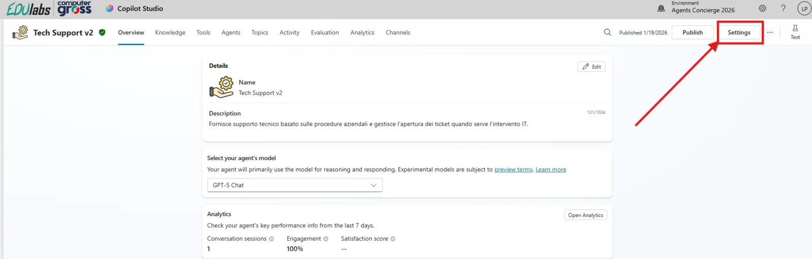
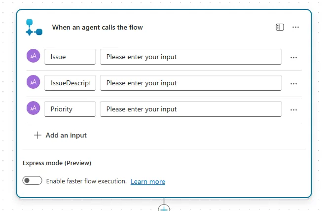
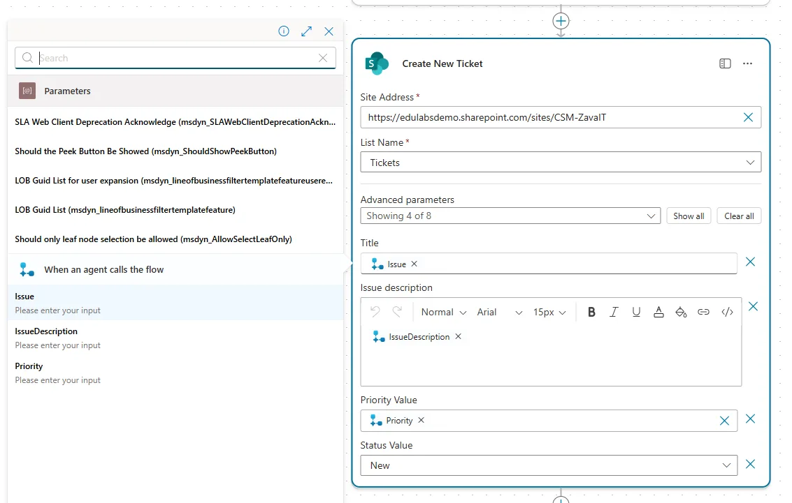

# Setup Guide (Tech Support · v2)

## Prerequisiti

### Setup Copilot Studio

Copilot Studio è contenuto all'interno di Microsoft 365, per cui come prima cosa è necessario essere in possesso di un valido account Microsoft 365.

Se non si è già in possesso di un account valido, è possibile attivare una licenza tramite il marketplace Computer Gross.  Eventualmente, solo per tenant di prova è possibile navigare alla pagina [Piani e prezzi di Microsoft 365 per aziende | Microsoft 365](https://www.microsoft.com/it-it/microsoft-365/business/microsoft-365-plans-and-pricing) ed attivare una licenza gratuita tramite l'opzione `Prova gratuitamente`.

Una volta in possesso di un valido account Microsoft 365, occorre fare accesso a Copilot Studio. E' possibile attivare una trial gratuita seguendo i seguenti passaggi:

1. Navigare su [aka.ms/TryCopilotStudio](https://aka.ms/TryCopilotStudio)
2. Inserire l'indirizzo mail dell'account Microsoft 365.
3. Seguire il wizard fino a raggiungere `Start free trial`.

??? info "Copilot Studio Trail"
	Per maggiori informazioni sulla versione di prova ed ulteriori approfondimenti sull'attivazione di Copilot Studio, consultare la documentazione ufficiale [Get access to Copilot Studio - Microsoft Copilot Studio | Microsoft Learn](https://learn.microsoft.com/en-us/microsoft-copilot-studio/requirements-licensing-subscriptions)

### Setup nuovo ambiente developer

Usando lo stesso account usato nel punto precedente, è possibile attivare un piano gratuito per sviluppatori in modo da avere un ambiente sicuro e slegato dai dati aziendali, utile a fare i propri test.

1. Fare login all'interno del portale https://aka.ms/PowerAppsDevPlan
2. Inserire l'indirizzo mail utilizzato nei precedenti punti ed attivare la prova
3. Questo genererà un ambiente con il vostro nome, che sarà possibile visualizzare in alto a destra rispetto all'interfaccia di Power Apps o Copilot Studio. Ad esempio `Mario Rossi's environment`

??? note "Power Platform Environments"
	Gli ambienti della Power Platform sono un concetto fondamentale per gestire la segmentazione dei dati ed il rilascio delle nuove applicazioni (come gli *agenti*). Il loro approfondimento è fuori dagli scopi di questa guida ma è consigliabile un approfondimento presso la documentazione ufficiale [Power Platform environments overview - Power Platform | Microsoft Learn](https://learn.microsoft.com/en-us/power-platform/admin/environments-overview).

### Setup Sito SharePoint

Per questo caso d'uso è stato utilizzato un sito SharePoint utilizzando un template predefinito. E' possibile replicare lo stesso sito navigando seguendo i seguenti passaggi:

1. Navigare su SharePoint Online
2. Selezionare il tasto `+ Create site`
3. Scegliere le seguenti opzioni nel wizard di creazione:
	- **Select the site type**: `Team Site`
	- **Select a template**: `IT help desk`
	- **Name**, **Privacy**, **Language** a piacere

## Creazione Agente da Copilot Studio

Navigare su [https://copilotstudio.microsoft.com/](https://copilotstudio.microsoft.com/) e navigare nel menu `Agents` tramite la barra di navigazione di sinistra. 

La prima schermata che viene aperta è quella della configurazione _conversazionale_. E' una valida scelta per creare un agente ma nel nostro caso adotteremo un approccio manuale, quindi scegliere `Create blank agent` in alto.


Una volta atteso qualche secondo per il provisioning dell'agente, la schermata risultante sarà quella della **Overview**.

Come prima azione premere `Edit` nel primo box intitolato **Details**. Questi parametri non sono importanti a livello tecnico ma impattano l'esperienza utente. Di seguito le nostre scelte:

- `Name`:

```
Tech Support v2
```

- `Description`:

```
Fornisce supporto tecnico basato sulle procedure aziendali e gestisce l’apertura dei ticket quando serve l’intervento IT.
```



Andiamo subito a modificare alcune impostazioni generali dell'agente tramite i `Settings` in alto a destra. Modificare i seguenti valori:

| Setting                      | Value      |
| ---------------------------- | ---------- |
| Content moderation level     | *Moderate* |
| Use general knowledge        | *Off*      |
| Use information from the web | *Off*      |
## Knowledge Base

Come fonte di conoscenza utilizzeremo dei semplici documenti che simulano delle guide tecniche aziendali. Possono essere caricate tramite upload diretto oppure caricate all'interno di un sito SharePoint da impostare all'interno della base di conoscenza.

Siccome l'indicizzazione dei contenuti all'interno di siti SharePoint appena creati potrebbe richiedere tempo, caricare i file direttamente tramite *Upload file*. I file usati per questo esempio possono essere scaricati al link sottostante:

-> [Scarica i materiali demo (ZIP)](../../downloads/tech-support/tech-support-demo-material.zip)


## Configurazione del Topic *Apertura Ticket*

L'obiettivo è guidare la conversazione quando si tratta di aprire un nuovo ticket, prima raccogliendo degli input specifici e poi interagendo con un sistema aziendale. 

Un modo per gestire questo flusso in maniera controllato è utilizzare uno specifico Topic.

1. Navigare all'interno nel menu **Topics** nel menu orizzontale in alto
2. Premere il tasto `+ Add a topic` e selezionare l'opzione `From blank` 
3. Una volta all'interno del Topic, riempire i seguenti campi

- **Name** (in alto a destra): `Apertura Ticket`
- **Describe what the topic does**:

```
Gestisce i casi in cui l’assistente non è in grado di fornire una risposta basandosi sulla knowledge base SharePoint o sugli strumenti interni, oppure quando l’utente richiede esplicitamente l’apertura di un ticket di supporto.
```


Successivamente, premere l'icona circolare con il `+` sotto il box del trigger e selezionare *Ask with Adaptive Card*. A questo punto premere nei tre puntini (`...`) nell'angolo del nuovo nodo ed espandere la finestra laterale **Properties**:


A questo punto seguire i seguenti passaggi:

1. Premere su **Edit adaptive card** per accedere al designer delle Adaptive Card
2. Espandere il *Card payload editor* nel lato inferiore del designer
3. Cancellare tutto il testo presente ed incollare il seguente codice:

```
{
    "$schema": "https://adaptivecards.io/schemas/adaptive-card.json",
    "type": "AdaptiveCard",
    "version": "1.5",
    "body": [
        {
            "type": "TextBlock",
            "text": "Nuovo Ticket di Supporto Tecnico",
            "weight": "Bolder",
            "size": "Medium"
        },
        {
            "type": "TextBlock",
            "text": "Per favore fornisci i dettagli richiesti.",
            "wrap": true
        },
        {
            "type": "Input.Text",
            "id": "issue",
            "label": "Problema",
            "placeholder": "Es. Malfunzionamento Outlook",
            "isRequired": true,
            "errorMessage": "Inserisci il nome del problema."
        },
        {
            "type": "Input.Text",
            "id": "description",
            "label": "Descrizione del problema",
            "placeholder": "Descrivi cosa succede, quando, eventuali errori, passi per riprodurre...",
            "isMultiline": true,
            "isRequired": true,
            "errorMessage": "Inserisci la descrizione del problema."
        },
        {
            "type": "Input.ChoiceSet",
            "id": "priority",
            "label": "Priorità",
            "isRequired": true,
            "errorMessage": "Seleziona una priorità.",
            "choices": [
                {
                    "title": "Bassa (non bloccante)",
                    "value": "Low"
                },
                {
                    "title": "Media (da risolvere entro 48 ore)",
                    "value": "Normal"
                },
                {
                    "title": "Alta (impedisce di lavorare)",
                    "value": "Critical"
                }
            ]
        }
    ],
    "actions": [
        {
            "type": "Action.Submit",
            "title": "Invia Ticket",
            "data": {
                "action": "createTicket"
            }
        }
    ]
}
```

Una volta sicuri che la carta si visualizza senza errori, premere il tasto **Save** in alto a destra e chiudere il designer.


Una volta fatto questo passaggio, salvare anche lo stato del *Topic* tramite il tasto **Save** in alto a destra (rispetto al menu di creazione Topic).
## Creazione dell'Agent Flow

Una volta configurato il nodo *Ask with Adaptive Card* come descritto nel punto prima, aggiungere un nuovo nodo con il tasto `+` e seguire il menu **Add a tool > New Agent flow**:


Questo aprirà una nuova interfaccia, quella di configurazione degli Agent Flows, che risulterà familiare agli utilizzatori di *Power Automate*.

Il primo passaggio consiste nell'impostare gli input che sappiamo verranno passati al flusso. In questo caso occorre impostarne 3, tutti di tipo *Text*:

| Nome             | Tipo |
| ---------------- | ---- |
| Issue            | Text |
| IssueDescription | Text |
| Priority         | Text |



Una volta configurati gli input come descritto sopra, aggiungere un nuovo connettore tramite il `+` e selezionare il connettore SharePoint chiamato **Create new item**. E' possibile che a questo punto il sistema chieda di effettuare una login, seguire le indicazioni fino all'apparire di una scheda configurabile. 

Riempire i campi seguenti:

- **Site Address**:
- **List Name**:

Espandere il campo *Advanced parameters* ed impostare:

- **Title**: tramite l'icona del *fulmine* che compare dopo avere inserito il cursore di testo nel box,  selezionare il campo `Issue` preso dal nodo precedente (*When an agents calls the flow*)
- **Issue description**: tramite l'icona del *fulmine*, selezionare il campo `IssueDescription`
- **Priority Value**: tramite l'icona del *fulmine*, selezionare il campo `IssueDescription`
- **Status Value**: lasciare il valore su `New`



## WORK IN PROGRESS

